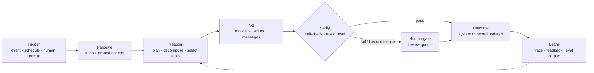

# Habagat — Research Method, Agent Taxonomy & Use-Case Notation

> **Document 00 of the Habagat Agent-as-a-Service corpus.**
> Read this first. Every use case in Documents 01–21 uses the notation defined here.

---

## Executive take

- We studied enterprise work as **workflows**, not as "AI features". A workflow becomes an agent candidate when it is *triggered*, *multi-step*, *tool-mediated*, *judgement-bearing*, and *repeated at volume*.
- We found **eight recurring agent archetypes** that explain ~90% of the 280+ use cases catalogued. Habagat's economics depend on this: we build the archetype once and instantiate it per customer, not per idea.
- Every use case is specified as a **closed loop**: Trigger → Perception → Reasoning → Tool Actions → Verification → Outcome → Learning. An agent without the verification and learning legs is a demo, not a product.
- We grade every use case on an **autonomy ladder (L0–L4)** and a **blast-radius class (B1–B4)**. These two numbers, not the model choice, determine the engineering cost and the governance regime.
- The commercial unit is the **agent-run**, not the seat. This is the single most important decision in the business model and it flows from this taxonomy.

---

## 1. How this research was conducted

This is a **fresh, first-principles study**. No prior project artefacts were consulted.

The method had four passes:

| Pass | Question asked | Output |
|---|---|---|
| **1. Work decomposition** | What work actually happens in a company, independent of software category? | 9 universal value streams (see §2) |
| **2. Agent-fit screening** | Which of that work passes the agent-fit test? | Screening rubric (§3) |
| **3. Cross-industry synthesis** | What repeats in *every* company regardless of sector? | 20 cross-industry use cases (Doc 01) |
| **4. Industry deepening** | What is sector-specific, high-value and defensible? | 20 industries × 12–16 use cases (Docs 02–21) |

### 1.1 The nine universal value streams

Every organisation, in every industry, runs some version of these. They are the scaffolding of the cross-industry catalogue.

1. **Demand creation** — find, qualify and win customers.
2. **Order-to-cash** — quote, contract, fulfil, invoice, collect.
3. **Procure-to-pay** — source, contract, receive, pay suppliers.
4. **Hire-to-retire** — attract, onboard, develop, exit people.
5. **Plan-to-produce** — forecast, schedule, make/deliver the thing.
6. **Issue-to-resolution** — customer and employee service.
7. **Record-to-report** — close the books, report, forecast, comply.
8. **Idea-to-market** — R&D, product, engineering, launch.
9. **Risk-to-assurance** — security, legal, audit, regulatory, safety.

### 1.2 The agent-fit test

A workflow is a **strong agent candidate** when it scores ≥ 4 of 6:

| # | Criterion | Why it matters |
|---|---|---|
| 1 | **Triggerable** — there is an unambiguous event or request that starts it | Determines whether the agent can run unattended |
| 2 | **Multi-step & tool-mediated** — needs 3+ actions across 2+ systems | Below this, a form or a function call is cheaper than an agent |
| 3 | **Judgement-bearing** — requires interpretation of unstructured input | This is what deterministic RPA could never do; it is the whole reason agents exist |
| 4 | **Volume** — ≥ 500 executions/month, or ≤ 500 but each worth ≥ $1,000 | Drives ROI; low-volume/high-value cases are the "expert agent" archetype |
| 5 | **Verifiable** — a machine or a human can cheaply check whether the output is right | Without this you cannot build an eval set, and without an eval set you cannot ship |
| 6 | **Bounded blast radius** — a wrong answer is recoverable | Determines autonomy level and the governance regime |

Workflows that fail criterion 5 or 6 are not rejected — they are **demoted to L1/L2 autonomy** (draft-and-review) until an evaluation corpus exists.

---

## 2. The eight agent archetypes

The 280+ catalogued use cases collapse into eight reusable engineering patterns. **Habagat's product is these eight blueprints**, hardened, evaluated and instantiated per customer.

| # | Archetype | Core loop | Typical autonomy | Representative use cases |
|---|---|---|---|---|
| **A1** | **Intake & Triage Agent** | Classify → enrich → route → acknowledge | L3 | Support ticket triage, claims FNOL, referral intake, RFP qualification |
| **A2** | **Document Intelligence Agent** | Ingest → extract → validate → post to system of record | L3 | Invoice processing, KYC docs, clinical intake, shipping docs, contracts |
| **A3** | **Research & Synthesis Agent** | Decompose → retrieve across sources → synthesise → cite | L2 | Market research, competitive intel, literature review, due diligence |
| **A4** | **Advisor / Copilot Agent** | Understand context → retrieve policy & data → recommend → explain | L1–L2 | Clinical decision support, underwriting advisor, field-tech assistant |
| **A5** | **Transaction & Fulfilment Agent** | Validate → orchestrate multi-system writes → confirm → reconcile | L2–L3 | Order changes, provisioning, rebooking, dispatch, payment runs |
| **A6** | **Monitoring & Anomaly Agent** | Watch signal → detect deviation → diagnose → act or escalate | L3–L4 | Fraud, network faults, predictive maintenance, margin leakage |
| **A7** | **Negotiation & Outbound Agent** | Plan → engage counterparty → adapt → close or escalate | L1–L2 | Collections, supplier negotiation, SDR outreach, appointment setting |
| **A8** | **Compliance & Assurance Agent** | Gather evidence → test against control → report → remediate | L2–L3 | Audit prep, regulatory reporting, policy attestation, safety inspection |

> **Engineering consequence.** A new customer request is first mapped to an archetype. If it maps cleanly, delivery is *configuration + domain grounding + evaluation*, measured in weeks. If it maps to no archetype, it is a **platform investment decision**, not a project. This is how Habagat keeps delivery cost sublinear to customer count.

---

## 3. The autonomy ladder (L0–L4)

| Level | Name | Human role | Ship criteria | Governance |
|---|---|---|---|---|
| **L0** | Assistive | Human does the work; agent answers questions | None (informational) | Standard |
| **L1** | Draft | Agent produces a draft; human edits and submits | Eval pass ≥ 80% on helpfulness | Standard |
| **L2** | Recommend + approve | Agent proposes a specific action; human approves with one click | Eval pass ≥ 90%; approval rate tracked | Reviewed |
| **L3** | Act with exception escalation | Agent executes within a policy envelope; escapes to human on low confidence or out-of-policy | Eval pass ≥ 95%; false-action rate < defined SLO; reversible actions | Controlled — dual approval to raise |
| **L4** | Act autonomously with post-hoc audit | Agent acts; humans sample-audit | Eval pass ≥ 98%; sustained 90 days at L3; formal risk sign-off | Restricted — board-level policy |

**Rule of the house:** *every agent ships at L1 or L2 and is promoted by evidence, never by ambition.* Promotion is a documented gate with an eval report, a shadow-mode comparison, and an owner.

## 4. Blast-radius classes (B1–B4)

| Class | Definition | Example | Required controls |
|---|---|---|---|
| **B1** | Output is read-only or internally scoped | Research brief | Logging |
| **B2** | Output is written to a system of record but reversible | Draft posted to CRM | Logging + undo + audit trail |
| **B3** | Output reaches a customer or moves money reversibly | Email sent, invoice raised | Approval gate or L3 policy envelope + kill switch |
| **B4** | Irreversible, regulated, or safety-relevant | Payment released, clinical action, safety shutdown | Human approval mandatory below L4; formal risk assessment; regulator-facing evidence |

---

## 5. Use-case notation (used in every catalogue entry)

Every use case in Documents 01–21 is written in this exact structure so it can be lifted directly into a delivery backlog.

```
### UC-<code> — <Name>
**Archetype** A#  |  **Autonomy** L#  |  **Blast radius** B#  |  **Value stream** <name>

**Pain** — the status quo and why it is expensive.
**Trigger** — the precise user or system event that starts the run.
**Workflow** — numbered steps from trigger to outcome, naming the tool call at each step.
**Systems & tools** — the connectors the agent needs.
**Outcome** — what exists in the world after a successful run.
**KPIs** — the 3–4 metrics that prove it worked.
**Human gate** — where a person must intervene, and on what signal.
```

### 5.1 The canonical agent run loop

Every workflow below is an instance of this loop. It is implemented once in the Habagat harness.



**The two legs everyone skips.** `Verify` and `Learn` are where Habagat's product value concentrates. Anyone can wire `Trigger → Reason → Act`. The verification leg is what makes an agent deployable in a regulated enterprise; the learning leg is what makes month 12 better than month 1 and makes the customer relationship compounding rather than churning.

---

## 6. How to read the catalogue

- **Document 01** — 20 cross-industry use cases. These are the horizontal product line: sellable to any company in any sector. They are Habagat's volume business.
- **Documents 02–21** — 20 industries, 12–16 use cases each (**262 total**). These are the vertical product line: higher price, higher defensibility, slower to build.
- **Documents 30–39** — the platform, architecture, infrastructure, governance and security plans for building and operating all of it on Azure AI Foundry with one isolated tenant per customer.
- **Documents 40+** — business model, investor narrative, CTO technical strategy, and the Software Architect Agent prompt.

### Portfolio strategy implied by the research

| | Horizontal (Doc 01) | Vertical (Docs 02–21) |
|---|---|---|
| Build cost | Once, reused across all customers | Once per industry, reused across that industry |
| Sales motion | Land — fast pilot, low friction | Expand — high ACV, board-level sponsor |
| Gross margin | Highest (max reuse) | High, after the 3rd customer in the vertical |
| Defensibility | Low individually, high as a suite | High — domain evals + regulatory grounding |
| Habagat's play | **Land with 2–3 horizontals in 30 days** | **Expand into 2–3 verticals per customer within 2 quarters** |

---

## 7. Definitions used throughout

| Term | Definition as used here |
|---|---|
| **Agent** | A goal-directed system that plans, calls tools, and acts on a trigger, with memory of the run and evaluation of the result. |
| **Agent-run** | One complete execution of the loop in §5.1. The billing unit. |
| **Harness / orchestrator** | The runtime that executes the loop, enforces policy, manages tools, memory, retries and observability. |
| **Blueprint** | A parameterised, tested implementation of an archetype, ready to instantiate per customer. |
| **Instance** | A blueprint deployed into one customer's isolated Azure tenant, grounded in that customer's data and policy. |
| **Eval corpus** | The versioned set of graded cases that gates every promotion of an agent. |
| **Control plane** | Habagat's own tenant: provisioning, fleet management, telemetry, billing. Holds no customer content. |
| **Data plane** | The customer's dedicated Azure tenant/subscription where the agent and all customer data live. |
