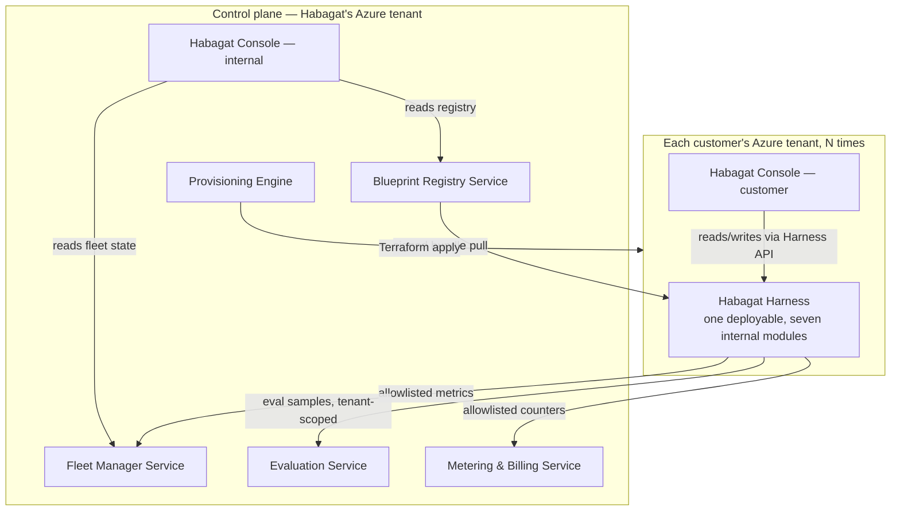
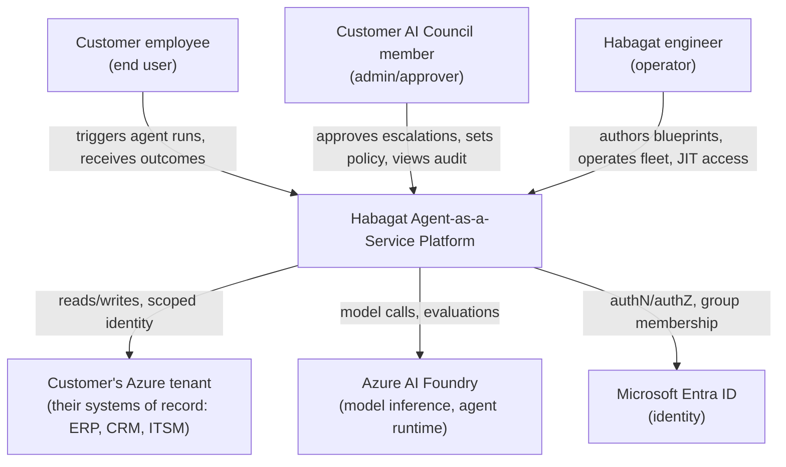
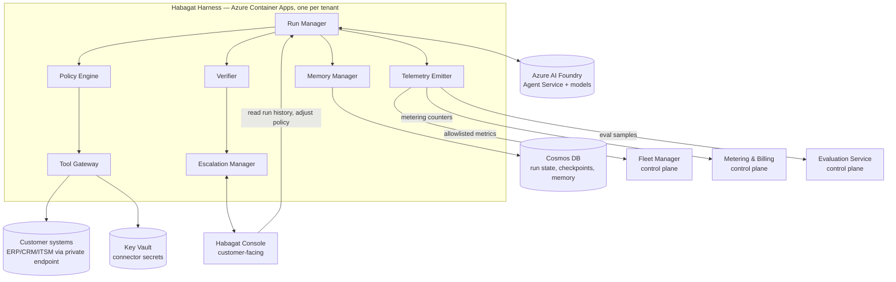
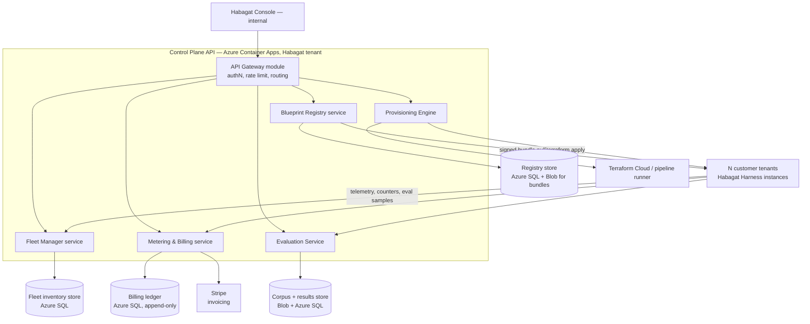

# Document 51 — Application Architecture Overview

> Owner: Software Architecture · Status: Engineering standard v1.0
> Scope: the **application** architecture — services, boundaries, communication, and technology choices — inside the platform defined by Docs 30–36. This document does not re-decide the two-plane model, the Agent Blueprint, or the harness subsystems; it designs the software that implements them.

## Executive take

- **Nine deployables, not thirty.** A team of eight engineers can operate roughly one service per engineer before coordination cost exceeds the benefit of separation. We decompose along the bounded contexts that already exist in Docs 30–36 (Blueprint, Tenant, Run, Policy, Evaluation, Fleet, Identity, Billing) and collapse several into shared deployables where the traffic and team ownership do not justify a network boundary.
- **The Harness is a single deployable per tenant, not eight microservices.** Its seven subsystems (Doc 31) are modules inside one Container Apps revision. Splitting them into separate services would add network hops and partial-failure modes to a control loop that must reason about a single run's state — see §2.2 for the justification.
- **Two languages, per CTO Doc 01 bet B9: Python for everything that touches models, evaluation, or agent logic; TypeScript for everything that is a UI or a thin API gateway.** No third language enters production without staff sign-off.
- **Synchronous inside a run, asynchronous across runs.** A single agent run is a synchronous call chain (harness → Foundry → tool → verifier) because it has a human or a system waiting on its outcome. Everything about *fleet* operation — provisioning, evaluation, drift detection, billing — is asynchronous and event-driven, because it has no caller waiting and benefits from decoupling.
- **The control plane and every data plane share one codebase (the platform monorepo, CTO Doc 03 §1) but run as physically distinct deployables in physically distinct Azure tenants.** Shared code, isolated runtime — this is what makes "buy the inference, build the trust" affordable for eight engineers.

---

## 1. Service decomposition

### 1.1 The test we apply

A capability becomes a **separate deployable** only if it passes at least two of these; otherwise it stays a **module** inside an existing deployable:

| Test | Question |
|---|---|
| **Isolation boundary** | Does it have to run inside a different Azure tenant, or does its compromise have a different blast radius than its neighbour? |
| **Independent scaling** | Does its load pattern differ by more than 10× from its neighbour's? |
| **Independent release cadence** | Does it need to deploy on a different schedule, gated by different tests? |
| **Independent team ownership** | Does a distinct pod own it end-to-end, including on-call? |

Applying this test to the capabilities named in Docs 30–36 and CTO Docs 01–04:

| Capability | Deployable? | Reasoning |
|---|---|---|
| Habagat Harness (Run Manager, Policy Engine, Tool Gateway, Memory Manager, Verifier, Escalation Manager, Telemetry Emitter) | **One deployable** | All seven live inside the isolation boundary of one tenant, scale together (one run drives load on all seven), release together (a harness version is one artifact per Doc 31 §1), and are owned by the Agent Pod assigned to that tenant. Splitting them adds inter-process calls to a control loop that must be transactionally coherent — see §2.2. |
| Blueprint Registry | Deployable | Different isolation boundary (control plane), different release cadence (blueprint authors, not fleet operators), independently scaled (read-heavy, bursty at rollout). |
| Fleet Manager | Deployable | Owns its own state machine (tenant inventory, ring assignment) and is on the critical path for rollout decisions; a bug here must not be coupled to a bug in billing. |
| Provisioning Engine | Deployable, but thin | Wraps Terraform execution; mostly a queue consumer + Terraform Cloud/Azure DevOps pipeline orchestration. Kept separate because its failure mode (a stuck `terraform apply`) must not block Fleet Manager's read APIs. |
| Evaluation Service | Deployable | Distinct scaling profile (bursty, CPU/GPU-heavy grading jobs vs. the request/response profile of everything else); distinct team (Eval Engineering, CTO Doc 01 §2.2). |
| Metering & Billing | Deployable | Financial-grade consistency requirements (§4, Doc 52) that must not share a failure domain with anything else; audited separately. |
| Habagat Console (customer + internal) | Deployable(s) — see Doc 56 | Different technology (TypeScript/React) and release cadence (UX iteration) from the Python backend services. |
| Tool implementations / MCP servers | **Modules inside the Tool Gateway**, not separate deployables, until a specific connector's load or blast radius diverges — then it is promoted to its own container (Doc 57 §1). | Most tools are low-volume and stateless; running 40 separate connector services for 8 engineers to operate is unjustified until one specific connector needs it. |
| Policy Engine, Verifier | **Modules inside the Harness** | See §2.2 — these are the two subsystems most tempting to split out, and the two most important to keep in-process. |

### 1.2 The nine deployables

Nine deployables total: **Blueprint Registry, Fleet Manager, Provisioning Engine, Evaluation Service, Metering & Billing, Habagat Console (two builds of one codebase — internal and customer), and the Habagat Harness** (replicated once per tenant). The Console counts as one engineering artifact producing two deployed surfaces, not two separate services (Doc 56 §1).

**What we deliberately did not split out**, and why each stays a module:

| Tempting split | Kept as a module inside | Why splitting would hurt |
|---|---|---|
| Policy Engine | Harness | Must evaluate the envelope *before* the model call in the same transaction as run-state checkpointing (Doc 31 §2.2). A network hop here adds latency to every single tool call and introduces a partial-failure mode ("the policy check timed out — was the tool call allowed or not?") that has no good answer. |
| Verifier | Harness | Needs the full run context (retrieved passages, tool results, the model's proposed outcome) already in memory. Re-fetching it over a network call doubles the data-transfer cost of every run for no isolation or scaling benefit. |
| Memory Manager | Harness | Talks to Cosmos DB directly; wrapping it in its own service adds a hop for every read without changing its scaling profile (it scales with runs, exactly like the rest of the harness). |
| Escalation Manager | Harness (writes) + Console (reads/UI) | The write path (enqueue, SLA tracking) is harness-local; the read/interaction path is properly a Console concern. Splitting the write path out would desynchronize run state from escalation state. |
| Connector implementations | Tool Gateway (module) or their own container per Doc 57 §1 threshold | Most connectors are too low-volume to justify an operated service; MCP servers for the handful of high-volume, third-party-maintained systems (SAP, Salesforce) get their own container per the promotion rule in Doc 57. |

> **The general principle:** a synchronous decision loop (policy → reason → act → verify) is one deployable. Anything that can tolerate "eventually" — provisioning, billing reconciliation, fleet-wide evaluation, drift detection — is allowed to be a separate deployable and to communicate asynchronously.

---

## 2. Communication: synchronous vs. asynchronous

### 2.1 The rule

| Communication | Style | Why |
|---|---|---|
| Inside one agent run (harness internals; harness → Foundry → tool → verifier) | **Synchronous, in-process or same-container-network call** | A human or an external system is waiting; the run either completes, escalates, or fails within its budget (Doc 31 §2.1). There is no case where "notify me later" is acceptable inside a run. |
| Harness → Tool Gateway → customer system | **Synchronous with timeout + retry**, never fire-and-forget | The agent's next reasoning step depends on the tool result. |
| Harness → Escalation Manager → human review queue | **Asynchronous (queue) after enqueue** | The run checkpoints and pauses; there is no caller blocked on a human's response — that would exhaust the run's step/cost budget waiting. |
| Blueprint Registry → Harness (bundle distribution) | **Asynchronous (pull-based, versioned)** | The Harness pulls a signed bundle at startup and on a poll interval; the Registry does not push into customer tenants (Doc 30 §2.1 — control plane never initiates a payload-carrying connection into the data plane). |
| Harness → Fleet Manager, Harness → Metering & Billing | **Asynchronous (event push, at-least-once, schema-validated allowlist)** | Telemetry and billing counters are aggregates with no caller waiting; retries and at-least-once delivery are safe because both consumers are idempotent on `(tenant_id, run_id, event_type)`. |
| Fleet Manager → Provisioning Engine | **Asynchronous (command queue)** | A `terraform apply` can take minutes; the caller (a human approving a rollout, or an automated ring-advance decision) should not block a request thread on it. |
| Evaluation Service ↔ everything | **Asynchronous** | Grading jobs are batch-shaped and can take from seconds to tens of minutes (Doc 36 §4); nothing in the request path of a live agent run should depend on a synchronous call to the Evaluation Service. |
| Console → Harness / Fleet Manager / Registry (reads) | **Synchronous (request/response API)** | A human is looking at a screen. |

### 2.2 Why the Harness itself is synchronous internally

This is the single most consequential communication decision in the system, so we make the reasoning explicit rather than asserting it.

A single agent run is fundamentally **a state machine with one writer**: the Run Manager owns the run's state and is the only component permitted to advance it (Doc 31 §2.1, Doc 54 §2). Every other subsystem — Policy Engine, Tool Gateway, Memory Manager, Verifier — is consulted *by* the Run Manager and returns a result *to* it within the same logical transaction boundary (though not necessarily the same database transaction — see Doc 52 §2 for aggregate boundaries). If we split these into separate network services:

1. **Latency compounds.** A tool call already crosses a network boundary to the customer's system. Adding a policy-check hop and a verifier hop around every tool call multiplies p95 latency for no functional gain — the policy envelope and the verifier both need data (run context, budget remaining, retrieved evidence) that already lives in the Run Manager's working memory.
2. **Partial failure has no good answer.** If the Policy Engine is a separate service and it times out mid-check, what does the Run Manager do? It cannot proceed (that would be "fail open" on a security control) and it cannot cleanly retry (the tool call it was checking may have already had side effects if the check-then-act is not atomic). Keeping the check in-process makes "did we check?" and "did we act?" the same transaction.
3. **No isolation benefit.** All seven subsystems already run inside the same tenant's trust boundary (Doc 34 §2.1 — the harness identity is a single workload identity for the tenant). Splitting them into separate containers inside the same tenant does not reduce blast radius; a compromised Policy Engine container and a compromised Tool Gateway container inside the same VNet have the same practical impact.
4. **No independent scaling benefit.** All seven scale with exactly one variable: concurrent agent runs in that tenant. There is no workload where the Verifier needs 10× the replicas of the Run Manager.

We revisit this decision only if a specific subsystem demonstrates a genuinely different scaling curve in production — see ADR-01 in Doc 59.

---

## 3. Bounded contexts (DDD)

Eight bounded contexts, matching the assignment given, mapped onto the nine deployables.

| Bounded context | Owning deployable(s) | Ubiquitous language (the terms that mean exactly one thing inside this context) |
|---|---|---|
| **Blueprint** | Blueprint Registry | *Blueprint* (a versioned, parameterized agent definition), *BlueprintVersion* (immutable, content-addressed), *Archetype* (A1–A8, Doc 00 §2), *Promotion* (moving a version between rings), *Compile* (Agent Spec → runtime target, CTO Doc 03 §1.4) |
| **Tenant** | Provisioning Engine, Fleet Manager (tenant record) | *Tenant* (one customer's isolated Azure environment), *TenantConfig* (the declarative file, Doc 32 §3.2), *DeploymentModel* (A/B/C, Doc 32 §1), *ComplianceProfile*, *RolloutRing* |
| **Run** | Habagat Harness | *Run* (one execution of the canonical loop, Doc 00 §5.1), *Step*, *ToolCall*, *Checkpoint*, *Envelope* (the Policy Engine's output, Doc 31 §2.2), *Verdict* (the Verifier's output) |
| **Policy** | Habagat Harness (Policy Engine module); rule *definitions* authored via Blueprint Registry | *AutonomyLevel* (L0–L4), *BlastRadius* (B1–B4), *RiskClass* (R0–R3, Doc 31 §2.2), *PolicyOverride* (tenant-level tightening, never loosening) |
| **Evaluation** | Evaluation Service | *EvalCase*, *EvalCorpus*, *Grader*, *Gate* (a named threshold a version must clear), *ShadowRun*, *Regression* |
| **Fleet** | Fleet Manager | *FleetCoordinate* (`{platformVersion, blueprintVersions[], modelVersions[], ring}`, CTO Doc 03 §4.2), *Drift*, *Ring* (R0–R3), *SLO* |
| **Identity** | Not a deployable — implemented via Entra ID/Lighthouse/PIM (Doc 34 §2) and referenced by every other context | *WorkloadIdentity*, *DelegatedAccess* (Lighthouse), *EligibleRole* (PIM), *OnBehalfOf* |
| **Billing** | Metering & Billing | *AgentRun* (the billable unit, Doc 00 §7), *Counter*, *InvoiceLine*, *PlatformFee*, *UsageTier* |

### 3.1 Anti-corruption layers

Contexts do not share domain models directly; each consuming context translates the producing context's model into its own vocabulary at the boundary.

| Boundary | Anti-corruption translation |
|---|---|
| Blueprint → Run | The Harness never interprets a raw `BlueprintVersion` document. At startup it loads a **compiled, signed Agent Bundle** (Doc 30 §2.1, Doc 53 §4) — a flattened, validated artifact with no notion of "blueprint," "archetype," or "promotion." This is the compiler's job (CTO Doc 03 §1.2 `compiler/`), and it is the ACL: Blueprint-context concepts never leak into Run-context code. |
| Run → Fleet | The Harness emits **telemetry events** in a fixed, versioned schema (Doc 53 §5) — `run_completed`, `drift_signal`, etc. — never its internal run-state representation. Fleet Manager has no knowledge of `Checkpoint` or `ToolCall`; it only knows the event schema. |
| Run → Billing | The Harness emits **metering events** (`agent_run_completed { tenant_id, agent_id, blueprint_version, outcome, cost_usd }`), not run internals. Billing has no concept of `Envelope` or `Verdict`. |
| Run → Evaluation | The Harness emits **eval samples** (a run's input/output pair, tenant-scoped, stored in the tenant per Doc 36 §2.1) that the Evaluation Service pulls and grades; it never reaches into Harness state directly. |
| Policy (definitions) → Run (enforcement) | Blueprint authors write policy *bundles* (declarative rule sets, Doc 54 §2) in the Blueprint context's vocabulary; the Policy Engine module compiles them into an executable rule set at bundle-load time. The Harness's runtime representation of a rule has no notion of "who authored this" or "which blueprint version" — only "evaluate this predicate against this envelope." |

---

## 4. C4 model

### 4.1 System context

### 4.2 Container diagram — the Habagat Harness

### 4.3 Container diagram — the Control Plane API

---

## 5. Technology choices

We hold to CTO Doc 01 bet B9 (two languages) and CTO Doc 01 §3 (build-vs-buy). This section is the concrete per-service mapping.

| Service | Language / framework | Datastore | Rationale |
|---|---|---|---|
| **Habagat Harness** | Python 3.12, FastAPI (internal control endpoints) + the Foundry Agent Service SDK | Cosmos DB (run state, checkpoints, memory) + Key Vault (secrets) | Python because it is the language of the Foundry SDK, the eval harness, and every prompt/tool author on the team — one language for everything model-adjacent avoids a translation layer at the highest-change-frequency part of the system. |
| **Blueprint Registry** | Python, FastAPI | Azure SQL (metadata: versions, promotions, dependencies) + Blob Storage (bundle content, content-addressed) | Metadata is relational (foreign keys between blueprint → version → promotion record); bundle content is opaque signed blobs — SQL for the graph, Blob for the payload. |
| **Fleet Manager** | Python, FastAPI | Azure SQL (tenant inventory, fleet coordinates, drift records) | Needs transactional consistency for ring-advance decisions (Doc 55 §2) and relational queries ("which tenants are on version X" is a join). |
| **Provisioning Engine** | Python, thin orchestration layer | Azure SQL (provisioning job state) + Terraform state (per-tenant, Habagat-controlled backend, Doc 32 §3.1) | Mostly a queue consumer that shells out to Terraform; keeping it thin avoids reimplementing Terraform's state management. |
| **Evaluation Service** | Python (the eval harness is Python per CTO Doc 03 §1.2 `eval/`) | Blob Storage (corpus, versioned) + Azure SQL (results, gate history) | Grading jobs are compute-heavy batch work; Python for the same reason as the Harness — one grading pipeline, reused by CI (CTO Doc 03 §3) and by production shadow-evaluation. |
| **Metering & Billing** | Python, FastAPI | **Azure SQL, append-only ledger table** (never updated, only inserted and compensated) | Financial data demands an audit trail; an append-only ledger with compensating entries (never `UPDATE`/`DELETE`) is the standard pattern for billing correctness (Doc 55 §5). |
| **Habagat Console** (internal + customer) | TypeScript, React (Doc 56 §1) | No datastore of its own — reads/writes via the backend APIs above | UI concerns are cleanly separated from domain logic; TypeScript is the team's second language specifically for this surface (CTO Doc 01 Adopt list). |
| **CLI** (`habagat`) | Python (CTO Doc 03 §1.3 golden paths) | N/A | Ships in the same language as the platform it operates, so contributors do not context-switch to write a golden path. |
| **IaC** | Terraform (primary) + Bicep (only where an Azure Verified Module gap exists, CTO Doc 01 §3 item 15) | N/A | Per CTO Doc 01 bet B2 — Terraform keeps a non-Azure future two-way-door cheap even though we are single-cloud today. |

**What we explicitly did not introduce:** a third backend language (no Go, no Java, no Rust) anywhere in the nine deployables. If a future performance-critical component (e.g., a high-throughput document-classification cascade step) genuinely needs it, that is a staff-engineer-approved exception per CTO Doc 01 bet B9, not a default.

---

## Open questions and decisions required

1. **Console split.** Doc 56 will specify whether the internal and customer consoles are one React application with role-based views or two separately deployed builds of shared components. This document assumes "two builds, one codebase" (§1.2) as the lighter-weight default; Doc 56 owns the final call.
2. **Tool Gateway promotion threshold.** §1.2 defers the exact volume/blast-radius threshold at which a connector graduates from "module inside the Tool Gateway" to "its own container" to Doc 57 §1. This should be a concrete, monitored number (e.g., sustained >X calls/minute or any R2/R3 tool touching a top-10 ERP), not a judgement call made ad hoc per connector.
3. **Conflict flagged against Doc 30 §7 (multi-agent composition).** Doc 30 describes multi-agent patterns (supervisor + specialists, sequential pipeline) as *blueprint-level* compositions running inside one Harness process. This document confirms that reading — a "multi-agent" blueprint is still one Harness deployable orchestrating multiple model calls, not multiple Harness deployables — but Doc 30 does not say so explicitly. **Recommend Doc 30 be amended** to state this alignment so a future reader does not infer that "supervisor + specialists" implies separate services.
4. **Fleet Manager vs. Provisioning Engine coupling.** They are separate deployables (§1.1) but share a lifecycle (a new tenant is a Fleet Manager record *and* a Provisioning Engine job). Doc 55 must specify the saga that keeps them consistent when one succeeds and the other fails — this document only establishes that they are separate services, not how their joint failure is handled.
