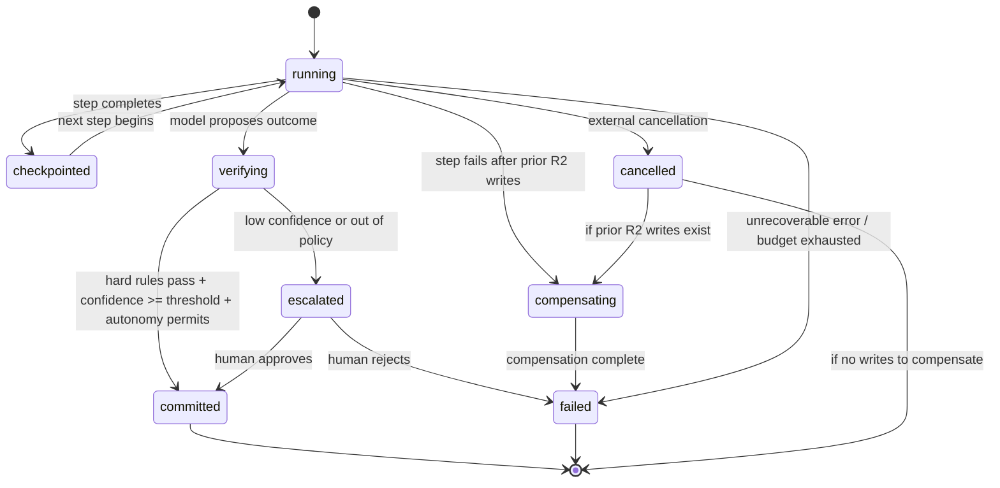

# Document 52 — Domain Model & Data Design

> Owner: Software Architecture · Status: Engineering standard v1.0
> Depends on: Doc 51 (bounded contexts), Doc 30 (Agent Blueprint, ADR-08 — blueprints centralized, tenants hold config only), Doc 31 (harness subsystems), Doc 36 (evaluation corpus structure)

## Executive take

- **Fourteen entities, eight state machines, and one non-negotiable rule: no store outside a customer's tenant may hold a field with customer content.** Every physical data model in this document is checked against that rule explicitly, because "we don't move customer data" (Doc 30 §2.1) is worthless unless the schema makes it structurally true.
- **Cosmos DB partition keys are chosen from the access pattern, not the entity.** The two access patterns that dominate harness traffic — "give me everything for this run" and "give me this entity's memory across runs" — drive two different container designs; getting this wrong is, per Doc 51, "effectively unfixable at scale."
- **Aggregate boundaries follow the same synchronous/asynchronous split as Doc 51 §2.** A `Run` and its `Step`s are one transactionally-consistent aggregate (one writer, the Run Manager). Everything that crosses a service boundary — evaluation results, billing counters, fleet telemetry — is eventually consistent by design, and idempotent by construction.
- **The control-plane schema has no free-text field capable of holding a document, a prompt, or a tool result.** This is not a policy; it is a column-level constraint, enforced by schema validation at the API boundary (§5).

---

## 1. Core domain model

### 1.1 Entity catalogue

| Entity | Bounded context | Lives in |
|---|---|---|
| Blueprint | Blueprint | Control plane (Registry) |
| BlueprintVersion | Blueprint | Control plane (Registry) |
| Tenant | Tenant | Control plane (Fleet Manager) + the tenant's own `tenant.yaml` (CTO Doc 03 §1.2) |
| AgentInstance | Tenant / Run | Tenant (harness config) |
| Run | Run | Tenant (Cosmos DB) |
| Step | Run | Tenant (Cosmos DB, embedded in Run — see §3.1) |
| ToolCall | Run | Tenant (Cosmos DB, embedded in Step) |
| Verification | Run | Tenant (Cosmos DB, embedded in Run) |
| Escalation | Run | Tenant (Cosmos DB) + surfaced via Console |
| EvalCase | Evaluation | Control plane (shared corpus) or Tenant (tenant-scoped corpus, Doc 36 §2.1) |
| EvalResult | Evaluation | Same store as the EvalCase it grades |
| PolicyEnvelope | Policy | Computed at runtime, tenant (not persisted beyond the run that used it — see §1.2 note) |
| MemoryRecord | Run | Tenant (Cosmos DB) |
| AuditEvent | Run / Fleet | Tenant (full record) + Control plane (allowlisted aggregate only) |

### 1.2 Entity definitions: attributes, invariants, lifecycle

#### Blueprint

```
Blueprint {
  blueprint_id: string (immutable, e.g. "invoice-ap")
  display_name: string
  archetype: enum(A1..A8)             # Doc 00 §2
  owner_pod: string
  created_at: timestamp
  status: enum(active, deprecated, retired)
}
```
**Invariants:** `blueprint_id` is globally unique and never reused, even after retirement (a retired ID must never be reassigned — audit trails reference it forever). A Blueprint cannot move to `retired` while any `BlueprintVersion` under it is deployed to a tenant at `ring != none`.

**Lifecycle:** `draft → active → deprecated → retired`. `deprecated` means no new tenants may adopt it but existing tenants continue running until migrated; `retired` requires zero active deployments (verified by Fleet Manager query before the transition is permitted).

#### BlueprintVersion

```
BlueprintVersion {
  version_id: string (semver, e.g. "4.2.0")
  blueprint_id: FK -> Blueprint
  content_digest: string (SHA-256 of the compiled Agent Bundle, CTO Doc 03 §1.4)
  agent_spec: JSON (the agent.yaml content, see Doc 53 §4)
  autonomy_default: enum(L0..L4)
  autonomy_max_permitted: enum(L0..L4)
  blast_radius: enum(B1..B4)
  eval_gate: JSON (thresholds, Doc 36 §3)
  signed_by: string (signing identity)
  signature: string
  ring: enum(R0, R1, R2, R3, none)     # current furthest ring reached
  created_at: timestamp
  superseded_by: nullable FK -> BlueprintVersion
}
```
**Invariants:** `content_digest` is content-addressed — two versions with identical compiled output have the same digest and are deduplicated (this is what makes "did anything actually change" answerable, per CTO Doc 03 §3.4). `autonomy_default <= autonomy_max_permitted`, always. A version is **immutable** once `signed_by`/`signature` are set — no field on a signed version is ever updated; a fix is a new version. This immutability is what makes the zero-snowflake rule (Doc 30 §4.2) enforceable: the Harness verifies the signature against the exact bytes it loaded, so an "edited" version is by definition a different, unsigned artifact that fails to load (Doc 34 §4.3).

**Lifecycle:** `compiled (unsigned) → signed → ring:R0 → ring:R1 → ring:R2 → ring:R3 → superseded`. Ring transitions are monotonic and one-directional except for an explicit rollback, which creates a *new* version record pointing back at the last-known-good digest rather than mutating history (Doc 55 §1 owns the promotion state machine in detail).

#### Tenant

```
Tenant {
  tenant_id: string (immutable, e.g. "contoso-prod")
  display_name: string
  deployment_model: enum(A, B, C)      # Doc 32 §1
  subscription_id: string
  primary_region: string
  dr_region: nullable string
  data_residency: enum(...)
  compliance_profile: string
  rollout_ring: enum(R0, R1, R2, R3)
  status: enum(provisioning, active, suspended, offboarding, terminated)
  created_at: timestamp
}
```
**Invariants:** `subscription_id` is unique across the fleet — two tenants never share a subscription (Doc 30 P1). `status` transitions are one-directional except `active <-> suspended`. A tenant cannot enter `active` until the Provisioning Engine reports success **and** the isolation canary (Doc 30 §2.1) has passed at least once (this is the exit criterion from Doc 32 §3 step J).

**Lifecycle:** `provisioning → active ⇄ suspended → offboarding → terminated`. `terminated` is retained as a tombstone record indefinitely (never hard-deleted) for audit purposes, but with no content — see §5.

#### AgentInstance

```
AgentInstance {
  instance_id: string
  tenant_id: FK -> Tenant
  blueprint_id: FK -> Blueprint
  blueprint_version: FK -> BlueprintVersion
  current_autonomy: enum(L0..L4)       # may be lower than blueprint's max_permitted
  policy_overrides: JSON                # tenant tightening only, never loosening (Doc 31 §2.2 rule 2)
  status: enum(shadow, canary, live, disabled)
  promoted_at: nullable timestamp
  last_evaluated_at: timestamp
}
```
**Invariants:** `current_autonomy <= blueprint_version.autonomy_max_permitted`, enforced at write time, not just at policy-evaluation time — a config-loading bug must not be able to grant autonomy the blueprint never certified. `last_evaluated_at` older than 30 days forces `current_autonomy` to be clamped to `L2` automatically (Doc 33 §2.4 "eval currency" SLO) — this is a scheduled job, not a manual process.

**Lifecycle:** `shadow → canary → live ⇄ disabled`. Promotion `canary → live` at a higher autonomy level requires the full gate in Doc 33 §1.4; demotion `live → live(lower autonomy)` is automatic and gate-free per Doc 33 §1.4 "demotion is automatic and unemotional."

#### Run

```
Run {
  run_id: string (UUID)
  tenant_id: string                    # partition key context, see §3.1
  instance_id: FK -> AgentInstance
  correlation_id: string               # spans multi-agent chains, Doc 31 §2.1
  trigger: { type, provenance, idempotency_key }
  status: enum(running, checkpointed, verifying, escalated, committed, compensating, failed, cancelled)
  steps: [Step]                        # embedded, see §3.1
  proposed_outcome: nullable JSON
  verification: nullable Verification  # embedded
  budget: { max_steps, max_cost_usd, spent_steps, spent_cost_usd }
  started_at: timestamp
  completed_at: nullable timestamp
  cost_usd: decimal
}
```
**Invariants:** `spent_steps <= max_steps` and `spent_cost_usd <= max_cost_usd` are checked before every step executes, not after (Doc 31 §2.1 — budgets "terminate the run cleanly," which requires a pre-check). `idempotency_key` is unique per tenant — a retried trigger with the same key returns the existing `run_id` rather than creating a new Run (Doc 31 §2.1). Exactly one process (the Run Manager for this tenant) may transition a Run's status; this is enforced by optimistic concurrency (an `_etag`/version check on every write, §3.1).

**Lifecycle state machine:**



#### Step

```
Step {
  step_id: string
  step_number: int
  tool_calls: [ToolCall]               # embedded
  model_call: nullable { model_deployment, model_version, prompt_digest, tokens_in, tokens_out, cost_usd }
  checkpoint_state: JSON                # opaque working-memory snapshot
  started_at, completed_at: timestamp
}
```
**Invariants:** `step_number` is strictly increasing within a Run and never reused. A Step is append-only once `completed_at` is set — no Step is ever edited after completion (this is what makes the audit trail in Doc 31 §5 trustworthy: the trace is a record of what happened, not a mutable log that could be rewritten).

#### ToolCall

```
ToolCall {
  tool_call_id: string
  tool_id: string
  risk_class: enum(R0, R1, R2, R3)      # Doc 31 §2.2
  arguments: JSON
  result: nullable JSON
  status: enum(pending, executed, denied, failed, compensated)
  denial_reason: nullable string
  compensating_action_id: nullable string   # required if risk_class == R2, Doc 30 §5.1
  idempotency_key: string               # derived from run_id + step_number, Doc 31 §2.3
}
```
**Invariants:** if `risk_class == R2`, `compensating_action_id` must be non-null (enforced at Agent Bundle compile time per CTO Doc 03 §3.5 — "a spec with an R3 tool and neither a compensator nor humanApprovalRequired fails CI"; the R2 analogue is enforced identically). If `risk_class == R3`, the ToolCall cannot transition to `executed` without a linked, approved Escalation record — this is a foreign-key-style invariant checked at write time, not merely a convention.

#### Verification

```
Verification {
  verification_id: string
  run_id: FK -> Run
  hard_rules_checked: [{ rule_id, passed: bool }]
  hard_rules_passed: bool               # true only if every entry above is true
  groundedness_score: float
  unattributable_claims: [string]       # stripped claims, Doc 31 §2.5
  confidence: float
  self_check_notes: string
  decision: enum(commit, escalate)
}
```
**Invariants:** `hard_rules_passed` is computed, never set directly, from `hard_rules_checked` — this prevents a bug from setting "passed" while a rule actually failed. If `hard_rules_passed == false`, `decision` must equal `escalate`; this is an invariant checked at write time (mirroring Doc 31 §2.5 — "a failed hard rule always escalates; it is never reasoned around" — as a database constraint, not just a code path).

#### Escalation

```
Escalation {
  escalation_id: string
  run_id: FK -> Run
  reason: enum(low_confidence, out_of_policy, hard_rule_failed, tool_denied, budget_exhausted)
  evidence: JSON                        # the "complete case," Doc 31 §2.6
  sla_due_at: timestamp
  assigned_to: nullable string
  decision: nullable enum(approve, modify, reject)
  decision_reason: nullable string      # captured as eval signal, Doc 31 §2.6 / Doc 36 §2
  decided_by: nullable string
  decided_at: nullable timestamp
}
```
**Invariants:** `decision_reason` is **mandatory** whenever `decision` is set — Doc 36 §2's flywheel depends on every human correction being a labelled case, so an escalation resolved without a reason is a data-quality defect, enforced as a required field rather than a UX nicety (Doc 56 owns making this fast to fill in, not optional to skip).

**Lifecycle:** `pending → (approve|modify|reject)`. An aged-out escalation (past `sla_due_at`) is not auto-resolved — auto-approving an escalation would defeat its purpose — it is re-escalated to a supervisor queue (Doc 31 §2.6 "tracks SLA and re-escalates on ageing").

#### EvalCase / EvalResult

```
EvalCase {
  case_id: string
  blueprint_id: FK -> Blueprint
  band: enum(happy_path, common_variation, edge, adversarial, should_escalate)   # Doc 36 §1
  provenance: string                    # e.g. "production_incident_2026_03_11"
  input: JSON
  system_state: JSON
  expected: { outcome, reason, must_not_do: [string], must_identify: [string] }
  grading_spec: [{ grader, weight }]
  scope: enum(shared, tenant)           # Doc 36 §2.1 — tenant-scoped cases never leave the tenant
  tenant_id: nullable string            # set only if scope == tenant
}

EvalResult {
  result_id: string
  case_id: FK -> EvalCase
  blueprint_version: FK -> BlueprintVersion
  scores: JSON (per grader)
  overall_score: float
  passed: bool
  graded_at: timestamp
  judge_version: nullable string        # if an LLM-as-judge grader was used, Doc 36 §1.2
}
```
**Invariants:** `scope == tenant` cases are **physically stored in that tenant's data plane** (Doc 36 §2.1 table), never in the control-plane Evaluation Service database — see §4 for how this is enforced at the storage layer, not merely by application logic. A `should_escalate`-band regression blocks release regardless of aggregate score (CTO Doc 03 §3.3 rule 4 / Doc 36 §4.1) — this is enforced in the gate-evaluation logic, not in the schema, but the schema's `band` field is what makes that logic possible.

#### PolicyEnvelope

```
PolicyEnvelope {   # computed per-run, not a persisted long-lived entity
  allowed_tools: [{ tool_id, risk_class }]
  data_scope: [string]                  # index/record filters
  value_limits: JSON
  write_permitted: bool
  human_approval_required_for: [string]
  max_cost_usd: decimal
  max_steps: int
  computed_at: timestamp
  inputs_hash: string                   # hash of (blueprint_version, tenant_overrides, caller_identity, budget_state) for audit
}
```
**Invariants:** Never mutated after computation — a new envelope is computed per run (and, per Doc 31 §2.2, *before* the model sees untrusted content). We persist the envelope **embedded in the Run record** (§3.1) for audit ("what was this run allowed to do") rather than as a standalone long-lived entity, because it has no independent identity or lifecycle outside the run that computed it.

#### MemoryRecord

```
MemoryRecord {
  memory_id: string
  scope: enum(run, session, entity, blueprint)   # Doc 31 §2.4
  entity_key: nullable string           # e.g. "vendor:V-8821" for entity-scoped memory
  content: JSON
  provenance: { run_id, evidence }
  ttl_at: nullable timestamp
  created_at: timestamp
  deleted_at: nullable timestamp        # soft-delete, see §5
}
```
**Invariants:** `content` never contains an unresolved reference to another tenant's data (trivially true since it is tenant-partitioned, but checked in code review because a copy-paste of a cross-tenant key would be a serious defect). Deletion is customer-triggered and must propagate within the contractual SLA (Doc 34 §3) — `deleted_at` is the propagation record, and physical purge follows on a schedule tied to the retention policy in `tenant.yaml`.

#### AuditEvent

```
AuditEvent {
  event_id: string
  event_type: string
  run_id: nullable FK -> Run
  actor: { type: enum(agent, human, system), identity: string }
  action: string
  target: string
  outcome: string
  timestamp: timestamp
  full_detail: JSON                     # tenant-only field, see §4.4
}
```
**Invariants:** `AuditEvent` is append-only, always. The control plane receives a **projection** of this entity with `full_detail` stripped (§4.4) — the full-detail record never leaves the tenant.

---

## 2. Aggregate boundaries and consistency

| Aggregate | Root | Consistency requirement | Reasoning |
|---|---|---|---|
| **Run aggregate** | `Run` (embedding `Step`, `ToolCall`, `Verification`) | **Strong, single-writer.** One partition, one document (or a small bounded set — see §3.1), one process (the Run Manager for that tenant) with optimistic concurrency. | The Run Manager is explicitly "the only component permitted to advance [run state]" (Doc 51 §2.2). A run cannot be half-checkpointed; the budget check in §1.2 must see the true current spend. This is Doc 51's justification for the harness being one deployable, restated as a data-consistency requirement. |
| **Escalation** | `Escalation` (references `Run`, does not embed it) | **Strong within itself, eventually consistent with its Run.** The Escalation record is written once at enqueue time and updated once at decision time; the Run polls/subscribes for the decision rather than sharing a transaction with it. | Doc 31 §2.1 — a run legitimately pauses for hours or days waiting on a human. Holding a database transaction open across that span is not viable; the Run transitions to `escalated` and resumes on a separate write when the Escalation resolves. |
| **AgentInstance** | `AgentInstance` | **Strong for autonomy-level writes; eventually consistent for `last_evaluated_at`.** | Autonomy changes are rare, high-stakes, and gate-driven (Doc 33 §1.4) — they must not race with a concurrent promotion decision. `last_evaluated_at` is updated by a low-priority background job and tolerates staleness of a few minutes. |
| **BlueprintVersion** | `BlueprintVersion` | **Strong, immutable-after-sign.** | Signing is a one-time event (§1.2); once signed, no further writes are permitted to that row at all — this is enforced by a database-level check (a trigger or an application-layer guard rejecting any `UPDATE` where `signature IS NOT NULL`). |
| **Tenant / Fleet inventory** | `Tenant` (Fleet Manager) | **Eventually consistent with the Provisioning Engine's job state.** | Per Doc 51 §5 open question 4, provisioning is a separate deployable and a separate saga; the Tenant record's `status` field is updated by the saga's compensating/completing steps, not written transactionally alongside the Terraform apply itself (which is an external system). |
| **EvalCase / EvalResult** | `EvalResult` references `EvalCase` and `BlueprintVersion` | **Eventually consistent.** | Grading is inherently asynchronous and batch-shaped (Doc 51 §2.1 table); a result appears some time after the run or the CI trigger that produced the case. |
| **Metering counters** | Not modeled as a mutable aggregate at all — see Doc 55 §5 | **Append-only, eventually consistent, reconciled nightly.** | Financial correctness comes from immutability and reconciliation, not from strong consistency at write time (Doc 55 owns the full design). |

**The general rule, stated once:** *strong consistency is reserved for state one process must be able to trust completely and immediately — the run's own execution state and a signed artifact's immutability. Everything that crosses the boundary between the Harness and a control-plane service is eventually consistent, idempotent, and safe to retry.* This is the same line Doc 51 §2 draws for communication style, applied to data.

---

## 3. Physical data model per store

### 3.1 Cosmos DB — the Harness's primary store (per tenant)

**Access patterns first, schema second** — this is the discipline Cosmos punishes you for skipping.

| Access pattern | Frequency | Shape |
|---|---|---|
| "Load the full state of run X to resume/checkpoint it" | Very high (every step of every run) | Point read by `run_id` |
| "List recent runs for this AgentInstance, newest first" (Console run explorer, Doc 33 §4 "Run explorer") | Medium | Range query, needs an efficient sort/filter on `instance_id` + time |
| "Get all memory for entity Y across all runs" (Memory Manager entity scope, Doc 31 §2.4) | Medium | Point/range read by `entity_key` |
| "Get all pending escalations, oldest first" (Escalation Manager SLA tracking, Doc 31 §2.6) | Medium, latency-sensitive | Range query across many `instance_id`s, sorted by `sla_due_at` |

**Design decision: two containers, not one, with partition keys chosen per pattern.**

| Container | Partition key | Contains | Why this key |
|---|---|---|---|
| `runs` | `/instance_id` | `Run` documents, each embedding its `Step[]`, `ToolCall[]` (nested inside Step), and `Verification` | Pattern 1 and 2 both key off the instance. Embedding Steps inside the Run document avoids a cross-partition fan-out to reconstruct a run's history (the single most common read), and a run's total document size is bounded (Doc 31 §2.1 step/cost budgets cap the number of steps, so this never approaches the 2MB document limit in practice — worth a runtime assertion, not just an assumption). |
| `memory` | `/scope_key` where `scope_key = "{scope}:{entity_key or instance_id}"` | `MemoryRecord` documents | Pattern 3 needs point reads by entity across runs, which is exactly what a partition key on the entity gives you; putting memory inside the `runs` container would force a cross-run, cross-partition query every time an agent needs "what do we know about vendor V-8821," which is the highest-frequency memory read there is. |

**Escalations are a small, separate container** (`escalations`, partition key `/tenant_id`, since a tenant has few enough concurrent open escalations that a single logical partition with a well-chosen indexing policy on `sla_due_at` outperforms trying to fan out a query across the `runs` container's many instance-partitions). This is a deliberate exception to "partition by instance" because the *query* pattern (all pending, oldest-first, across instances) is fundamentally cross-instance — Cosmos rewards designing the partition key around the read that actually happens, even when it means a second container.

**RU/cost note (illustrative, ties to Doc 32 §7's $200/month Cosmos line):** point reads by partition key are the cheapest operation Cosmos offers; both container designs above are point-read-dominant by construction. The one query that must fan out (escalation SLA scanning) is bounded by tenant size (tens, not millions, of open escalations) and is cheap in absolute terms even as a cross-partition query within its own container.

**TTL:** `memory` documents carry Cosmos's native TTL feature set from `MemoryRecord.ttl_at` (Doc 31 §2.4's "Session TTL default 24h" is implemented exactly this way — no application-level cleanup job needed for session-scope memory). `runs` documents do **not** use Cosmos TTL for deletion; run history is retained per the tenant's retention policy (`tenant.yaml`, Doc 32 §3.2) and purged by an explicit, logged job (§5), because a run record is an audit artifact, not ephemeral state, and silent TTL-based deletion of an audit trail is unacceptable.

### 3.2 Azure SQL — control-plane relational data

Used wherever the access pattern is inherently relational (joins across a small number of well-known tables) rather than document-shaped, per Doc 35 §3 ("preferred over Cosmos for anything requiring joins and transactions").

| Database | Tables (indicative) | Used by |
|---|---|---|
| Registry DB | `blueprints`, `blueprint_versions`, `promotions` | Blueprint Registry |
| Fleet DB | `tenants`, `agent_instances`, `fleet_coordinates`, `drift_records` | Fleet Manager |
| Eval DB | `eval_cases` (metadata only — see below), `eval_results`, `gate_history` | Evaluation Service |
| Billing DB | `agent_run_ledger` (append-only), `invoice_lines`, `tenant_plans` | Metering & Billing |

**EvalCase content note:** the `eval_cases` table in the *control-plane* Eval DB holds only **shared-scope** cases (Doc 36 §2.1's "shared corpus, with explicit written consent") — metadata plus a pointer to the case content in Blob Storage. **Tenant-scoped** cases have no row in this table at all; they live entirely inside the tenant's own store (a `tenant_eval_cases` container in that tenant's Cosmos account, or Blob for larger fixture files), and the control-plane Evaluation Service only ever receives an *aggregate score* from a tenant-scoped grading run (§4.3), never the case content.

### 3.3 Blob Storage layout

| Container | Path convention | Contents |
|---|---|---|
| Registry bundles | `bundles/{blueprint_id}/{version}/{content_digest}.tar.gz` | Compiled, signed Agent Bundles (content-addressed — the path *is* the integrity check, alongside the signature) |
| Shared eval corpus | `corpus/shared/{blueprint_id}/{band}/{case_id}/` | Fixture documents, expected outputs for shared-scope EvalCases |
| Tenant documents & artefacts | `{tenant}/documents/{yyyy}/{mm}/{dd}/{run_id}/` | Source documents an agent processed (invoices, contracts) — **exists only inside the tenant's own storage account**, never in a Habagat-owned account |
| Tenant trace archive | `{tenant}/traces/{yyyy}/{mm}/{dd}/` | Cold-tier OpenTelemetry trace exports past the Log Analytics hot-retention window (Doc 31 §2.7) |

### 3.4 Azure AI Search index schema

One index per tenant per use case (Doc 32 §2.1 — "per-tenant service; per-use-case indexes"). Fields, with the security-trimming fields called out explicitly since they are the load-bearing part of Doc 30's Rule 1 ("entitlement-trimmed retrieval, always"):

```
{
  "id": "string (key)",
  "content": "string (searchable)",
  "content_vector": "Collection(Edm.Single) (vector search)",
  "document_id": "string (filterable)",
  "effective_date": "DateTimeOffset (filterable, sortable)",     # Doc 30 Rule 3 — freshness
  "superseded_by": "string (filterable, nullable)",              # Doc 30 Rule 3
  "acl_groups": "Collection(Edm.String) (filterable)",           # SECURITY TRIMMING FIELD
  "acl_users": "Collection(Edm.String) (filterable, nullable)",  # SECURITY TRIMMING FIELD
  "source_system": "string (filterable)",
  "ingested_at": "DateTimeOffset (filterable)"
}
```

Every query issued by the Tool Gateway's retrieval tool **must** include a filter of the form `acl_groups/any(g: search.in(g, '{caller_group_ids}'))` — this is enforced in the retrieval tool's implementation (a single, audited code path — Doc 57 §4 owns the ingestion pipeline that populates `acl_groups` correctly, including deletion/permission-revocation propagation). A retrieval call that omits the filter fails a mandatory contract test (Doc 58 §7).

---

## 4. The control-plane data model: structurally excluding customer content

This is the section that turns Doc 30's "the control plane never holds customer content" from a policy into a checkable schema property. **Every table and container listed for the control plane in §3.2–3.3 is reviewed against this question: could a field in this row ever contain a customer's document text, a prompt, a tool result, or PII beyond an operational identifier?**

| Control-plane store | Fields that touch tenant data | Why they are safe |
|---|---|---|
| Registry DB / Blob | `blueprint_versions.agent_spec` (JSON) | Contains **Habagat's own** prompts, tool definitions, and policy bundles — authored by Habagat engineers, not customer content. Verified by code review requirement: no field in an Agent Spec is populated from a customer document at authoring time (it is populated from customer *configuration*, e.g. tenant overrides, which are held in the tenant's own repo per CTO Doc 03 §1.2, not in the Registry). |
| Fleet DB | `agent_instances.policy_overrides` (JSON) | Contains tenant-chosen *policy parameters* (value limits, operating hours) — configuration, not content. A schema validator rejects any field longer than 4KB or matching a free-text pattern, as a defense-in-depth check against someone accidentally pasting a document into a config field. |
| Eval DB (control plane) | `eval_cases` | **Shared-scope only** (§3.2); by construction contains synthetic or explicitly-consented, de-identified content (Doc 36 §2.1). Tenant-scoped cases have zero representation here. |
| Billing DB | `agent_run_ledger` | `{tenant_id, agent_id, blueprint_version, run_id, outcome, cost_usd, timestamp}` — an allowlisted event schema (Doc 53 §5 owns the exact contract). `outcome` is an enum (`committed`/`escalated`/`failed`), never free text. |
| Fleet telemetry | Drift records, health signals | Config hashes and resource states (Doc 33 §2.3) — never payloads. |

**The enforcement mechanism, not just the review:** every API endpoint in the Control Plane API (Doc 53 §1) that accepts a write from a tenant is bound to a **JSON Schema with `additionalProperties: false`** and an explicit allowlist of fields, generated from the same contract definitions used for the telemetry events in Doc 53 §5. A field not on the allowlist is rejected at the API gateway, before it reaches any handler — this is the "structurally cannot hold customer content" property Doc 51 asks for: the rejection happens because the schema has no slot for it, not because a developer remembered to strip it.

**The canary test (Doc 30 §2.1, Doc 34 §6) is the runtime verification of this design:** synthetic markers planted in tenant data are searched for across every control-plane store listed above, on a schedule, with any hit treated as a P1 (Doc 33 §6). The schema design in this section is *why* that test is expected to always pass; the test is what proves the design held under real operation.

---

## 5. Data lifecycle: retention, archival, deletion

| Data class | Retention default | Archival | Deletion propagation |
|---|---|---|---|
| `Run` records (Cosmos, tenant) | Per `tenant.yaml` (Doc 32 §3.2 shows `traces: 400` days as an example profile value) | After hot-retention window, exported to `{tenant}/traces/...` Blob (§3.3) in cold tier, then Cosmos document is deleted | On customer-initiated deletion request, the Cosmos document and any archived Blob export are both purged within the contractual SLA (Doc 34 §3); a tombstone `AuditEvent` records that the deletion occurred (event, not content) |
| `MemoryRecord` (Cosmos, tenant) | `entity`/`blueprint` scope: until deleted; `session`: TTL default 24h; `run`: lifetime of the run | N/A (working data, not archived) | Soft-delete (`deleted_at` set) immediately on request, hard purge on the next scheduled sweep (documented interval, e.g. nightly) — the two-step process exists so a delete request itself is auditable before the content is gone |
| Tenant documents (Blob) | Per `tenant.yaml` (`documents: tenant_managed` — the customer sets this) | Lifecycle-managed tiering (hot → cool → archive) per Doc 35 §3 | Same SLA as above; blob lifecycle rules are configured per tenant, not globally |
| `EvalCase`/`EvalResult`, tenant-scoped | Lifetime of the blueprint version they were created for, plus the annual refresh cycle (Doc 36 §6) | N/A | Deleted when the customer's tenant is offboarded (Tenant lifecycle `offboarding → terminated`); never contributes to the shared corpus without explicit written consent (Doc 36 §2.1), so there is nothing outside the tenant to clean up |
| `AuditEvent`, full-detail (tenant) | Matches `Run` retention (they are logically linked) | Same as Run | Retained even after a Run's content is purged, but with content fields nulled — an audit record of "this happened" outlives the record of "here is exactly what was in it," which is the standard pattern for satisfying both audit and deletion obligations |
| `AuditEvent`, control-plane projection | Indefinite (it contains no customer content by construction — §4) | N/A | Never deleted; it is the fleet's own operational history |
| `BlueprintVersion` | Indefinite, even after `retired` | N/A | Never deleted — an old signed version must remain verifiable forever in case an old trace references it |
| Backups (Cosmos continuous backup, SQL PITR) | Provider-default retention window (e.g. 30 days) unless extended per compliance profile | N/A | **Deletion propagation to backups is the hard case.** A point-in-time restore within the backup window would resurrect deleted content. Mitigation: (a) the retention window is set no longer than the shortest customer-contracted deletion SLA allows, or (b) for customers with a stricter requirement, backups are explicitly excluded from PITR restore scope for the affected data class and instead rely on the primary store's deletion plus a documented backup-purge runbook triggered by a deletion request. **This is flagged as an open question in Doc 58 (NFRs) — see §7 below.** |

---

## 6. Multi-tenancy data rules as enforceable schema-level constraints

Restating Doc 30 P1 ("isolation is physical, not logical") as constraints a schema reviewer or an automated linter can check, not just a principle to remember:

| Rule | Enforced by |
|---|---|
| No table or container in any data store has a `tenant_id` column used to **filter** rows belonging to multiple tenants within one shared store. | Structural: every per-tenant store (Cosmos account, SQL database, Search service, Storage account — Doc 32 §2.1) is a **separate Azure resource per tenant**. `tenant_id` appears only in **control-plane** tables (§3.2) as a foreign key to the `tenants` table, where it identifies *which tenant's resources* a control-plane record refers to — it is never used to partition customer content within a shared resource, because no such shared resource for customer content exists. |
| No model deployment serves more than one tenant's context in the same conversation/session. | Structural: model deployments are provisioned per-tenant (Doc 32 §2.1 "Model deployments... no shared endpoint carrying customer context"); this is an infrastructure fact, not a data-model fact, but it is listed here because it is the same rule applied to compute rather than storage. |
| No shared vector index. | Structural: Azure AI Search service is one per tenant (§3.4); there is no cross-tenant index to accidentally query. |
| A control-plane query can never join across two tenants' data, because it never holds any. | Enforced by §4's schema allowlisting — there is nothing to join. |
| A Habagat engineer's query tooling cannot express a cross-tenant query even by mistake. | Operational control (Doc 34 §2.1) rather than a schema constraint per se, but supported by the schema design: since tenant content lives in genuinely separate Azure resources under separate subscriptions (Doc 32 §1), a cross-tenant query would require separate credentials for each tenant (via Lighthouse, JIT/PIM) — there is no single connection string that spans two tenants' data to misuse. |

---

## Open questions and decisions required

1. **Backup retention vs. deletion SLA conflict (§5).** For any customer whose contracted deletion SLA is shorter than the platform's default backup retention window, we need either a per-tenant backup configuration (higher operational complexity, Doc 32 §7 cost impact) or a documented, tested backup-purge runbook. Recommend deciding this before the first customer with a sub-30-day deletion requirement is contracted, not after.
2. **Cosmos `runs` container document-size assumption (§3.1).** The design assumes a Run's embedded Step/ToolCall history never approaches Cosmos's 2MB document limit, because Doc 31's step/cost budgets bound the number of steps. This should be a **runtime assertion** (the Run Manager refuses to add a step that would push the document over a safety threshold, escalating instead) rather than an unchecked assumption — recommend this be added to Doc 54's Run Manager spec explicitly.
3. **Tenant-scoped EvalCase storage engine (§3.2).** This document assumes tenant-scoped eval cases live in "a `tenant_eval_cases` container in that tenant's Cosmos account, or Blob for larger fixture files" without fully specifying which, for which case sizes. Doc 55 (Evaluation Service design) should make this concrete, since it affects how the Evaluation Service's per-tenant grading job authenticates and reads.
4. **No conflict found with the binding constraints in Docs 30–36.** This design is additive: it specifies *how* the two-plane isolation, the Agent Blueprint immutability, and the tool risk classes are represented in physical schemas, without contradicting any ADR in Doc 30 §9 or any principle in Doc 30 §1.
