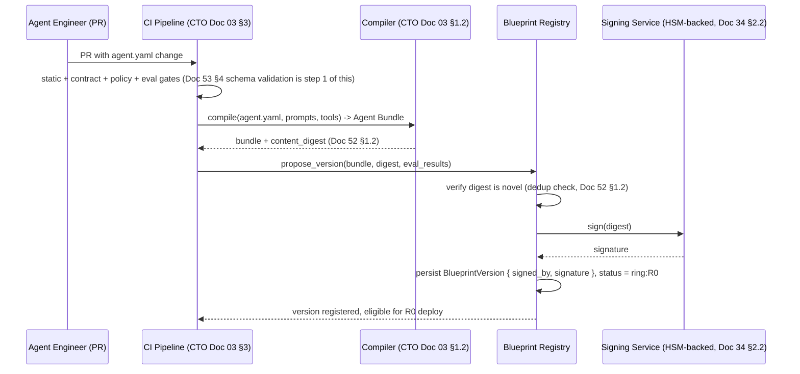
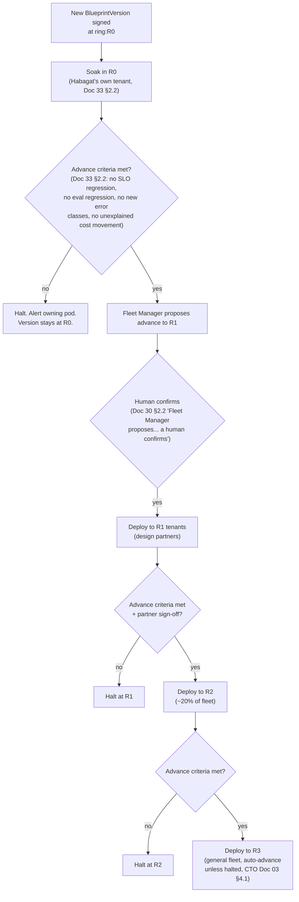
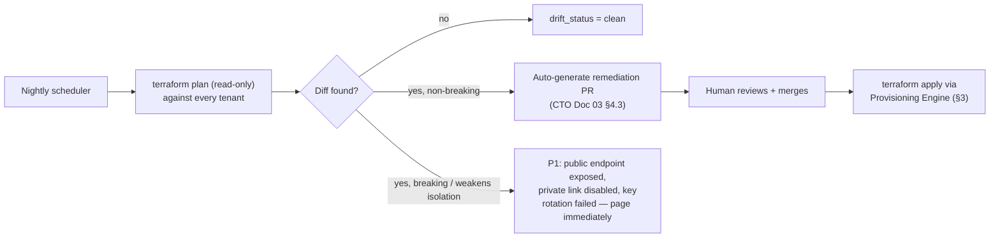
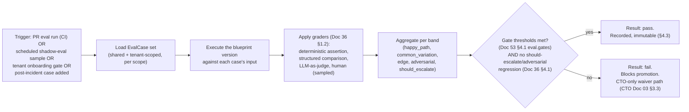
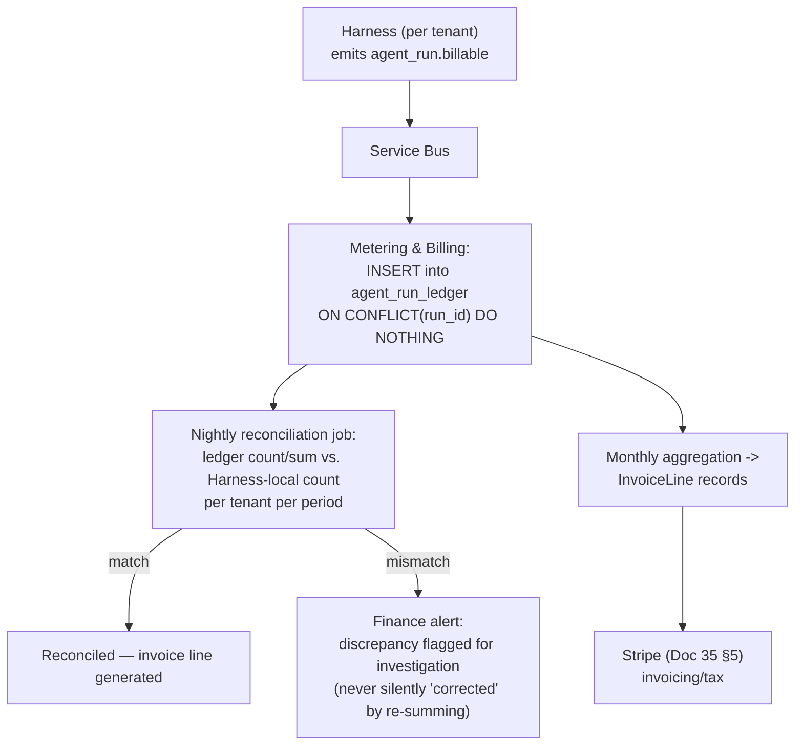

# Document 55 — Control Plane Design

> Owner: Software Architecture · Status: Engineering standard v1.0
> Depends on: Doc 51 §1 (control-plane deployables), Doc 33 (governance & fleet management — this document implements it), Doc 52 (domain model), Doc 53 (interfaces)

## Executive take

- **Every control-plane service in this document is designed around one property: it can be down without stopping a single customer agent run.** Doc 34 §7 states this as a business-continuity claim ("tenants continue running"); this document is where that claim is made structurally true, service by service.
- **The Fleet Manager and Provisioning Engine are separate deployables (Doc 51 §1.1) with a joint lifecycle, reconciled by a saga — never by a shared database transaction**, because they run against genuinely different failure domains (an API call vs. a multi-minute `terraform apply`).
- **The Evaluation Service treats a gate result as an immutable fact, never recomputed in place** — a blueprint version's gate history is an append-only ledger, for the same reason billing is: it is evidence, and evidence that can be silently edited is not evidence.
- **Billing correctness comes from an append-only ledger reconciled nightly, not from strong consistency at write time** — this is the concrete design behind CTO Doc 01 bet B10's metering requirement and the aggregate-boundary decision in Doc 52 §2.

---

## 1. Blueprint Registry

### 1.1 Responsibilities

Storage, versioning, signing, promotion, and dependency resolution for `Blueprint` and `BlueprintVersion` (Doc 52 §1.2).

### 1.2 Versioning and signing flow



**The registry never signs an unvalidated bundle.** Signing is the last step, gated on the CI pipeline's full gate sequence (CTO Doc 03 §3.1) having already passed — this is why `BlueprintVersion` is immutable *starting from* the moment it is signed (Doc 52 §1.2): everything that could change about it was decided before that point.

### 1.3 Promotion between rings

Promotion is a **Fleet Manager decision informed by Registry data**, not a Registry-internal state change — the Registry records "this version reached ring X" as a fact after Fleet Manager (§2) has orchestrated the actual rollout and confirmed the ring's advance criteria (Doc 33 §2.2) were met. This keeps the Registry's job narrow (store and serve versions) and the Fleet Manager's job — deciding *when* a version is safe to push further — separate, matching the bounded-context split in Doc 51 §3.

```
POST /v1/blueprints/{id}/versions/{version}/promote
  body: { to_ring: "R1", advance_evidence: { soak_days, eval_delta, incident_count } }
```

The Registry validates the promotion request against a simple invariant — rings only advance forward (`R0 → R1 → R2 → R3`), never skip, never regress via this endpoint (a regression is a *new* version pointing at a prior digest, per Doc 52 §1.2's `superseded_by`, not a ring downgrade of the existing record) — and appends a `promotions` row (Doc 51 §3.2). It does not itself decide *whether* the evidence is sufficient; that decision is made by the Fleet Manager's advance-criteria check (§2.2) before this call is ever made, and the Registry's validation here is a second, independent check that the promotion request is well-formed, not a re-judgment of the evidence.

### 1.4 Dependency resolution

A `BlueprintVersion` references tool versions, a policy bundle version, and an eval suite version (Doc 53 §4.1's `models`, `tools`, `policy.bundle`, `eval.suites` fields). The Registry resolves these at **compile time**, not at deploy time: the Agent Bundle is a fully-resolved, self-contained artifact (CTO Doc 03 §1.4 — "everything downstream... keys off that digest"). This means the Registry never needs to perform live dependency resolution when a tenant's Harness pulls a bundle — it serves an already-flattened artifact, which is both simpler and removes an entire class of "the tenant's dependency resolution disagreed with CI's" bugs.

### 1.5 Storage

Per Doc 52 §3.2/§3.3: `blueprints` and `blueprint_versions` metadata in Azure SQL (relational — a blueprint has many versions, a version has many promotion records, this is a natural join pattern); bundle content in Blob Storage, content-addressed by digest.

---

## 2. Fleet Manager

### 2.1 Tenant inventory model

The Fleet Manager's core data structure is the **fleet coordinate** per tenant (CTO Doc 03 §4.2):

```
FleetCoordinate {
  tenant_id
  platform_version
  blueprint_versions: [{ blueprint_id, version, ring, autonomy_current }]
  model_versions: [{ deployment, provider_version }]
  module_version           # Terraform module version, Doc 32 §3.1
  ring                     # the tenant's own assigned ring for platform changes
  last_reconciled_at
  drift_status: enum(clean, drifting, remediating)
}
```

This is reconciled nightly (and on-demand after any deploy) against: the tenant's own `.habagat-lock` (CTO Doc 03 §1.2), the actual Azure resource state (via Azure Resource Graph queries under the Lighthouse delegation, Doc 32 §1.1), and Azure Policy compliance state (Doc 33 §2.3).

### 2.2 Ring assignment and advance orchestration



**Automated halt criteria** (Doc 33 §2.2, CTO Doc 03 §4.1 §"Automated halt criteria") are evaluated continuously during a soak, not only at the end of it — a mid-soak breach (e.g. task success drops >1.0pp three hours into an R1 soak) halts immediately rather than waiting for the soak window to expire, because CTO Doc 03 §4.1 explicitly lists these as real-time halt triggers, not end-of-soak gates.

### 2.3 Deploying to a tenant: the Fleet Manager ↔ Harness relationship

The Fleet Manager does not deploy code directly — it issues a **deploy intent** to the tenant's Harness (via the same signed-bundle-pull mechanism as Doc 30 §2.1), and the Harness itself performs the load, verifying the signature (Doc 34 §4.3) before activating the new version. This keeps the "control plane never pushes a payload into a data plane" property (Doc 30 §2.1) intact even for deployment: the Fleet Manager's outbound action is a small, content-free instruction ("a new signed bundle is available at digest X, pull it"), and the actual bundle transfer is a pull, over a private endpoint, verified before use.

### 2.4 Drift detection and remediation loop

Implements Doc 33 §2.3 and CTO Doc 03 §4.3 as a concrete nightly job plus continuous checks:



In parallel, a **continuous** check (not nightly) runs the Doc 30 §2.1 isolation canary against every tenant — this is the highest-priority drift check in the system and its failure mode is always P1 with an automatic fleet-freeze consideration (Doc 33 §6, "Isolation canary failure... Automatic SEV-1, automatic fleet freeze on rollouts"), never routed through the ordinary remediation-PR path above.

### 2.5 Storage

`tenants`, `agent_instances`, `fleet_coordinates`, `drift_records` in Azure SQL (Doc 52 §3.2) — this is inherently relational data (a tenant has many instances, an instance has a fleet coordinate, drift records reference a tenant and a resource) and benefits from SQL's join and transactional-update guarantees for the ring-advance state machine in §2.2, which must not race with itself (two concurrent advance decisions for the same version must not both succeed).

---

## 3. Provisioning Engine

### 3.1 Why it is a separate deployable from Fleet Manager (elaborating Doc 51 §1.1)

A `terraform apply` for a new tenant landing zone (Doc 32 §2) can take from minutes to (in the worst case, waiting on quota approval or a slow customer-side network change, Doc 32 §4) days. The Fleet Manager's API must remain responsive for reads (Console queries, ring-advance checks) regardless of how many provisioning jobs are in flight or stuck. Coupling them into one deployable would mean a stuck Terraform job could degrade the read path every operator and every customer's Console depends on.

### 3.2 The provisioning saga

This is the concrete answer to the open question Doc 51 §5 raised: *how do the Fleet Manager's `Tenant` record and the Provisioning Engine's job state stay consistent when one succeeds and the other doesn't?*

```mermaid
sequenceDiagram
  participant SALES as Sales/Onboarding record created
  participant FM as Fleet Manager
  participant PROV as Provisioning Engine
  participant TF as Terraform
  participant AZ as Azure (customer tenant)

  SALES->>FM: create_tenant(config)
  FM->>FM: Tenant.status = provisioning (Doc 52 §1.2)
  FM->>PROV: provision(tenant_id, config)  [async command, Doc 53 §5.1]
  PROV->>PROV: job.status = running
  PROV->>TF: terraform apply (landing zone, Doc 32 §3)
  alt apply succeeds
    TF-->>PROV: success
    PROV->>PROV: run isolation canary smoke test (Doc 32 §3 step J)
    alt canary passes
      PROV->>FM: tenant.provisioned event (Doc 53 §5.1)
      FM->>FM: Tenant.status = active
    else canary fails
      PROV->>PROV: job.status = failed (canary)
      PROV->>FM: tenant.status_changed { status: provisioning_failed }
      FM->>FM: Tenant.status stays provisioning; alert raised
    end
  else apply fails
    TF-->>PROV: error (e.g. quota exhausted, Doc 32 §5)
    PROV->>PROV: job.status = failed
    PROV->>PROV: attempt terraform destroy (cleanup partial resources)
    PROV->>FM: tenant.status_changed { status: provisioning_failed, reason }
    FM->>FM: Tenant.status stays provisioning; alert raised; NO manual retry of\n     half-applied state — always destroy-and-restart, never patch-forward
  end
```

**The compensating rule for a failed apply, stated explicitly (mirroring Doc 54 §3's saga design for run-level compensation, applied at the infrastructure level):** a partially-applied Terraform plan is never manually patched forward. The Provisioning Engine's failure handler always attempts a full `terraform destroy` of whatever was created before surfacing the failure, because a landing zone in an unknown partial state is exactly the kind of "snowflake" the zero-snowflake rule (Doc 30 §4.2) exists to prevent — better to restart cleanly from a known-empty state than to reconcile an ambiguous one.

**Idempotency of the whole saga:** `provision(tenant_id, config)` is itself idempotent on `tenant_id` — a retried provisioning command (e.g. after a Provisioning Engine restart mid-job) checks the existing Terraform state before reapplying, so a crash mid-provisioning resumes rather than duplicates, exactly as Doc 52 §2's "eventually consistent with the Provisioning Engine's job state" describes.

### 3.3 Storage

Provisioning job state in Azure SQL (small table: `job_id, tenant_id, status, started_at, completed_at, failure_reason`); Terraform state itself in the Habagat-controlled backend described in Doc 32 §3.1, one state file per tenant, never shared.

---

## 4. Evaluation Service

### 4.1 Responsibilities

Corpus storage (for shared-scope cases; tenant-scoped cases stay in the tenant per Doc 52 §3.2), run scheduling for grading jobs, grader execution, result aggregation, and gate evaluation (Doc 36).

### 4.2 The grading pipeline



**Where a grading job actually executes the blueprint version** (the "RUN" step): for shared-scope corpora, this happens in an isolated evaluation environment in the control plane using synthetic/de-identified data (Doc 36 §2.1). For **tenant-scoped** corpora, the grading job must execute against the tenant's own data — this means the grading *compute* runs inside the tenant (invoked by the control-plane Evaluation Service as an orchestrator, but the actual model calls and case content stay in-tenant), and only the **aggregate score** is returned to the control plane (Doc 36 §2.1's "aggregate statistics... reported to the control plane" — same allowlist discipline as Doc 53 §6, applied to eval results).

### 4.3 Gate results are immutable facts

An `EvalResult` (Doc 52 §1.2) is never updated after `graded_at` is set — a re-grade (e.g. because a judge model was recalibrated, Doc 36 §1.2) produces a **new** `EvalResult` row referencing the same `case_id` and `blueprint_version`, never an edit to the old one. This is the same immutability discipline as `BlueprintVersion` (§1.2) and for the same reason: gate history is the evidence a customer's AI Council and a regulator both rely on (Doc 33 §1.4 promotion gate, Doc 34 §6 isolation evidence pack), and evidence that can be silently rewritten is not evidence.

### 4.4 Judge calibration as a tracked entity

Per Doc 36 §1.2's rule that an LLM judge "must itself be validated against human grading, and re-validated when the judge model changes": the Evaluation Service stores a `judge_calibration` record (`judge_version, human_agreement_kappa, calibrated_at, sample_size`) and **refuses to accept a grading run's LLM-as-judge scores as gate-eligible** if the judge version used has no calibration record meeting the κ ≥ 0.75 bar from CTO Doc 01's Trial-ring criteria — this is a hard check in the `GATECHECK` step above, not a reporting-only metric.

### 4.5 Storage

Per Doc 52 §3.2/§3.3: shared `eval_cases` metadata + `eval_results` + `gate_history` in Azure SQL; shared corpus fixture content in Blob; tenant-scoped cases entirely in the tenant (Doc 52 open question 3 flags the exact tenant-side storage engine as still to be finalized — this document does not resolve it, consistent with that flag).

---

## 5. Metering & Billing

### 5.1 Why append-only, and why reconciled rather than transactionally exact at write time

Billing correctness has two competing needs: (a) it must never double-charge or silently lose a billable event, and (b) the event source (the Harness, inside a tenant, per Doc 51 §2.1) delivers events at-least-once over an asynchronous channel that can, in principle, deliver duplicates or arrive out of order. The standard resolution — and the one we adopt — is **not** to try to make the write path perfectly exactly-once (which would require a distributed transaction across the tenant and the control plane, violating the isolation boundary and the async-by-default rule in Doc 51 §2.1). Instead:

1. Every `agent_run.billable` event (Doc 53 §5.1) is inserted into an **append-only ledger table**, keyed uniquely on `run_id` (a natural idempotency key — a run bills exactly once, ever).
2. A duplicate delivery of the same event is a no-op insert (unique constraint violation, caught and discarded, not an error).
3. **Nothing in this table is ever `UPDATE`d.** A correction (e.g., a cost recalculation after a billing dispute) is a new row with a `correction_of` reference to the original, never an edit — this produces a complete, auditable history of every billing decision ever made about a run, which is what a finance team and a customer dispute process both need.
4. **Nightly reconciliation** compares the ledger's row count and sum per tenant against the Harness's own local run count for the same period (the Harness retains this locally per its own retention policy, Doc 31 §2.7) — a discrepancy beyond a small tolerance opens a finance-facing alert, the billing equivalent of the drift detection in §2.4.



### 5.2 Metering schema (elaborating Doc 52 §1.2's Billing entities)

```
agent_run_ledger {                        # append-only, unique on run_id
  ledger_id: string (PK)
  run_id: string (UNIQUE)
  tenant_id: string
  agent_id: string
  blueprint_version: string
  outcome: enum(committed, escalated, failed, cancelled)
  cost_usd: decimal                       # Habagat's COGS for this run (CTO Doc 04 §4.1)
  billable: bool                          # e.g. a `failed` run before any tool call may be non-billable per contract
  recorded_at: timestamp
  correction_of: nullable FK -> agent_run_ledger.ledger_id
}

invoice_lines {
  line_id: string
  tenant_id: string
  period: string (YYYY-MM)
  line_type: enum(platform_fee, agent_subscription, run_usage)
  quantity: int
  unit_price_usd: decimal
  total_usd: decimal
  generated_from: [ledger_id]              # traceability back to source events
}
```

**What "billable" encodes:** per CTO Doc 04 §4.1's SKU distinction (customer-reviewed vs. Habagat-managed review), the pricing model in Doc 40 §1 (platform fee + agent subscription + usage), and contract-specific terms (e.g., a run that fails before any tool executes may be contractually non-billable) — this is a per-tenant-plan rule evaluated at ledger-insert time from `tenant_plans` (§5.1's schema), not hardcoded.

### 5.3 Tests

- **Duplicate-delivery test**: submit the same `agent_run.billable` event twice; assert exactly one ledger row.
- **Never-updated test**: a static-analysis / code-review check (and a runtime assertion in the data-access layer) that no code path issues an `UPDATE` or `DELETE` against `agent_run_ledger` — only `INSERT`.
- **Reconciliation discrepancy test**: seed a Harness-local count that disagrees with the ledger; assert the nightly job raises an alert and does **not** auto-correct the ledger.

---

## 6. The Habagat Console: information architecture

Full UX design is Doc 56's responsibility; this section specifies what the Console reads and writes, so Docs 55 and 56 agree on the seam.

### 6.1 Two audiences, shared backend, per Doc 53 §1.1

| Console surface | Reads from | Writes to |
|---|---|---|
| **Internal** (Habagat operators) | Blueprint Registry (versions, promotions), Fleet Manager (inventory, drift, SLOs), Evaluation Service (gate history) | Blueprint Registry (promote), Fleet Manager (confirm ring advance, Doc 33 §2.2), Provisioning Engine (trigger provisioning) |
| **Customer** (AI Council members, Doc 33 §1.1) | Fleet Manager (their own tenant's agent inventory, autonomy levels), Harness (run history via the tenant's own API, Doc 53 §2.2), Escalation Manager (approval queue), Billing (their own usage) | Harness (policy adjustments — downward only without gate, Doc 33 §4; escalation decisions, Doc 53 §2.3; kill switch, Doc 53 §5.1) |

### 6.2 The model card surface (Doc 33 §4 "sleeper feature")

A model card is **generated, not authored** — it is assembled by the Console's backend from data already held by three services: the Blueprint Registry (what the agent does, from `spec.objective`), the Evaluation Service (evaluation results by band, known limitations inferred from the should-escalate band's cases), and the Fleet Manager (current autonomy level, human oversight design from the policy bundle). This means a model card is always current with zero authoring effort — the same principle as Doc 36 §5's "produced automatically, per agent, per version."

### 6.3 The audit export surface

```
POST /v1/tenants/{tenant_id}/audit-export
  body: { from_date, to_date, format: "json" | "csv" }
  -> { export_job_id }

GET /v1/tenants/{tenant_id}/audit-export/{export_job_id}
  -> { status: "running" | "ready" | "failed", download_url (SAS, time-limited) }
```

This is an **asynchronous job** (Doc 51 §2.1's rule for anything that can take more than a request/response cycle — a large tenant's full audit history can be substantial) that reads from the tenant's own `AuditEvent` store (Doc 52 §1.2) — never from any control-plane copy, because none exists (Doc 52 §4). The export runs *inside the tenant's* Harness deployment (as a background job the Harness performs, not a control-plane service reaching into tenant storage), consistent with the isolation boundary — the Console merely triggers it and retrieves a time-limited download link once ready.

---

## Open questions and decisions required

1. **Tenant-scoped evaluation compute placement (§4.2)** — this document states that tenant-scoped grading "compute runs inside the tenant" but does not fully specify whether this is a temporary job the control-plane Evaluation Service deploys into the tenant per run, or a standing capability of the Harness itself (a `POST /internal/v1/evaluate` endpoint alongside the trigger-ingestion endpoint in Doc 53 §2). Recommend the latter — it reuses the Harness's existing model-calling and tool-calling infrastructure rather than introducing a second execution path — but this should be confirmed and added to Doc 53 §2 as an explicit endpoint.
2. **Provisioning Engine retry policy after a quota-exhaustion failure (§3.2)** — the saga currently destroys and requires a full restart on any apply failure, including quota exhaustion, which per Doc 32 §5 is "a lead-time item" that may simply need waiting for, not destroying and redoing from scratch. Recommend a distinction between *transient/waitable* failures (quota pending — pause the job, do not destroy) and *structural* failures (bad config, conflicting resource names — destroy and restart), which this document did not have space to fully design. Flagging for a follow-up revision of §3.2.
3. **No conflict found with binding constraints.** The Provisioning Engine's destroy-and-restart rule (§3.2) is a direct extension of the zero-snowflake principle (Doc 30 §4.2) to infrastructure state, which Doc 32 implies ("No portal changes, ever... a tenant that has been hand-edited is no longer a tenant Habagat can operate at fleet cost") but does not itself spell out for the *provisioning failure* case specifically — recommend Doc 32 §3.1 be amended to reference this rule explicitly.
