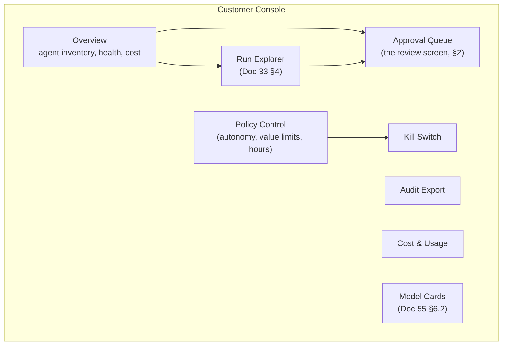
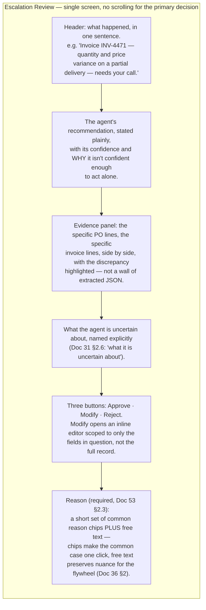
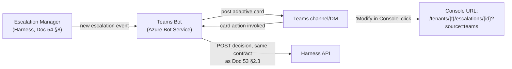
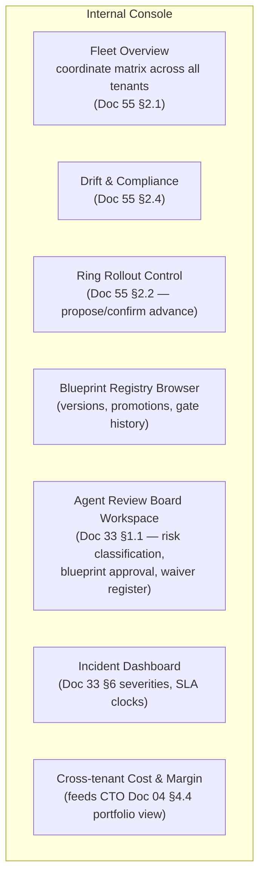

# Document 56 — Frontend & Experience Architecture

> Owner: Software Architecture · Status: Engineering standard v1.0
> Depends on: Doc 51 (Console as a deployable), Doc 55 §6 (Console information architecture — this document is its UX/technical design), Doc 31 §2.6 (Escalation Manager), Doc 33 §4 (customer-facing governance surfaces)

## Executive take

- **The human-review experience is the product at L2 autonomy, not a support screen bolted onto it.** CTO Doc 03 §2 stage 6 requires "100% human review" at canary and Doc 33 §1.4's promotion gate depends on the quality of the decisions made here — a slow, unclear review UI does not just annoy reviewers, it degrades the evaluation corpus (Doc 36 §2) that the entire margin thesis (CTO Doc 04) depends on. We design this screen first and give it the most detail in this document.
- **One React codebase, two builds.** Per Doc 51 §5 open question 1 and Doc 55 §6.1, the internal and customer Consoles share components and design tokens but are separately deployed builds with role-scoped routing — never a single build that shows/hides features by client-side permission check, because that pattern leaks the existence of features a customer's tier doesn't include and is a weaker security boundary than a build-time split.
- **Teams is a first-class delivery surface for approvals, not an afterthought.** Doc 31 §2.6 and Doc 35 §6 both identify Teams as where reviewers already work; the adaptive card and the web Console are two views of the exact same approval contract (Doc 53 §2.3), so a reviewer's choice of surface never changes the outcome or the audit trail.
- **Accessibility is WCAG 2.1 AA, non-negotiable**, because several verticals in Docs 02–21 (public sector, healthcare, education) have customers with statutory accessibility obligations that flow through to any tool their staff use — this is a sales-blocking requirement in those verticals, not a nice-to-have.

---

## 1. The customer console

### 1.1 Framework and architecture

| Choice | Decision | Rationale |
|---|---|---|
| Framework | React 18+, TypeScript | Doc 51 §5 — the team's second language, specifically for UI |
| Rendering | Client-rendered SPA behind the API Gateway (Doc 51 §4.3), not server-rendered | The Console is an authenticated, behind-login application with no SEO requirement and heavy real-time interaction (run explorer, live escalation queue) — server rendering adds complexity (hydration, a Node runtime to operate) with no benefit for this workload |
| State management | Server state via a fetch/cache library (query-and-cache pattern) for all API-backed data (Doc 55 §6.1's read/write table); local UI state (form drafts, modal visibility) in component state only — no global client-side store duplicating server state | The Console is fundamentally a set of views over Doc 55's backend services; a heavyweight global store invites the state going stale relative to the source of truth, which is exactly the wrong failure mode for a compliance-facing audit tool |
| Auth flow | Entra ID via the standard authorization-code-with-PKCE flow (MSAL library), tokens held in memory only (never `localStorage`) | Matches Doc 53 §1.4's "Entra ID bearer tokens exclusively"; in-memory-only token storage is the standard mitigation against token theft via XSS, appropriate given this application holds audit and policy data |
| Real-time updates | Server-Sent Events (SSE) from the Fleet Manager / Escalation Manager for the live queue (§2) and run-status views; not WebSockets | The Console's real-time needs are all server-to-client push (a new escalation arrived, a run's status changed) with no client-to-server streaming requirement — SSE is simpler to operate (works over standard HTTP/2, no separate protocol) and sufficient |

### 1.2 Accessibility standard

**WCAG 2.1 Level AA**, verified by: automated checks in CI (axe-core or equivalent, run against every component in the design system per §5.2) plus a manual audit before each major release. Concretely, this commits the Console to: full keyboard operability (§2.4 makes this explicit for the review screen specifically), visible focus states on every interactive element, sufficient color contrast for both themes, and screen-reader-compatible labeling on every data table and form control — the run explorer's tables and the review screen's evidence panels are the two highest-risk surfaces and receive dedicated audit attention.

### 1.3 Information architecture (elaborating Doc 55 §6.1)



`Overview` is the landing page and is deliberately not a dashboard-of-everything — it surfaces exactly three things: agents currently needing attention (queue depth, any drift or SLO breach on Fleet Manager's tenant-scoped view), this month's cost-to-date against the plan, and any open incident affecting this tenant. Everything else is one click away, not crammed onto the first screen.

---

## 2. The human-review experience

This is the screen the Escalation Manager (Doc 31 §2.6, Doc 54 §8) exists to serve, and it is designed to the standard Doc 31 §2.6 sets: *"the reviewer decides in seconds rather than re-investigating."*

### 2.1 What "seconds, not minutes" requires structurally

A reviewer opening an escalation must never need to open a second tool, ask a colleague, or scroll through raw logs to understand what happened. The `EvidenceAssembler` (Doc 54 §8.1) is designed backward from this screen's layout — the payload it assembles is exactly what this screen needs, in the order this screen presents it, not a generic dump of run internals.

### 2.2 Screen layout



### 2.3 Reason capture design (the flywheel interface)

Doc 36 §2's flywheel depends on every escalation decision producing a labeled case, and Doc 52 §1.2 makes `decision_reason` a mandatory field. The UX risk is that a mandatory free-text field becomes a rushed, low-quality "n/a" from a busy reviewer — which would produce a corpus of noise, defeating the entire purpose. The design response:

- **Reason chips are pre-populated from the escalation's own `reason` enum** (Doc 52 §1.2: `low_confidence`, `out_of_policy`, `hard_rule_failed`, `tool_denied`, `budget_exhausted`) plus blueprint-specific common reasons mined from *prior* decisions on this blueprint (a self-improving suggestion list — the more decisions are made, the better the chip suggestions get, which is itself a small instance of the flywheel operating on the UI's own suggestions).
- **A chip selection auto-fills a well-formed sentence** the reviewer can edit rather than write from scratch (e.g. selecting "Partial delivery, price changed mid-shipment" produces "Rejected the auto-post because the delivered quantity (600/1000) and the invoiced unit price ($4.35 vs PO $4.20) both changed — this needs a commercial decision, not just a data fix.") — this converts the mandatory-field friction point into a one-click-plus-edit action for the common case, while free text remains fully available for the genuinely novel case.
- **Chips are versioned per blueprint** alongside the blueprint itself (CTO Doc 03 §1.2), so a chip vocabulary evolves through the same review process as prompts and tools — a chip is, in effect, a small piece of the Agent Factory's accumulated domain knowledge (CTO Doc 01 §2.2).

### 2.4 Keyboard-first interaction

A reviewer processing dozens of escalations a day should rarely need a mouse:

| Key | Action |
|---|---|
| `A` | Approve |
| `M` | Open Modify editor (focus on first editable field) |
| `R` | Reject |
| `1`–`9` | Select the Nth reason chip |
| `Enter` | Confirm the current action (after a reason is set) |
| `J` / `K` | Next / previous escalation in the queue |
| `?` | Show this shortcut list |

Every action above has an equivalent mouse/touch affordance (per the accessibility standard, §1.2) — keyboard shortcuts are an acceleration layer, never the only way to act.

### 2.5 What this screen deliberately does not do

- It does not let a reviewer approve without engaging with the evidence panel — the Approve/Modify/Reject buttons are disabled until the evidence panel has been scrolled into view or a minimum dwell time has passed (a soft nudge against rubber-stamping, not a hard block, since a genuinely obvious case should be fast to approve — but the design tracks and reports an unusually low median dwell time per reviewer as a *quality signal* to the reviewer's team lead, not a blocking gate, matching Doc 33 §1.4's "escalation quality... over-escalation is a failure mode too," applied here to *under*-scrutiny as its mirror-image risk).
- It does not show the reviewer other tenants' data, other reviewers' pending items, or any control-plane-only information (Doc 52 §4) — the screen is scoped entirely to this tenant's Escalation Manager data.

---

## 3. Teams integration

### 3.1 Why Teams, and what it is a view of

Doc 31 §2.6 identifies Teams as a delivery surface "where the work already happens." The Teams adaptive card is **not a separate feature with its own logic** — it is a compact rendering of the same `Escalation` resource (Doc 52 §1.2) and calls the same decision endpoint (Doc 53 §2.3) as the web Console's review screen (§2). This is the concrete implementation of "one contract, two front ends" stated in Doc 53 §2.3.

### 3.2 Adaptive card design

```
┌─────────────────────────────────────────┐
│ 🔶 Needs your decision                   │
│ Invoice INV-4471 — quantity/price        │
│ variance on partial delivery             │
│                                           │
│ Agent recommends: Escalate               │
│ Confidence: 0.71 (below 0.90 threshold)  │
│                                           │
│ PO: 1000 @ $4.20   Invoiced: 600 @ $4.35 │
│                                           │
│ [Approve]  [Modify in Console]  [Reject] │
└─────────────────────────────────────────┘
```

**Design constraint:** the card shows enough of the evidence panel (§2.2) to make the *common* decision without leaving Teams (a compact version of the PO/invoice comparison), but `Modify` always deep-links to the full web Console (§3.3) rather than attempting to replicate the inline field editor inside the card's limited interaction model — adaptive cards are good at binary/small-choice decisions and poor at structured multi-field editing, so we play to that strength rather than forcing a bad editing experience into a card.

**Reason capture in the card:** `Approve` and `Reject` present a condensed reason-chip picker (top 3 chips only, per §2.3's self-improving list) inline in the card's follow-up prompt; selecting "other" or wanting free text deep-links to the Console. This keeps the *fast path* fast in Teams while never allowing a decision through without a reason (Doc 53 §2.3's server-side validation applies identically regardless of which client called it).

### 3.3 Bot architecture and deep-linking



The bot is a thin Azure Bot Service integration with no business logic of its own — it translates a Teams card action into the exact same API call (§3.2, Doc 53 §2.3) a web-Console button press would make, and translates the API response back into a card update (e.g., "✅ Approved by Priya at 14:32"). This thinness is deliberate: any decision logic living in the bot rather than in the Harness's Escalation Manager would create a second, divergent code path for a safety-relevant decision.

---

## 4. The internal operator console

### 4.1 Purpose and audience

Fleet operations (Doc 33 §2, Doc 55 §2) — the view a Habagat engineer or the Agent Review Board (Doc 33 §1.1) uses to manage the fleet, not any individual tenant's day-to-day.

### 4.2 Information architecture



**`Fleet Overview` is the operator's equivalent of the customer Console's `Home`** — one screen answering "is the fleet healthy," with drill-down into any tenant that isn't. It shows the fleet coordinate matrix (Doc 55 §2.1) as a grid: tenants as rows, `{platform version, blueprint versions, ring, drift status}` as columns, with any red cell (drift, an SLO breach, stale eval currency per Doc 33 §2.4) immediately visible without opening a detail view — this is the screen that makes CTO Doc 01 risk R2 (fleet entropy) *visible* daily rather than discovered at 25 tenants.

### 4.3 The waiver register (CTO Doc 03 §3.3 rule 6, made concrete)

A dedicated, always-visible widget on the Review Board Workspace listing every active eval-gate waiver, its expiry date, the named risk, and the compensating control — because CTO Doc 03 §1's board-reporting commitment ("the waiver register is reported to the board quarterly") requires the register to actually exist as queryable data, not just as a policy. An expiring waiver surfaces here with escalating visual urgency in the 7 days before expiry, since an expired, un-renewed waiver reverts the blocked gate to blocking (per CTO Doc 01 bet B5) and a pod should never be surprised by that.

---

## 5. Design system approach

### 5.1 One design system, two brand contexts

A single component library (built once, per Doc 51 §5 — "shared components") with a small theming layer distinguishing the internal operator context (denser, more data-per-screen, no need for the softened tone a customer-facing screen needs) from the customer context (more whitespace, plainer language, WCAG AA enforced with zero exceptions since the internal tool has a captive, trained audience while the customer tool does not get that latitude).

### 5.2 Component strategy

| Layer | Approach |
|---|---|
| **Primitives** | Built on a headless, accessible component foundation (unstyled behavior + ARIA correctness out of the box) rather than a fully-styled component kit — this keeps the visual language ours while not reinventing keyboard navigation and focus management from scratch, which is exactly the kind of undifferentiated work Doc 51 §5's build-vs-buy discipline argues against reimplementing |
| **Composite components** | Built in-house: the evidence panel (§2.2), the fleet coordinate matrix (§4.2), the reason-chip picker (§2.3) — these encode domain-specific interaction patterns no off-the-shelf kit provides, and they are exactly where the "product is the review experience" investment (this document's Executive take) concentrates |
| **Data visualization** | A single charting approach used consistently for cost trends, eval score trendlines (Doc 33 §2.4), and drift-over-time — visual consistency here matters because an operator moving between the fleet dashboard and a single blueprint's eval history should read the same chart grammar in both places |
| **Testing** | Every composite component has a visual regression test and an accessibility test (axe-core) in CI, gating merges — matching the "automated checks in CI" commitment in §1.2 |

---

## Open questions and decisions required

1. **SSE vs. a managed real-time service** (§1.1) — this document chose SSE over Azure Web PubSub or a similar managed service for simplicity; if the customer Console's concurrent-connection count grows large enough that connection management becomes an operational burden inside the Harness (which would be serving these connections per Doc 51 §4.2's container diagram), revisit in favor of a managed service. Flagging as a scaling threshold to watch, not a current problem.
2. **Rubber-stamping soft-nudge calibration** (§2.5) — the "unusually low median dwell time" threshold needs real usage data to set sensibly; an initial value should be treated as provisional and tuned once the first design-partner tenants (Doc 33 §2.2 ring R1) generate real review-time data.
3. **No conflict found with binding constraints.** This document's Teams/Console dual-surface design is a direct, literal implementation of Doc 31 §2.6's stated delivery surfaces and Doc 53 §2.3's single decision contract; no new autonomy, blast-radius, or tool-risk concept is introduced — the Console only ever exercises capabilities (policy adjustment downward, escalation decisions, kill switch) already defined as customer-permitted actions in Doc 33 §4.
