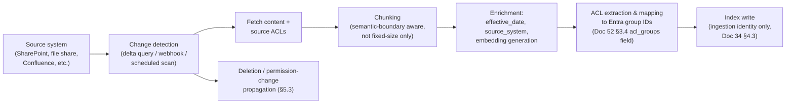

# Document 57 — Integration & Connector Framework

> Owner: Software Architecture · Status: Engineering standard v1.0
> Depends on: Doc 53 §3 (Tool Interface contract — every connector is a tool), Doc 32 §4 (connectivity patterns), Doc 34 §2 (identity), CTO Doc 01 §3 item 12 (MCP-first strategy)

## Executive take

- **A connector is a Tool Interface implementation (Doc 53 §3.1) plus a network path (Doc 32 §4) plus a credential lifecycle (§2 below). Nothing more.** Keeping this definition narrow is what lets a connector be built in "days per connector" (Doc 51 §5's build-vs-buy summary) rather than becoming a bespoke integration project each time.
- **MCP servers first, for the systems the ecosystem already covers; hand-built connectors for the long tail our verticals need and nobody else will build** (CTO Doc 01 §3 item 12). This document gives the concrete promotion rule for when a connector graduates from "module inside the Tool Gateway" (Doc 51 §1.2) to "its own container" — the threshold Doc 51 §5 flagged as needing a real answer.
- **Deletion propagation in the ingestion pipeline is the single most commonly-missed piece of this framework, and the one most likely to become a real security bug if skipped** (Doc 30 §6 flags it explicitly). We specify it completely in §5, including the case everyone forgets: a permission *revocation* that isn't a deletion at all.
- **Connectors are tested against recorded fixtures, never against a customer's live system**, because Doc 51 §4.2 states "no Habagat engineer has standing access to customer production data" and a connector test suite that required such access would quietly violate that on every CI run.

---

## 1. The connector framework

### 1.1 What a connector author must implement

Exactly four things, matching the Tool Interface contract's structure (Doc 53 §3.1) plus the operational concerns Doc 31 §2.3 assigns to the Tool Gateway:

| Component | Contract | Who owns it once shipped |
|---|---|---|
| **Tool declaration(s)** | One or more entries conforming to Doc 53 §3.1's schema — `input_schema`, `output_schema`, `risk_class`, and (for R2) a `compensating_action` | The connector author, versioned in the platform monorepo (CTO Doc 03 §1.2 `tools/`) |
| **Execution adapter** | A function/class implementing `execute(arguments, credential) -> result`, called by the Tool Gateway's dispatch (Doc 54 §5.2) after policy, rate-limit, and circuit-breaker checks have already passed | The connector author |
| **Credential resolution** | Declares its `auth_mode` (Doc 53 §3.1: `delegated`, `service_principal`, `managed_identity`) and, for `service_principal` mode, the specific scopes/roles it needs (least privilege, Doc 34 §2.1 principle 3) | The connector author declares; the AuthBroker (Doc 54 §5.1) resolves at runtime |
| **Fixture set for testing** | Recorded request/response pairs covering success, each documented error mode, and at least one malformed/adversarial response (§6) | The connector author, required before merge |

### 1.2 The promotion rule: module vs. own container

Doc 51 §1.1 left most connectors as modules inside the Tool Gateway and deferred the exact promotion threshold to this document. The rule:

| Condition (any one triggers promotion) | Threshold |
|---|---|
| Sustained call volume | > 50 calls/minute sustained for any single tenant (a level at which the connector's own resource use — connection pooling, response parsing — starts to matter for the shared Tool Gateway process's resource budget) |
| Risk class and reach | Any **R2 or R3** tool touching a top-tier ERP/CRM system (SAP, Oracle, Salesforce, Workday — the systems named across Docs 02–21's most common `Systems & tools` entries) — these get dedicated containers regardless of volume, because their blast radius and their own maintenance cadence (frequent API version changes) warrant independent deployment and independent on-call ownership |
| Independent release need | The connector's own SDK/library requires a release cadence out of step with the platform monorepo's (e.g., a vendor SDK with frequent breaking changes) | Promoted to decouple its build/deploy from the Harness's own release train |
| Distinct failure domain | The connector performs blocking or long-running operations (e.g., a batch export from a legacy system that takes minutes) that would tie up Tool Gateway worker threads shared with fast, common tools | Promoted so its own resource contention cannot degrade every other tool call in the same Harness process |

A promoted connector runs as its **own Container Apps deployment inside the tenant** (still within the isolation boundary — it is not a control-plane service), exposed to the Tool Gateway over the tenant's internal network only, and is invoked exactly as any other tool would be from the Gateway's perspective (Doc 54 §5.2's call sequence is unchanged — the Gateway does not know or care whether a tool executes in-process or in a sibling container).

---

## 2. Connector categories with reference implementations

### 2.1 Microsoft Graph (delegated auth reference)

The most common grounding and trigger source across the catalogue (Doc 35 §6 — "the most common trigger source and grounding source in enterprise deployments"; used in UC-X01, UC-X09, UC-X17, and dozens of vertical use cases in Docs 02–21).

| Aspect | Design |
|---|---|
| Auth mode | `delegated` — on-behalf-of flow (Doc 34 §2.1 principle 4), so a Graph call for "search SharePoint" is scoped to exactly what the acting user (Doc 52 §1.2 `Run.trigger.provenance.acting_identity`) can see, which is what makes Doc 30 Rule 1's entitlement-trimmed retrieval work for Graph-sourced content specifically |
| Tools exposed | `graph.search_files`, `graph.read_mail`, `graph.send_teams_message`, `graph.get_calendar_availability` — each a thin, typed wrapper over one Graph API surface, not a single generic "call Graph" tool (a generic passthrough tool would defeat the whole point of Doc 53 §3.1's typed input/output schemas) |
| Risk classes | Reads (`search_files`, `read_mail`) are R0; `send_teams_message` is R1 (writes to a Habagat-facilitated channel, reversible by nature of messaging) or R2 depending on the blueprint's declared use (a message that constitutes a customer-facing commitment might be classified R2 with its own compensating "send correction" tool) |
| Rate limiting | Respects Graph's own throttling headers; the RateLimiter (Doc 54 §5.1) treats a Graph 429 as a signal to back its local token bucket off further than its configured default, not just to retry |

### 2.2 SAP S/4HANA (service-principal, promoted-container reference)

The reference implementation for an R2/R3-heavy ERP connector, matching the `erp.post_invoice` / `erp.release_payment` examples used throughout Docs 30, 31, 53, 54.

| Aspect | Design |
|---|---|
| Deployment | **Promoted to its own container** per §1.2's second rule (top-tier ERP + R2/R3 tools) |
| Auth mode | `service_principal` — SAP's OData services are typically accessed via a technical user, not per-human delegation; the service principal's scope is limited to exactly the OData services the declared tools need (e.g., invoice posting, PO lookup), never a blanket SAP admin role |
| Network | Private Endpoint or VNet peering to the customer's SAP landscape (Doc 32 §4's "Private Endpoint / Private Link" or "VNet peering" rows), never a public SAP Gateway endpoint |
| Tools exposed | `erp.lookup_po` (R0), `erp.three_way_match` (R0, a computed check rather than a raw SAP call — see note below), `erp.post_invoice` (R2, Doc 53 §3.2's worked example), `erp.release_payment` (R3) |
| The `three_way_match` note | This tool is not a single SAP API call but an orchestration of several reads (PO, goods receipt, invoice) plus a comparison performed in the connector's own code — it is R0 because it only reads and computes, never writes, and this classification is what allows it to run without policy friction while still doing meaningful domain work |

### 2.3 Salesforce (delegated auth, SaaS reference)

| Aspect | Design |
|---|---|
| Auth mode | `delegated` where the blueprint acts on behalf of a specific sales rep (e.g., UC-X06 lead scoring reading the rep's own pipeline); `service_principal` where the agent acts as a system-level integration (e.g., UC-X06's enrichment writing back to a shared lead record) |
| Network | Public API + Entra-federated OAuth + IP allowlist (Doc 32 §4's fastest-to-establish pattern — "Modern SaaS... Hours") |
| Tools exposed | `salesforce.get_account`, `salesforce.get_pipeline`, `salesforce.create_lead` (R2, compensator: `salesforce.disqualify_lead`), `salesforce.log_activity` (R1) |

### 2.4 ServiceNow (delegated + service-principal hybrid reference)

| Aspect | Design |
|---|---|
| Auth mode | Hybrid: ticket reads as `delegated` (an agent answering "what's the status of my ticket" acts as the asking user); ticket creation/update as `service_principal` scoped to a specific ITSM integration role, matching UC-X10's design |
| Tools exposed | `servicenow.get_ticket`, `servicenow.create_access_request` (R2, compensator: `servicenow.cancel_request`), `servicenow.apply_remediation` (R2 or R3 depending on the blueprint's declared runbook risk) |

### 2.5 Generic REST connector

For long-tail systems with a conventional REST API and no existing MCP server or Logic Apps connector (CTO Doc 01 §3 item 12's "build for the top 20 systems in our verticals" residual case).

| Aspect | Design |
|---|---|
| Configuration, not code, for the common shape | A declarative adapter: base URL, auth scheme (API key in header, OAuth2 client-credentials, bearer token from Key Vault), and a mapping from the tool's declared `input_schema`/`output_schema` to the target API's actual request/response shape — implemented once as a generic adapter, configured per connector instance, rather than hand-coding a new adapter class for every simple REST system |
| When this is NOT sufficient | Any system requiring multi-step orchestration (like SAP's three-way match, §2.2), non-standard auth, or response shapes that need real transformation logic graduates to a hand-built adapter — the generic REST connector is deliberately for the *simple* long tail only |

### 2.6 Database connector

For customer systems exposing no API at all beyond direct database access (a real and common case per Doc 32 §4's acknowledgment of "legacy systems with no API").

| Aspect | Design |
|---|---|
| Access pattern | **Read-only by default** — a database connector exposes R0 query tools against a defined, reviewed set of views (never arbitrary SQL construction by the model; the model selects from a declared set of parameterized queries, each with its own `input_schema` for parameters) |
| Why no arbitrary SQL | Matches Doc 34 §4.1's "no arbitrary-HTTP tool exists" principle, applied to SQL: an arbitrary-query tool is a generic exfiltration/injection surface exactly like an arbitrary-HTTP tool, and is excluded from the framework's design space entirely, not merely discouraged |
| Writes | If a write-back is genuinely required (rare, and only where the customer's system has no API layer at all), it is implemented as a narrowly-scoped stored-procedure call, declared as an R2/R3 tool exactly like any other write, never as a raw `UPDATE`/`INSERT` construction |
| Network | Private Endpoint or VNet peering only (a database is never exposed publicly for this purpose) |

### 2.7 File/queue drop connector

For the systems Doc 32 §4 calls "ugly, effective, and more common than anyone admits."

| Aspect | Design |
|---|---|
| Pattern | A monitored Blob container or Storage Queue (in the tenant's own storage account) that the customer's legacy system drops files into or picks files up from, on its own schedule; the connector's "tool" is really a trigger adapter (Doc 51 §4.2's trigger layer) plus a read/write tool over that Blob location |
| Idempotency | File-drop patterns are notoriously prone to duplicate processing (the same file re-dropped, or a partial write read mid-transfer); the connector requires a completion marker convention (e.g., a `.done` sentinel file written after the main file completes) and computes its own idempotency key from the file's content hash, not just its name — a file with the same name but different content (a common legacy-system behavior — overwriting a file in place) must not be treated as a duplicate |

---

## 3. Authentication patterns per category

Restating and consolidating §2's per-connector choices as a single decision table, so a new connector author has one place to look:

| Pattern | Use when | Credential source | Identity that appears in the customer system's own logs |
|---|---|---|---|
| **Delegated (on-behalf-of)** | The action is naturally "this specific user, acting" — a search, a read of their own data, an action with individual accountability | Token exchange via Entra OBO flow (Doc 34 §2.1 principle 4), no static credential stored | The acting human user — this is what lets a customer's own audit log show "Priya searched this," not "Habagat's service account searched this" |
| **Service principal** | The action is a system-level integration with no natural single human actor — a scheduled batch job, a system-of-record write the agent performs on the business's behalf rather than any one person's | Key Vault-stored client credential (or certificate), fetched by the Harness's managed identity, rotated automatically (Doc 34 §2.2) | A named, narrowly-scoped service account, distinguishable in the customer's logs from any human user and from other connectors' service accounts (Doc 34 §2.1 principle 3 — "one identity per workload") |
| **Managed identity** | The target is itself an Azure resource in the tenant (e.g., a connector reading from the tenant's own Fabric/OneLake instance, Doc 35 §3) | Azure-native managed identity, no credential material at all | The managed identity's own object ID |

**The credential lifecycle, common to all three patterns:** no connector ever receives a raw credential value in its execution context beyond what it needs for the single call in progress (Doc 31 §2.3 "the model never sees a credential... tool authentication happens in the Tool Gateway"); rotation is automatic (Key Vault-managed for service principals, Entra-managed for OBO tokens and managed identities); and every credential use is logged with the tool call it served (Doc 52 §1.2 `ToolCall` already records `tool_id` and timing — the AuthBroker's resolution is a sub-span of that same trace, per Doc 31 §5's tracing requirements).

---

## 4. Rate limiting, retry, circuit breaking, idempotency, bulk operations

These are Tool Gateway concerns (Doc 54 §5) applied per-connector; this section specifies the connector author's responsibility versus what the framework provides for free.

| Concern | Framework provides | Connector author must specify |
|---|---|---|
| **Rate limiting** | The token-bucket mechanism itself (Doc 54 §5.1 RateLimiter) | The tool declaration's `rate_limit` values (Doc 53 §3.1) — set from the target system's documented limits, not guessed |
| **Retry** | Bounded exponential backoff with jitter, applied generically to any tool call that fails with a retryable error class | Which HTTP status codes / error types are retryable for this specific system (a `409 Conflict` on an idempotent insert might mean "already done, treat as success," while on another system it means "genuine conflict, do not retry blindly") — declared as part of the execution adapter, not left to the framework's generic default |
| **Circuit breaking** | The breaker state machine itself (Doc 54 §5.1 CircuitBreaker) | The failure-count threshold and reset timeout appropriate to this system's known behavior (a flaky but fast-recovering SaaS API warrants a different threshold than a rarely-down but slow-to-recover on-prem system) |
| **Idempotency** | The `idempotency_key = f(run_id, step_number, tool_id)` derivation (Doc 53 §3.3) | Whether the target system accepts an idempotency key natively (pass it through in a header) or requires the Tool Gateway's own deduplication (check-before-dispatch, Doc 53 §3.3's fallback path) — this is a declared property of the connector, checked once during connector review, not decided ad hoc per call |
| **Bulk operations** | Nothing generic — bulk is connector-specific | Where a system supports genuine bulk operations (e.g., batch invoice posting), the connector author decides whether to expose a dedicated bulk tool (with its own risk classification — a bulk R2 write is not automatically "R2 times N," its blast radius may warrant R3 treatment, decided case by case in the Agent Review Board per Doc 33 §1.2) or to rely on the harness issuing individual calls, which is the safer default absent a specific, evaluated reason to do otherwise |

---

## 5. The ingestion pipeline for grounding content

This is the pipeline that populates the Azure AI Search indexes specified in Doc 52 §3.4 — the part of the framework responsible for keeping retrieval both useful and safe.

### 5.1 Pipeline stages

### 5.2 Change detection

Preferred order, matching how quickly and cheaply each source can report changes:

1. **Webhook/subscription** (Microsoft Graph change notifications for SharePoint/OneDrive) — near-real-time, lowest cost.
2. **Delta query** (Graph delta API, or an equivalent incremental-changes API on the source system) — periodic polling that only returns what changed since the last poll, far cheaper than a full rescan.
3. **Full scheduled scan** — the fallback for sources with no incremental API (some legacy document repositories), run on a longer interval (e.g., nightly) and accepted as the source of a longer worst-case staleness window for that specific source, disclosed to the customer as a property of that connector rather than hidden.

### 5.3 Deletion and permission-revocation propagation — the part everyone forgets

Doc 30 §6 flags this explicitly: "incremental indexing; deletion propagation matters and is usually missed." We specify both halves of the problem, because they are distinct failure modes:

**(a) Content deletion.** A document is deleted or moved out of scope at the source. The pipeline's `DELPROP` stage must issue an index delete for every chunk derived from that document — not just stop re-indexing it (a common half-measure that leaves stale chunks servable forever). This requires tracking a `document_id → [chunk_ids]` mapping at ingestion time specifically so deletion can be complete, not partial.

**(b) Permission revocation — the case that is not a deletion at all.** A document is *not* deleted, but a user or group loses access to it at the source (an employee leaves a team, a SharePoint permission is tightened). The document must remain indexed (other, still-entitled users still need to find it) but its `acl_groups` field (Doc 52 §3.4) must be updated to reflect the narrower access — **immediately**, not on the next scheduled reindex, because a stale ACL here is a live, exploitable over-entitlement: a user whose access was revoked at the source could otherwise still retrieve the content through the agent's search tool for as long as the stale index entry persists. This is why change detection (§5.2) must fire on *permission* change events, not only content change events — Graph's change-notification subscriptions support this distinction and the ingestion pipeline subscribes to both.

**The test that proves this works (feeding Doc 58 §7's testing strategy):** an end-to-end integration test that (1) indexes a document accessible to group A, (2) confirms a group-A-scoped retrieval query returns it, (3) revokes the source permission for group A, (4) asserts that within the pipeline's defined propagation SLA, the same retrieval query no longer returns the document. This test is run in CI against a synthetic fixture source, not against any real customer's SharePoint.

### 5.4 Incremental reindexing at scale

For high-volume tenants, a full reindex is never triggered casually (Doc 32 §7's cost model shows Azure AI Search as a real, metered cost line — unnecessary full reindexes are pure waste). The pipeline supports:

- **Incremental upsert** as the default and near-universal path (§5.1's normal flow).
- **Full reindex** reserved for: an index schema change (e.g., adding a new field per Doc 52 §3.4), a source-of-truth reconciliation after a detected inconsistency, or a customer-requested rebuild — always a deliberate, logged, rate-limited operation, never an automatic response to routine drift.

---

## 6. Connector testing strategy

### 6.1 The constraint: no access to customer production systems

Doc 51 §4.2 states "no Habagat engineer has standing access to customer production data," and CTO Doc 03 §3.2's CI test matrix already requires "contract tests against recorded/mocked system responses" for tools generally. This section makes that concrete for connectors specifically.

### 6.2 The fixture-based test pyramid

| Level | What it tests | Fixture source |
|---|---|---|
| **Schema contract tests** | Every declared tool's `input_schema`/`output_schema` round-trips correctly (Doc 54 §5.4) | Synthetic, hand-authored per Doc 53 §3.2's worked-example pattern |
| **Recorded-response tests** | The execution adapter correctly parses real API response shapes, including documented error responses | Recorded once (with the connector author's own test/sandbox account for that system, or the vendor's published API mock/sandbox environment where one exists — e.g., Salesforce and SAP both offer sandbox tenants for exactly this purpose) and replayed thereafter; never live-called in CI |
| **Adversarial/malformed-response tests** | The ResultSanitizer (Doc 54 §5.1) correctly handles a response containing injection-style content (Doc 34 §4.1's "Result sanitisation" control) and the adapter correctly handles a genuinely malformed (not just unexpected) response without crashing the Tool Gateway process | Hand-crafted adversarial fixtures, maintained alongside the connector's happy-path fixtures |
| **Auth failure tests** | Expired token, revoked service principal, insufficient scope — each produces the correct, specific error surfaced to the Run Manager (Doc 54 §2.3's failure-mode table), not a generic failure that obscures the cause | Synthetic — the fixture is the *shape* of an auth failure response from that system's API, not a real expired credential |
| **Rate-limit/circuit-breaker tests** | §4's configured thresholds actually trigger the expected backoff/circuit-open behavior | Synthetic — a fixture sequence of responses simulating throttling |
| **Deletion-propagation test (ingestion connectors only)** | §5.3's end-to-end test | A synthetic fixture source with controllable permissions, not a real SharePoint tenant |

### 6.3 Staging validation against a real, non-production instance

Per Doc 32 §6's environment table, `Customer staging` uses "customer-provided de-identified or masked data" in a separate resource group within the customer's own subscription — this is the one point in the lifecycle where a connector is validated against something resembling the real target system, and even here it is de-identified data, never live production content, consistent with the fixture-testing philosophy extending as far into the real environment as the isolation and data-protection rules (Doc 34 §3) allow.

---

## Open questions and decisions required

1. **Bulk-operation risk classification (§4)** is left as a case-by-case Agent Review Board decision rather than a fixed rule (e.g., "bulk is always one class higher than the constituent operation"). Recommend the Board establish a standing guideline after the first two or three bulk connectors are reviewed, so this stops being a fresh debate each time.
2. **Generic REST connector's transformation-mapping language (§2.5)** is described functionally ("a mapping from schema to schema") but this document does not specify whether that mapping is expressed as code, a declarative transform spec (e.g., JSONata or similar), or a hybrid. Recommend a declarative spec for auditability (a mapping a non-engineer reviewer can read) unless a specific connector's transformation logic proves too complex to express declaratively, in which case it graduates to a hand-built adapter per §2.5's own escape hatch.
3. **No conflict found with binding constraints.** The read-only default for database connectors (§2.6) and the exclusion of arbitrary-query/arbitrary-HTTP tools are direct extensions of Doc 34 §4.1's "no arbitrary-HTTP tool exists" principle to a second, equally dangerous generic-access pattern (arbitrary SQL) that Doc 34 does not itself mention — recommend Doc 34 §4.1 be amended to name this explicitly alongside the HTTP case, since a future reader of Doc 34 alone would not know the same principle was intended to cover database access.
