# Document 58 — Non-Functional Requirements & SLOs

> Owner: Software Architecture · Status: Engineering standard v1.0
> Depends on: Doc 33 §2.4 (fleet SLOs — this document is the component-level decomposition of those), Doc 34 (threat model — this document traces controls to NFRs), CTO Doc 04 (unit economics — this document's cost NFRs enforce that model at runtime)

## Executive take

- **Every fleet-level SLO in Doc 33 §2.4 is decomposed here into the component-level target that actually produces it** — a fleet SLO like "harness availability ≥99.9%" is not achievable by wishing; it is the product of specific, budgeted targets on the Run Manager, Cosmos DB, and Foundry dependency, given here.
- **Scalability is analyzed as a sequence of specific breaking points, not a single number.** The system that works at 10 tenants breaks in a different place than the system that works at 100, and a different place again at 500 (Doc 51 §5 "isolation fabric operational cost" risk, CTO Doc 01 R2). We name what breaks at each threshold and what must exist before crossing it.
- **Security NFRs are not restated principles — they are traced, control by control, to the specific component that implements each Doc 34 threat-model row**, so a security review can verify the architecture actually does what Doc 34 claims rather than taking the claim on faith.
- **The observability cardinality budget is a real cost control, not a footnote.** Doc 32 §7's $300/month Log Analytics line item is dominated by trace volume; an unbounded label (e.g., embedding a raw invoice number in a metric dimension) can turn that into the largest line in the entire per-tenant cost model, silently.

---

## 1. Performance targets by agent archetype and workload class

Derived from CTO Doc 04 §4.3's three archetypes, translated into latency and throughput targets the harness must actually meet.

| Archetype | Example | Interactive or batch? | p50 run latency target | p95 run latency target | Reasoning |
|---|---|---|---|---|---|
| **A — High-volume/low-complexity** | Document classification, PO matching, email triage (CTO Doc 04 §4.3) | Mostly batch/async; occasionally interactive (a live classification while a user waits) | ≤ 2s | ≤ 5s | Small-tier model calls dominate (CTO Doc 04 §1 table); the run's own orchestration overhead, not model latency, is the binding constraint at this volume, so the target is set tight enough to keep orchestration overhead visible in monitoring rather than lost in model-latency noise |
| **B — Mid** | AP invoice agent, claims triage (the worked example throughout Docs 30/31/53/54) | Mixed — often triggered by an event (an email arriving) with no human waiting synchronously | ≤ 6s | ≤ 20s | Matches the Agent Spec worked example's own declared `p95LatencyMs: 20000` (CTO Doc 03 §1.4) — this is not a new number, it is the existing per-blueprint gate restated as the archetype-level default new blueprints inherit unless they justify otherwise |
| **C — Low-volume/high-complexity** | RFP drafting, complex claim adjudication (CTO Doc 04 §4.3) | Always interactive-adjacent but tolerant of longer completion (a human is not watching a spinner for these) | ≤ 60s | ≤ 300s | Multi-agent, frontier-throughout reasoning (CTO Doc 04 §4.3) genuinely takes longer; the target exists to bound *pathological* slowness (a stuck loop), not to force fast-food-speed reasoning on a task whose value is depth |

**Interactive vs. batch distinction, made concrete:** a run is "interactive" if its trigger provenance (Doc 52 §1.2 `Run.trigger`) indicates a synchronous caller is waiting (a Teams message, a live API call awaiting a response) — these runs get priority queue placement (Doc 54 §10 "Fairness"). A "batch" run (a scheduled reprocessing job, a bulk backfill) has no latency SLO at the individual-run level at all — only a **throughput** SLO (below), because nothing is waiting on any single run's completion.

### 1.1 Throughput targets

| Metric | Target | Reasoning |
|---|---|---|
| Sustained runs/hour per tenant at Standard tier | ≥ 500,000/month capacity headroom (matching CTO Doc 04 §4.2's 50,000/month worked example with 10× headroom for growth without a re-architecture) | Sized so a customer's organic growth within a contract year does not require an infrastructure change, only a scale-out of existing Container Apps replicas |
| Batch backfill throughput | Configurable per job, bounded by the tenant's model quota headroom (Doc 32 §5's 40% headroom SLO) — never permitted to consume quota that would starve interactive traffic | Backfills are explicitly lower priority (Doc 54 §10) |

---

## 2. Scalability targets and bottleneck analysis

This section names, concretely, what breaks first at each scale threshold — directly extending CTO Doc 01 R2's "leading indicators" into an architectural analysis of *why* each threshold is where it is.

### 2.1 At 10 tenants

| What breaks first | Why | What must exist before crossing this threshold |
|---|---|---|
| **Manual ring-advance decisions become a bottleneck** | At 10 tenants, a human confirming every ring advance (Doc 55 §2.2's `CONFIRM1` step) is still tractable by inspection, but the Fleet Overview dashboard (Doc 56 §4.2) must already exist — without it, "is the fleet healthy" requires manually checking 10 tenants one at a time, which is the first crack in the "operate at fleet cost" promise (Doc 30 §8) | Doc 56 §4.2's Fleet Overview screen, even in a minimal form |
| **The first cross-tenant pattern in incident response** | The first time the same defect class appears in two tenants nearly simultaneously, without a mechanism to recognize this, each is investigated as an unrelated SEV-2 | The eval-case-from-incident flywheel (Doc 36 §2, Doc 54 §3.4 point 5) must be operating, not just designed, by this point — it is what turns "two similar incidents" into a recognized pattern rather than two separate investigations |

### 2.2 At 100 tenants

This is the threshold CTO Doc 01 R2 and Doc 33 §2.1 both explicitly design around ("at 100 tenants, the questions that must be answerable in seconds are...").

| What breaks first | Why | What must exist before crossing this threshold |
|---|---|---|
| **Manual ring-advance confirmation no longer scales** | 100 tenants means dozens of blueprint versions in flight through the ring pipeline (Doc 55 §2.2) at any time; a human confirming every single advance becomes the bottleneck on release velocity, directly threatening the "security patch to 100% of fleet in ≤7 days" SLO (CTO Doc 03 §4.1) | An **auto-advance policy for R2→R3** (the largest population, lowest-incremental-risk step) gated purely on the automated halt criteria (CTO Doc 03 §4.1) with no human confirmation required, reserving human confirmation for R0→R1 and R1→R2 where the population and blast radius still warrant it — this is a policy change to Doc 55 §2.2's flow, not a new architectural component, and should be scheduled deliberately rather than discovered under pressure |
| **The nightly drift-detection job's runtime approaches its window** | A `terraform plan` per tenant, run sequentially against 100 tenants, risks not completing before the next business day even at a few minutes each | Parallelized drift checks (bounded concurrency, respecting each tenant's own Azure API rate limits) must be in place — a purely sequential nightly job, fine at 10 tenants, is a scalability defect at 100 |
| **Quota management (Doc 32 §5) becomes a full-time concern** | 100 quota surfaces (one per subscription) means quota exhaustion incidents, absent proactive management, become a recurring rather than occasional event | The "quota as inventory" ledger (Doc 32 §5) must be a live, alerting system by this point, not a spreadsheet — this is explicitly called out in Doc 32 as a practice to adopt, and 100 tenants is where skipping it becomes untenable |
| **Cross-tenant cost/margin analysis by hand becomes impossible** | CTO Doc 04 §4.4's blended portfolio view requires aggregating cost and revenue data across every tenant; doing this by manual export at 100 tenants is a multi-hour exercise repeated monthly | Doc 56 §4.2's Cross-tenant Cost & Margin view must be a live, queryable dashboard, not a manually-assembled spreadsheet |

### 2.3 At 500 tenants

| What breaks first | Why | What must exist before crossing this threshold |
|---|---|---|
| **The Agent Review Board's weekly cadence (Doc 33 §1.1) cannot keep pace with blueprint version volume** | At this scale, with CTO Doc 01's projected 25 archetypes and multiple pods each shipping regularly, the volume of blueprint changes needing Board attention (for Medium/High risk classes, Doc 33 §1.2) can exceed what a weekly meeting can review thoroughly | A **pre-screening automation** that routes genuinely Low-risk changes (per Doc 33 §1.2's risk classification, which is already computed from four objective inputs, not judgement) to a lighter-weight, asynchronous approval path, reserving the live weekly Board session for Medium/High risk items only — this does not weaken the governance model (Doc 33 §1's "the evidence is a document, not an opinion" still holds), it changes the review's *cadence* for the class of changes that were always meant to be lower-friction |
| **Fleet Manager's Azure SQL instance approaches practical query-latency limits for the coordinate-matrix view** | The Fleet Overview screen's grid query (Doc 56 §4.2) joins across `tenants`, `agent_instances`, `fleet_coordinates` for every tenant on every dashboard load; at 500 tenants × multiple agents each, this is a meaningfully larger join than at 100 | A materialized/cached view of the fleet coordinate matrix, refreshed on a short interval rather than computed live on every dashboard load — a standard read-model pattern, not a re-architecture, but one that must be built proactively rather than discovered via a slow dashboard |
| **The isolation canary's own execution time and cost become non-trivial** | Running a canary check against 500 separate tenants, each requiring its own Lighthouse-delegated query, is 500× the API calls of running it against 10 | Canary execution must itself be parallelized and rate-aware of the *Habagat-side* Azure API limits (not just each tenant's), which was a non-issue at smaller scale — this is the fleet-operations equivalent of the drift-detection scaling concern at 100 tenants, recurring one order of magnitude up |
| **PTU capacity planning across the fleet's largest tenants becomes a portfolio problem, not a per-tenant one** | CTO Doc 04 §6.1 notes PTU cannot be pooled across tenants (an explicit, accepted cost of single-tenancy); at 500 tenants, several may independently cross the PTU break-even volume around the same time, and Microsoft capacity commitments (Doc 35 §7, CTO Doc 01 §3 "partner-tier relationships") must be planned as a portfolio forecast, not negotiated tenant-by-tenant reactively | The committed-spend/capacity-assurance relationship with Microsoft (CTO Doc 01 Decision 7) must already be in place, sized against a forecast of *how many* tenants are approaching PTU break-even, not negotiated for the first time when the 500th tenant needs it |

---

## 3. Availability, RTO/RPO, and the degradation ladder

### 3.1 Availability targets by component

| Component | Target | Basis |
|---|---|---|
| Habagat Harness (per tenant) | ≥ 99.9% | Matches Doc 33 §2.4's fleet SLO directly — this document confirms it is achievable given Container Apps' own SLA plus the harness's own crash-resume design (Doc 54 §2.3) |
| Blueprint Registry | ≥ 99.5% | Lower than the Harness deliberately — per Doc 55 §1's design, a Registry outage prevents *new* deployments but does not affect any already-running Harness (which has already pulled and cached its signed bundle), so the consequence of a brief Registry outage is "we can't ship today," not "customer agents stop working" |
| Fleet Manager | ≥ 99.5% | Read availability matters for operator visibility, but per Doc 34 §7's business-continuity claim, a Fleet Manager outage has zero effect on any tenant's agent execution — the same asymmetry as the Registry |
| Metering & Billing | ≥ 99.5%, but **correctness over availability** | A brief Billing outage delays ledger writes; the append-only, reconciled design (Doc 55 §5.1) tolerates this because delayed events are still eventually recorded and reconciled — the SLO exists to bound *how* delayed, not to imply strong real-time availability is architecturally required |
| Evaluation Service | ≥ 99.0% | The least availability-sensitive control-plane service — an outage delays CI gate results and shadow-eval sampling but never blocks a live production run (Doc 51 §2.1 explicitly designed evaluation to be off the run's critical path) |

### 3.2 RTO/RPO

| Scenario | RTO | RPO | Basis |
|---|---|---|---|
| Azure region failure (per tenant) | 4 hours | 15 minutes | Directly restated from Doc 32 §5 and Doc 34 §7 — this document confirms these are the binding targets and traces them to the warm-standby design (infrastructure pre-defined in the paired region, state replicated) already specified there |
| Control-plane region failure | 4 hours | 15 minutes | Same target; the control plane is not exempted from disaster recovery planning just because it is less availability-critical minute-to-minute — a control-plane outage lasting days would still eventually threaten fleet operability (no new provisioning, no gate results, growing billing reconciliation backlog) |
| Habagat's own operational failure (company-level) | N/A — this is a business-continuity, not a technical RTO, scenario | N/A | Doc 34 §7's source-escrow and tenant-retention commitments apply; the technical architecture's contribution is exactly the "control plane never touches customer content, tenants keep running independently" property (Doc 30 §2, restated as the load-bearing fact behind Doc 34 §7's "very few AI vendors can say that") |

### 3.3 The degradation ladder

What the system does, in order, as dependencies fail — this elaborates Doc 31's failure-semantics table (§5.1) and CTO Doc 04 §6.2's quota-exhaustion chain into one unified ladder covering every dependency class:

```mermaid
flowchart TB
  L0["Normal operation:<br/>primary model, full autonomy per policy"] --> L1{"Primary model<br/>degraded/unavailable?"}
  L1 -->|yes| L1A["Fall back to certified fallback model<br/>(CTO Doc 03 §1.4 'fallback' field,<br/>bet B4 — pre-evaluated at ≥97% of primary)"]
  L1 -->|no| L2{"Model quota<br/>exhausted (429)?"}
  L1A --> L2
  L2 -->|yes| L2A["Exponential backoff + jitter →<br/>route to fallback model →<br/>queue non-interactive work →<br/>shed to batch (CTO Doc 04 §6.2)"]
  L2 -->|no| L3{"A customer system<br/>(tool target) unavailable?"}
  L2A --> L3
  L3 -->|yes| L3A["Circuit breaker opens for that connector<br/>(Doc 54 §5.1) — affected runs escalate<br/>with reason 'connector_unavailable';<br/>OTHER tools/agents in the same tenant<br/>are unaffected (Doc 31 §3 'Noisy tools')"]
  L3 -->|no| L4{"A control-plane service<br/>(Registry, Fleet Mgr, Billing, Eval)<br/>unavailable?"}
  L3A --> L4
  L4 -->|yes| L4A["Harness continues executing runs normally<br/>(Doc 34 §7) — new blueprint deploys pause,<br/>telemetry/billing events queue locally<br/>and retry, eval sampling pauses"]
  L4 -->|no| L5{"Habagat control-plane region<br/>OR the whole company<br/>is unreachable for an extended period?"}
  L4A --> L5
  L5 -->|yes| L5A["Tenants remain fully operational<br/>(Doc 34 §7) indefinitely, within the<br/>bounds of their already-deployed<br/>blueprint versions and cached policy"]
```

**The design principle this ladder encodes:** at every rung, the system degrades toward **doing less, more slowly, or with more human involvement** — never toward doing the *wrong* thing faster. Rung `L2A`'s "queue non-interactive work" and rung `L3A`'s "escalate rather than guess" are both instances of the same rule already established in Doc 54 §2.3 and Doc 30 §5.1: a stopped or slowed agent is a successful degradation; a confidently wrong one is not.

---

## 4. Security NFRs traced to the Doc 34 threat model, control by control

Doc 34 §1 lists eight threat actors with "primary controls." This table adds the third column Doc 34 does not itself provide: **which specific component, at what specific layer, implements each control** — the traceability a security reviewer needs to verify the architecture rather than the narrative.

| Threat actor (Doc 34 §1) | Primary control (Doc 34 §1) | Implementing component | NFR |
|---|---|---|---|
| External attacker | Private-endpoint-only data plane, no public ingress, Entra-only auth, WAF at APIM | Doc 32 §2.1 landing zone (private endpoints on every PaaS service, enforced by Azure Policy deny effect); API Management (Doc 51 §4.3) | 100% of data-plane services have public network access disabled — a policy compliance metric checked continuously (Doc 55 §2.4), not periodically |
| Malicious insider (Habagat) | Zero standing access; PIM; all access in the customer's audit log; control plane structurally cannot hold payloads | Doc 34 §2 identity architecture (PIM eligible roles); Doc 52 §4 schema-level content exclusion; Doc 53 §6 allowlist enforcement | Zero standing-access grants outstanding at any time (a continuously-checked count, not a point-in-time audit); every Habagat access session has a bounded, logged duration |
| Compromised Habagat supply chain | Signed artifacts, SBOM, ring rollout, two-person review | Doc 55 §1.2 signing flow; Doc 34 §4.3 supply chain controls; CTO Doc 03 §4.1 ring SLOs | No unsigned or single-reviewer-approved artifact ever reaches ring R1 or beyond — a CI gate, not a policy statement |
| Malicious customer user | Agent acts with caller's entitlements; ACL-trimmed retrieval; envelope from caller identity | Doc 54 §4.1 envelope algorithm Step 4; Doc 52 §3.4 ACL fields; Doc 57 §2.1 delegated-auth pattern | Every retrieval call's ACL filter is present — verified by the mandatory contract test referenced in Doc 52 §3.4 |
| Prompt injection via content | Envelope computed before untrusted content is read; non-authoritative tool results; egress allowlist; no arbitrary-HTTP tool | Doc 54 §4.1 (envelope precedes model invocation); Doc 54 §5.1 ResultSanitizer; Doc 57 §2.6's exclusion of arbitrary-query tools | A successful injection is a SEV-1 by definition (Doc 33 §6) regardless of harm — tracked as a zero-tolerance count, mirroring the eval "zero-tolerance metrics" pattern in CTO Doc 03 §3.3 rule 4 |
| Compromised customer system | Ingestion source-authority validation; anomaly detection on retrieval; circuit breakers | Doc 57 §5 ingestion pipeline; Doc 54 §5.1 CircuitBreaker | Ingestion identity is the only identity with index write permission (Doc 52 §3.4) — a distinct, narrowly-scoped identity, checked by RBAC audit |
| Model provider risk | No training on customer data; multi-model portability | Doc 35 §8 dependency risk table; CTO Doc 01 bet B1/B4 (provider-neutral spec, certified fallback) | Quarterly portability test (CTO Doc 01 bet B1) actually executes and passes — tracked as a scheduled, monitored job, not an aspiration |
| Nation-state/regulatory compulsion | Data resides in customer's own tenant and region | Doc 30 P1/P2 (physical isolation); Doc 32's per-tenant subscription model | Structural — no NFR is needed beyond the isolation NFRs already stated, because Habagat genuinely cannot produce data it does not hold |

---

## 5. Observability requirements

### 5.1 Semantic conventions

Built on OpenTelemetry's GenAI semantic conventions (Doc 35 §5, CTO Doc 01 Adopt list), extended with Habagat-specific attributes that do not exist in the standard conventions:

| Span attribute (Habagat extension) | Purpose |
|---|---|
| `habagat.run_id`, `habagat.instance_id`, `habagat.blueprint_version` | Correlates every span back to the domain entities in Doc 52 |
| `habagat.tool.risk_class` | Lets a trace be filtered to "show me every R2/R3 action in this run" — the single most useful filter for an auditor (Doc 31 §5's ten questions) |
| `habagat.policy.envelope_hash` | Links a span to the exact `PolicyEnvelope.inputs_hash` (Doc 52 §1.2) that authorized it — answers Doc 31 §5 question 5 ("which were denied and why") directly from the trace |
| `habagat.verification.decision` | `commit` or `escalate`, attached to the Verifier's span |
| `habagat.cost_usd` | Attached at the span level for every model call and tool call, aggregated to the run level — this is what makes CTO Doc 04's unit-economics model measurable in production, not just modeled on paper |

### 5.2 Required spans per run

Every run produces, at minimum, one span per: trigger ingestion, each model call, each tool call (including denied ones), the verification step, and (if applicable) the escalation and its resolution — this is the literal implementation of Doc 31 §5's "what a good trace looks like" checklist, one span type per question on that list.

### 5.3 The cardinality budget — a real cost control

**The problem, stated concretely:** a span attribute with unbounded cardinality (e.g., `invoice_number` as a tag rather than a log field, or a raw customer identifier used as a metric dimension) causes the underlying time-series/trace-indexing cost to grow with the *number of distinct values*, not the number of events — at scale, this can dominate the Log Analytics cost line (Doc 32 §7's $300/month figure, which explicitly says "dominated by trace volume; tune sampling").

**The rule:** any attribute used as a **metric dimension** (as opposed to a trace span attribute, which is fine to be high-cardinality since traces are not aggregated the same way metrics are) must be drawn from a bounded enumeration — `outcome` (4 values), `risk_class` (4 values), `blueprint_id` (bounded by the number of blueprints in the Factory, not the number of runs), `tenant_id` (bounded by fleet size). **Never**: `run_id`, `invoice_number`, any free-text field, any customer-identifying value, as a metric dimension. This rule is enforced by a lint check on the telemetry-emission code (extending the allowlist enforcement pattern in Doc 53 §6 to metric dimensions specifically, not just cross-boundary event fields) — a metric-emission call with an unbounded-cardinality dimension fails a static check in CI, the same discipline as the schema `additionalProperties: false` pattern used throughout Doc 53.

### 5.4 Retention and sampling

| Data | Hot retention | Sampling | Cold archive |
|---|---|---|---|
| Full trace, per run | Per tenant policy (Doc 32 §3.2 example: 400 days) | `traceLevel: full` by default per the Agent Spec (Doc 53 §4.1), with `sampled` available for very high-volume Archetype-A blueprints where 100% tracing would itself become a meaningful cost line — a deliberate, blueprint-declared trade-off, not a silent platform default | Exported to Blob (Doc 52 §3.3 `{tenant}/traces/...`) past the hot window, per Doc 52 §5's retention table |
| Metrics | 90 days hot (standard Azure Monitor default), aggregated further beyond that | N/A — metrics are pre-aggregated by design (§5.3), so there is no per-event sampling decision to make | Long-term metric trends (e.g., the eval-score trendline in Doc 33 §2.4) are retained as pre-aggregated rollups indefinitely, which is cheap precisely because §5.3's cardinality discipline keeps the rollup's dimensionality bounded |

---

## 6. Cost NFRs

### 6.1 Per-run cost envelope enforcement

This is the runtime enforcement of CTO Doc 04's unit-economics model — the model is only real if the system actually enforces the budgets it assumes.

| Enforcement point | Mechanism | Reference |
|---|---|---|
| Per-run cost ceiling | `Run.budget.max_cost_usd` checked before every step (Doc 54 §2.1 BudgetGuard) | Doc 52 §1.2, Doc 53 §4.1 `budgets.maxCostPerRunUsd` |
| Cost-per-successful-run drift | `costPerSuccessfulRunUsd` in the Agent Spec (Doc 53 §4.1) is a target, not a hard ceiling — but a sustained deviation beyond `alertAtPct` (default 115%, per the worked example in Doc 53 §4.2) opens an alert, treated with the same severity discipline as an accuracy regression (CTO Doc 01 R3 "Cost regressions are treated as defects with the same severity as accuracy regressions") | CTO Doc 04 §5's COGS-reduction-lever framework depends on this signal existing to know *when* a lever is needed |
| Per-tenant monthly cap | A hard stop at the tenant level (Doc 31 §3 "the per-tenant monthly cap is the one that prevents a billing incident") — distinct from the per-run ceiling, this is the backstop against a *pattern* of runs each individually within budget but collectively exceeding what the tenant's plan anticipated | Enforced by the Harness's own aggregate tracking (summing `Run.cost_usd` across the current billing period, checked against `tenant_plans`, Doc 55 §5.2), independent of the control-plane Billing service's own reconciliation (defense in depth: the enforcement that prevents overspend does not wait for the nightly reconciliation job to notice it) |

### 6.2 Enforcement by archetype

| Archetype | Cost NFR |
|---|---|
| A (high-volume) | Cost-per-run ceiling is tight and monitored aggressively — a small per-run drift multiplies across CTO Doc 04 §4.3's 200,000 runs/month, so this archetype's alert threshold (`alertAtPct`) should be set tighter than the default (e.g., 105–110% rather than 115%) |
| B (mid) | The default 115% threshold from the worked example (Doc 53 §4.2) is appropriate |
| C (low-volume/high-complexity) | Per-run cost variance is expected and larger in absolute terms (CTO Doc 04 §4.3's $50.06 COGS/run for archetype C) — the meaningful cost NFR here is **human review minutes per run** (CTO Doc 04 §4.3's note: "cutting review from 60 to 35 minutes... moves margin from 62.9% to 76.8%"), tracked as its own metric on the Escalation Manager (Doc 54 §8), not primarily a token-cost metric |

---

## 7. Testing strategy

| Layer | Test type | Coverage expectation | CI gate |
|---|---|---|---|
| **Unit** | Every pure function in the domain model (Doc 52) and the envelope algorithm (Doc 54 §4.1) | ≥90% line coverage on Policy Engine, Verifier, and Saga Coordinator code specifically (the three subsystems Doc 54 identifies as most safety-critical) — coverage on UI and reporting code is not held to the same bar | Blocks merge |
| **Integration** | Tool Gateway ↔ connector fixture round-trips (Doc 57 §6.2); Harness ↔ Cosmos DB read/write patterns (Doc 52 §3.1) | Every tool declared in the platform monorepo has at least the fixture set required by Doc 57 §1.1 | Blocks merge |
| **Contract** | Schema validation for every API and event contract in Doc 53; the deletion-propagation test (Doc 57 §5.3); the telemetry allowlist test (Doc 53 §6.3) | 100% of declared contracts have a corresponding test — a contract with no test is treated as undeclared | Blocks merge |
| **End-to-end** | Full agent run through the state machine (Doc 54 §2.2), including at least one scenario per terminal state (`committed`, `escalated → committed`, `escalated → failed`, `failed`, `compensating → failed`, `compensation_failed`) | Every terminal state in Doc 54 §2.2's diagram has at least one E2E test reaching it | Blocks merge to `staging` (CTO Doc 03 §2 stage 5) |
| **Evaluation** | The full eval-as-a-gate pipeline (Doc 36, Doc 55 §4) | Per CTO Doc 03 §3.3's rules — ≥150 cases for a new archetype, the five-band distribution (Doc 36 §1) | Blocks ring promotion (Doc 55 §2.2) |
| **Chaos** | Azure Chaos Studio (Doc 35 §5) exercises: Foundry endpoint failure (validates §3.3 rung L1), a customer-system connector timeout (validates rung L3), a control-plane service outage (validates rung L4) | At minimum, one chaos scenario per rung of the degradation ladder (§3.3), run on a defined schedule (not only ad hoc), against a non-production tenant | Reported to the Review Board (Doc 33 §1.1); a failed chaos run for an already-validated rung is treated as a regression, same severity class as an eval regression |
| **Security** | SAST, dependency scanning, IaC scanning, secret scanning (CTO Doc 03 §3.2); prompt-injection adversarial suite (Doc 57 §6.2, Doc 34 §4.1); annual third-party penetration test including agent-specific tests (Doc 34 §6) | Every connector has an adversarial fixture (Doc 57 §6.2); the injection suite runs on every PR and nightly (CTO Doc 03 §3.2) | Blocks merge (SAST/secrets/deps); annual pentest gates the compliance roadmap milestones (Doc 34 §5) rather than individual merges |

---

## Open questions and decisions required

1. **The 500-tenant Agent Review Board pre-screening automation (§2.3)** changes governance cadence for Low-risk changes. This is a process change, not purely a technical one, and should be ratified by the Board itself (Doc 33 §1.1) before it is built, not decided unilaterally in this architecture document — flagging it here as the trigger condition, with the actual policy change deferred to Doc 33's owning body.
2. **Archetype-A trace sampling default (§5.4)** — this document proposes sampling as an available, blueprint-declared option for very high-volume Archetype-A blueprints, but does not set a specific volume threshold at which full tracing should be presumptively switched to sampled. Recommend this be data-driven from the first Archetype-A blueprint's actual Log Analytics cost once in production, rather than guessed here.
3. **No conflict found with binding constraints.** Every SLO and threshold in this document either directly restates a figure already committed in Docs 30–36/CTO 01–06 (traced explicitly throughout) or is a new, additive decomposition consistent with those figures — no target here contradicts a fleet-level SLO in Doc 33 §2.4 or a cost assumption in CTO Doc 04.
