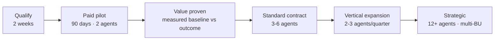

# Document 40 — Business Model & Go-to-Market

> How Habagat prices, sells, delivers and retains — derived directly from the architecture in Documents 30–36 and the use-case catalogue in Documents 01–21.

---

## Executive take

- The commercial unit is the **agent-run**, not the seat. Seat pricing prices the human Habagat is removing from the workflow, which is both illogical and self-limiting. Outcome-linked run pricing scales with the value created.
- Single-tenant architecture creates a **fixed cost floor of roughly $1,100–2,200 per tenant per month** (Document 32 §7). Pricing therefore has two components — a **platform fee** covering the floor and **agent-run fees** covering usage. This is non-negotiable arithmetic, and it should be stated plainly rather than discovered by an investor.
- The motion is **land narrow, prove hard, expand fast**: two horizontal agents in 30 days, a measured ROI in 90, then two to three vertical agents per quarter thereafter. Net revenue retention is the metric the whole company optimises for.
- Habagat's defensibility is not the model. It is the **evaluation corpus, the vertical blueprints, the isolation fabric and the switching cost of an operating agent fleet**. All four compound; none of them can be bought.

---

## 1. Pricing architecture

### 1.1 Three components

| Component | What it covers | Illustrative pricing |
|---|---|---|
| **Platform fee** (per tenant, per month) | The isolated environment, harness, observability, governance surfaces, fleet operations, support | $4,000–15,000/month by tier — must exceed the infrastructure floor with margin |
| **Agent subscription** (per agent, per month) | The blueprint licence, its evaluation corpus, continuous improvement, model card and governance artefacts | $2,000–12,000/month per agent by complexity tier |
| **Agent-run fees** (usage) | Consumption above the included volume | Tiered by archetype — see §1.3 |

**Why three components and not one.** The platform fee covers a real fixed cost and prevents small tenants from being gross-margin negative. The agent subscription monetises the blueprint asset, which is where the intellectual property lives. Run fees align price with value delivered. Collapsing these into a single number always produces a structure that loses money somewhere.

### 1.2 Illustrative packages

| Package | Platform | Agents included | Included runs/month | Indicative annual |
|---|---|---|---|---|
| **Pilot** (90 days) | Included | 2 horizontal | 5,000 | $45,000 (fixed-price pilot) |
| **Standard** | $4,000/mo | 3 | 50,000 | ~$150,000 |
| **Enterprise** | $9,000/mo | 6 | 250,000 | ~$400,000 |
| **Strategic** | $15,000/mo | 12+ | 1,000,000 | $900,000+ |

### 1.3 Run pricing by archetype

Derived from the cost structure: what drives the price is **human review load and reasoning depth**, not tokens.

| Archetype | Example | Cost/run (illustrative) | Price/run | Gross margin |
|---|---|---|---|---|
| **High-volume / low-complexity** | Ticket triage, data-quality checks, document classification | $0.012 | $0.06 | ~80% |
| **Mid** | Invoice processing, KYC refresh, claims document validation | $0.09 | $0.45 | ~80% |
| **Low-volume / high-complexity** | Credit memo preparation, contract review, due diligence | $2.40 | $12.00 | ~80% |

> **The margin discipline that matters.** In the worked model (CTO Document 04), inference is roughly 18% of cost while **human review is roughly 50%**. Therefore the primary margin lever is **autonomy rate**, not token optimisation. Every agent promoted from L2 to L3 moves a large block of cost out of COGS. This single insight should shape the roadmap, the delivery incentives and the investor narrative.

### 1.4 What Habagat should not do

| Anti-pattern | Why |
|---|---|
| **Per-seat pricing** | Prices the humans being removed. Actively penalises success |
| **Pure cost-plus on tokens** | Anchors on the cheapest input and commoditises to zero as models get cheaper |
| **Unlimited-usage flat fee** | The customer's most valuable agent becomes Habagat's largest loss |
| **Pure outcome/gainshare pricing** | Attribution disputes are unwinnable and the sales cycle doubles. Offer an **outcome guarantee** — a credit if a stated metric is not met — rather than a share of savings |
| **Free pilots** | A free pilot has no executive sponsor and no urgency. Charge for the pilot; credit it against the first year |

---

## 2. Go-to-market motion

### 2.1 The landing sequence

| Stage | Duration | Exit criterion | Owner |
|---|---|---|---|
| **Qualify** | 2 weeks | Named executive sponsor; a workflow with a *measurable existing baseline*; Azure access path identified | AE + Solutions Architect |
| **Paid pilot** | 90 days | Two agents live at L2; measured against the pre-agreed baseline | Agent Pod |
| **Prove** | Weeks 10–12 of pilot | A number the CFO accepts: cost per transaction, cycle time, or error rate | AE + Customer sponsor |
| **Land** | Month 4 | Annual contract; 3–6 agents | AE |
| **Expand** | Continuous | 2–3 new agents per quarter; **NRR > 130%** | Customer Success + Agent Pod |

### 2.2 Qualification — what a good customer looks like

| Signal | Why it predicts success |
|---|---|
| A workflow with an **existing measured baseline** | Without a baseline there is no ROI story, only anecdote. This is the single strongest predictor |
| An executive sponsor who owns the cost line | Ensures the project survives the second quarter |
| ≥ 10,000 transactions/month in the target workflow, or ≥ $1,000 value per transaction | Below this the run economics do not justify the fixed floor |
| Existing Azure footprint | Removes weeks of onboarding friction |
| A functioning risk function that engages early | Counter-intuitive but reliable: engaged risk functions close; absent ones ambush at signature |
| Prior failed AI project | They now understand that the hard part is not the model — and they will value the governance |

**Disqualify:** no baseline; no sponsor; "innovation budget" funding; a request for a proof of concept with no defined success criterion; a demand for full autonomy on day one.

### 2.3 Channels

| Channel | Contribution | Notes |
|---|---|---|
| **Direct enterprise sales** | ~50% | The core motion for Standard and above |
| **Microsoft co-sell** | ~25% | Habagat drives Azure consumption inside the customer's subscription, which aligns Microsoft's field incentives directly with Habagat's growth. **The cheapest distribution available to a company this size** |
| **Azure Marketplace / MACC** | Transaction mechanism for the above | Lets customers buy against committed Azure spend — frequently decisive in procurement |
| **Systems integrators** | ~15% | SIs deliver the change management Habagat does not want to own. Careful: they may prefer to sell their own build |
| **Vertical partnerships** | ~10% | Industry software vendors and associations where domain credibility transfers |

---

## 3. Delivery model

| Element | Design |
|---|---|
| **Agent Pod** | The delivery unit: Agent Engineer, Domain SME, Eval Engineer, plus shared SRE and Solutions Architect. See CTO Document 02 for ratios |
| **Time to first agent** | 10 working days from Azure access. This is a contractual commitment and a genuine differentiator against consultancy alternatives |
| **Human review operations** | Habagat-managed by default. It preserves the correction signal (Document 36 §2) and it is the option customers prefer, because they were trying to get out of the work |
| **Customer-managed review** | Offered at a lower price, with the corpus-contribution consequence stated openly |
| **Continuous improvement** | Included in the agent subscription. Every blueprint improves for every customer; this is the recurring-revenue justification |
| **Success measurement** | Quarterly business review against the agreed metrics, using the customer's own data |

---

## 4. Unit economics

> Illustrative, for a **Standard tenant** at ~$150,000 ARR. Substitute your own assumptions; the structure is the point.

| Line | Annual | Notes |
|---|---|---|
| Revenue | $150,000 | |
| Azure infrastructure | $(26,000) | ~$2,160/month (Document 32 §7) |
| Model inference | $(21,600) | ~$1,800/month at 50k runs |
| Human review operations | $(18,000) | Falls sharply as agents promote to L3 |
| Support and success allocation | $(12,000) | |
| **Gross margin** | **$72,400 (48%)** | **Year 1 — the honest number** |
| Gross margin at maturity (year 2+) | ~65–72% | After L3 promotion, caching and small-model routing |

| Metric | Target |
|---|---|
| CAC (enterprise) | $60,000–90,000 |
| CAC payback | < 18 months |
| Net revenue retention | **> 130%** — the expansion motion is the business model |
| Gross retention | > 92% |
| LTV/CAC | > 4× at maturity |

**The two numbers that decide the company:** gross margin trajectory (48% → 70% as autonomy increases) and NRR (>130%). If both hold, the model works at scale. If autonomy stalls at L2 across the fleet, margin stays near 50% and Habagat is a well-run services business rather than a software company. **The roadmap should therefore be biased relentlessly toward the evidence that unlocks L3.**

---

## 5. Competitive positioning

| Competitor type | Their pitch | Habagat's answer |
|---|---|---|
| **Horizontal AI platforms** (build-your-own agent tooling) | "A platform for your team to build agents" | They sell a toolkit and leave the operating burden with the customer. Habagat sells the operated outcome, with an SLA, evaluation and governance. Different buyer, different budget |
| **The hyperscalers themselves** | "Use our agent service directly" | Habagat is built *on* Foundry, not against it. Habagat sells what Microsoft does not: vertical blueprints, evaluation corpora, per-tenant operations and human review. Partner, not competitor |
| **Global systems integrators** | "We'll build it for you" | Bespoke build, per-customer cost, no compounding asset. Habagat's blueprints improve for every customer simultaneously. Positioning: Habagat is the product; the SI is the change-management partner |
| **Vertical AI point solutions** | "The best AI for invoice processing" | Deeper in one workflow. Habagat wins on portfolio, isolation and governance across many workflows — and the third agent costs the customer far less than a third vendor |
| **The customer's own team** | "We'll build this internally" | The most common competitor and the most honest one. Habagat's answer: the evaluation corpus, the governance apparatus, the fleet operations and the accumulated edge cases represent years of work — and the internal team's first agent will not have any of it. Offer to co-build with the customer's team on Habagat's platform |

---

## 6. Why now

| Shift | Consequence |
|---|---|
| **Model capability crossed the reliability threshold** for multi-step tool-using work | Agents became deployable in regulated workflows rather than only in chat |
| **Managed agent runtimes exist** (Foundry Agent Service, MCP, standardised tool calling) | A small team can build a serious platform; three years ago this required an infrastructure company |
| **Enterprise data gravity is in Microsoft 365 and Azure** | The grounding, identity and entitlement layer is already there and already governed |
| **Regulation arrived** (EU AI Act, sector rules) | Governance shifted from a differentiator to a requirement — which advantages the vendor who built it in rather than bolted it on |
| **Buyers have been burned** by pilots that never reached production | The market now values operated outcomes and evidence over demonstrations |

---

## 7. Risks and honest mitigations

| Risk | Severity | Mitigation | Residual |
|---|---|---|---|
| **Autonomy stalls at L2 across the fleet** | Critical — it is the margin thesis | Evaluation investment; shadow-mode discipline; promote the highest-volume agents first | Real. Watch the L3 promotion rate as the leading indicator of the business model |
| **Fleet entropy** — tenants become snowflakes | Critical | Zero-snowflake rule enforced in CI; drift detection; declarative specs | Manageable if enforced from customer one; unrecoverable if allowed to start |
| **Microsoft builds this** | High | Habagat's value is vertical depth, evaluation corpora and operations — the parts platform vendors historically do not build. Stay a partner and drive their consumption | Genuine. Depth is the defence |
| **Single-tenant cost floor** compresses margin in the mid-market | High | Lean tenant profile; platform fee covering the floor; do not sell below the floor | Structural; manage by qualification discipline |
| **An agent causes material customer harm** | High | Blast-radius design, human gates, compensating actions, insurance, contractual liability caps | Reduced, never eliminated. The governance apparatus is the answer, and it is also the sales asset |
| **Model provider concentration** | Medium | Provider-neutral spec; multi-model routing; quarterly portability test | Contained |
| **Buyers commoditise "agents"** as models improve | Medium | Sell the operated system and the evidence, never the model access | The evaluation corpus is the durable answer |
