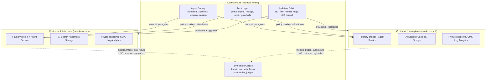

# Habagat — CTO Technical Strategy (FY26 → FY28)

> Owner: CTO · Status: Board draft v1.0 · Horizon: 3 years · Review cadence: quarterly
> All numbers in this document are **illustrative assumptions** unless sourced. Arithmetic is shown so you can substitute your own inputs.

## Executive take

- **We are not selling models. We are selling a bounded, evaluated, auditable unit of work** — an agent that completes a business transaction (an invoice posted, a claim triaged, a permit checked) with a measured accuracy and a per-run price. The model is a component; the *evidence that it works* is the product.
- **Single-tenant is not an operational tax; it is the wedge.** Regulated enterprises in our target markets cannot buy a shared data plane without a 9-month security review. A per-customer Azure subscription with the customer's own keys, network, and logs collapses that review to weeks. The engineering cost of N tenants is real and we neutralize it with an **Isolation Fabric** — provisioning as code, fleet release rings, and drift control — which is itself a moat.
- **Four compounding assets form the moat**: the **Agent Factory** (blueprints), the **Evaluation Corpus** (labeled, domain-specific ground truth), the **Isolation Fabric** (N-tenant automation), and the **Trust Layer** (policy, lineage, guardrails, audit). None of these is downloadable from a model provider; three of them get better with every customer.
- **The core bet is portability at the orchestration seam.** We adopt Azure AI Foundry Agent Service aggressively for speed, but every agent is defined in a provider-neutral **Agent Spec** and every eval runs against an abstract model interface. If Foundry pricing or terms move against us, we re-target the runtime in a quarter, not a year.
- **The biggest risk is not a competitor — it is COGS drift and eval debt.** An agent fleet silently degrades: models are retired, prompts rot, customer data distributions shift, and margins erode by token creep. We build the instrumentation for that on day one, not at 25 customers.

---

## 1. Technical thesis

### 1.1 What structurally changed

Four independent shifts landed within ~18 months. Any one alone is not a company; together they make "agent as a service" newly buildable and newly buyable.

| Shift | What specifically changed | Why it matters commercially |
|---|---|---|
| **Model capability crossed the reliability threshold for bounded work** | Frontier models now do multi-step tool use with recoverable failure, long-context grounding (100k+ tokens usable, not just accepted), and structured output that validates against a schema at >99% on constrained tasks. | We can price per *completed transaction* rather than per seat, because completion is now the common case rather than the lucky case. |
| **Managed agent runtimes arrived (Azure AI Foundry Agent Service)** | Threads, runs, tool invocation, connected tools (Azure AI Search, Bing grounding, Logic Apps/Functions, Fabric), file search, and code interpreter are a managed service inside the customer's own subscription — with identity, networking, and logging inherited from Azure. | Removes ~6–9 engineer-months of undifferentiated runtime work per company, and — critically — lets the *runtime itself* live inside the customer's isolation boundary. |
| **MCP standardized the tool seam** | Model Context Protocol turned "connect the agent to a system" from bespoke glue into a server contract with discovery, typed tools, and auth passthrough. Ecosystem servers exist for the systems our customers already run. | Our connector cost per new customer system drops from weeks to days, and the integration asset is reusable across the fleet instead of being per-customer scar tissue. |
| **Enterprise data gravity is already in Microsoft 365 / Azure** | The documents, the identity graph, the ERP extracts, the data lake, and the compliance posture are already in Entra ID, SharePoint/OneDrive, Fabric/OneLake, and Azure SQL. | The agent that runs *next to* the data avoids the single hardest enterprise sale: "please export your data to my cloud." We sell into an existing security boundary rather than asking for a new one. |

### 1.2 Why *this* shape of company wins now

The market is bifurcating. On one side, horizontal copilots (broad, shallow, seat-priced, bundled by the platform vendors — we cannot win there and will not try). On the other, **workflow-complete vertical agents** where the buyer is a line-of-business owner with a cost center, not IT with a tools budget.

Our thesis in one sentence: **the scarce good is not intelligence, it is the accountable deployment of intelligence inside a regulated boundary, with evidence.**

That decomposes into three things enterprises cannot self-serve:

1. **Evaluation against their own reality.** A generic benchmark says nothing about whether the agent handles *their* vendor invoices with *their* 14 exception types. Building that eval set is 60–70% of the real work of an agent, and it is the part customers most consistently underestimate and least want to do.
2. **Isolation with proof.** Not "we're SOC 2" — but "here is your subscription ID, your Key Vault, your private endpoints, your log workspace, your model deployment, and here is the export of every prompt and completion that touched your data."
3. **Operating the thing after launch.** Models get deprecated on the provider's schedule, not the customer's. Somebody has to re-evaluate, re-baseline, and re-certify the agent every time the substrate moves. That is an ongoing service, and it is why this is a service business and not a software license.

### 1.3 Why single-tenant, explicitly

| Dimension | Multi-tenant shared plane | Habagat single-tenant | Verdict |
|---|---|---|---|
| Security review length | 3–9 months, DPIA, pen-test evidence, subprocessor chain | 2–6 weeks; customer already trusts their own Azure subscription | **Decisive for our ICP** |
| Blast radius of a bug | All customers | One customer | Single-tenant |
| Data residency / sovereignty | Hard; region per tenant means sharding anyway | Native — deploy the tenant in the required region | Single-tenant |
| Per-customer marginal infra cost | Near zero | ~$400–1,500/mo floor (see §COGS in doc 04) | Multi-tenant wins |
| Release velocity | One deploy | N deploys → requires fleet tooling | Multi-tenant wins, unless we build the Fabric |
| Ability to charge enterprise prices | Compressed by commodity comparison | Premium sustained by isolation + SLA | Single-tenant |
| Noisy-neighbor / quota contention | Real, and invisible to the customer | Customer owns their quota | Single-tenant |

We accept the two costs (infra floor, release complexity) and engineer them down. The infra floor is addressed by right-sizing and shared-nothing-but-control-plane design; the release complexity is addressed by the Isolation Fabric, which is a durable capability rather than a recurring tax.

---

## 2. The defensible technical moat

### 2.1 "Isn't this just a wrapper?" — the substantive answer

The honest form of the objection is: *the model does the reasoning, so what value do you add that the model provider will not absorb?*

Answer in five parts, from weakest to strongest.

1. **A wrapper is a prompt. We ship a control system.** A production agent in our fleet is: an Agent Spec (declared goals, tools, refusal boundaries, escalation policy), a tool surface with typed contracts and least-privilege identities, a retrieval configuration with a defined chunking/indexing/ranking pipeline, a **deterministic policy layer** that runs *outside* the model (validation, threshold checks, dual control, spend limits), an eval suite with pass gates, and a runtime with tracing, cost accounting, and rollback. The model call is perhaps 15% of the artifact.
2. **The hard part is the failure taxonomy, and it is domain-specific.** For invoice processing, the value is in knowing that duplicate-invoice detection, multi-currency VAT edge cases, and PO-line partial matching are where 80% of the errors live — and having a labeled corpus of those cases. That knowledge is acquired by deploying, not by prompting. It compounds per vertical.
3. **The evaluation corpus is a proprietary dataset that we generate as a byproduct of doing the work.** Every human review, every escalation, every correction is a label. Under our contracts we retain rights to *de-identified failure patterns and eval schemas* (not customer data — see doc 05 Q11). After 25 customers in a vertical, our eval set for that vertical is not reproducible by a newcomer at any price and any prompt quality.
4. **The isolation fabric is an operations product.** Provisioning, upgrading, drift-detecting, and certifying 100 isolated tenants against a moving model substrate is an engineering system, not a config file. A competitor with a better prompt still has to build it. Model providers will not build it, because it is the opposite of their business model (they want workloads consolidated on their plane, not scattered into customer subscriptions).
5. **Model improvement is tailwind, not threat.** Every capability jump reduces our token cost and raises our accuracy ceiling on the *same* eval corpus — we capture that as margin and as a quality claim. A wrapper is threatened by model improvement only if the wrapper's value *was* the workaround. Ours is the evidence, the boundary, and the operations.

The place the objection *does* bite, and we should say so out loud: any single agent, viewed in isolation, at low volume, in an unregulated workflow, is commoditizable. Our defense is portfolio + regulation + operations, not any one agent. See §6 risk R1.

### 2.2 The four moat assets

| Asset | What it concretely is | Compounds with | Time to replicate (est.) |
|---|---|---|---|
| **Agent Factory** | ~20 parameterized agent blueprints (spec + tools + eval skeleton + IaC module), a scaffolding CLI, and a template catalog. A new customer instance of a known archetype ships in days. | Number of *archetypes* shipped | 12–18 months |
| **Evaluation Corpus** | Per-vertical labeled datasets, failure taxonomies, LLM-judge rubrics with human-agreement scores, and regression suites pinned per agent version. | Number of *runs* and *human reviews* | 24–36 months (needs deployments, not capital) |
| **Isolation Fabric** | Terraform/Bicep tenant modules, subscription vending, fleet inventory, ring-based rollout, drift detection & remediation, per-tenant quota and cost attribution. | Number of *tenants* | 12–24 months |
| **Trust Layer** | Deterministic policy engine (out-of-model), content safety config, PII handling, decision lineage store, audit export, human-in-the-loop workflow, incident forensics. | Number of *regulated* deployments | 18–30 months |

**Which of these do we defend hardest?** The Evaluation Corpus. It is the only one that cannot be bought, and it is the one that most directly converts into the commercial claim ("this agent is 97.3% accurate on your exception classes, here is the evidence"). Budget and org design in doc 02 reflect this: Eval Engineering is a first-class function, not a QA afterthought.

---

## 3. Build vs. buy vs. partner

Rule of thumb we apply: **build what carries the moat or what we cannot afford to have break; buy what is undifferentiated and switchable; partner where the vendor's roadmap is a strategic tailwind.**

| # | Capability | Decision | Choice | Rationale | Switching cost if we're wrong |
|---|---|---|---|---|---|
| 1 | **Agent orchestration runtime** | **Buy (Azure) + thin abstraction** | Azure AI Foundry Agent Service; provider-neutral **Agent Spec** compiled to it | Managed threads/runs/tools inside the customer boundary is exactly our shape. Abstraction keeps the door open. | Medium — ~1 quarter to add a second compiler target (see §5 bet B1) |
| 2 | **Multi-agent / workflow composition** | **Build (thin) on buy** | Foundry connected agents + our **Workflow Kernel** for deterministic steps, retries, compensation | LLM-driven control flow is unreliable for money-moving steps. Deterministic outer loop, model inner loop. | Low — it is our code |
| 3 | **Agent memory** | **Build** | Short-term = Foundry threads; long-term = per-tenant Cosmos DB + our memory policy (write rules, TTL, redaction, scope) | Memory policy is a compliance surface. Vendor defaults will not match "delete on request within 30 days, per data subject." | Low |
| 4 | **Evaluation** | **Build (core) + buy (harness)** | Azure AI Foundry Evaluations for plumbing/CI integration; **our corpus, rubrics, and judges** | The harness is undifferentiated; the corpus is the moat. Never outsource the corpus. | Harness: low. Corpus: never outsourced |
| 5 | **Observability / tracing** | **Buy + build the semantic layer** | OpenTelemetry + Azure Monitor / App Insights per tenant; control-plane aggregation of *metrics only* | OTel GenAI semantic conventions are stable enough. Our value-add is agent-level semantics (run outcome, escalation reason, cost per outcome). | Low — OTel is portable |
| 6 | **Vector store / retrieval** | **Buy** | Azure AI Search (primary); pgvector on Azure PostgreSQL for small/cheap tenants | Hybrid + semantic ranker + security trimming out of the box, in-tenant, private endpoints. Do not build a vector DB. | Medium — retrieval config is portable, index rebuild is a batch job |
| 7 | **Identity & authorization** | **Buy** | Microsoft Entra ID; managed identities for agent→resource; OBO for agent-acting-as-user | Zero appetite to own auth. Also, Entra is *why* the enterprise buys us. | Very high — do not attempt |
| 8 | **Billing / metering / rating** | **Build (metering) + buy (invoicing)** | Our metering pipeline (per-run, per-token, per-tool cost attribution); Stripe for invoicing/tax | Per-agent-run rating across N subscriptions with margin attribution is core to the business model and no vendor does it. Invoicing is solved. | Metering: n/a. Stripe: low |
| 9 | **RAG / ingestion pipeline** | **Build on buy** | Azure AI Search indexers + Document Intelligence + our chunking/enrichment/eval-of-retrieval layer | Retrieval quality is a top-3 driver of agent accuracy; the tuning layer is differentiating, the infrastructure is not. | Low–medium |
| 10 | **Guardrails / content safety** | **Buy + build policy** | Azure AI Content Safety (incl. prompt-shield/groundedness) + our deterministic policy engine (OPA-style rules) | Model-level safety is table stakes and improving fast; *business* guardrails (spend caps, dual control, jurisdiction rules) are ours and must be deterministic. | Low |
| 11 | **Workflow / human-in-the-loop UI** | **Build** | Habagat Review Console (React + per-tenant API); Teams and Outlook as delivery surfaces | The review queue is where labels are created — i.e., where the Evaluation Corpus is fed. Owning it is owning the flywheel. | n/a |
| 12 | **Connectors / tool integrations** | **Partner + build the long tail** | MCP servers first; Logic Apps / Azure Functions for enterprise systems; build for the top 20 systems in our verticals | MCP ecosystem does the commodity work; our verticals have systems no one will build for. | Low per connector |
| 13 | **Prompt & artifact management** | **Build** | Git-native: prompts, specs, tool schemas, eval sets versioned as code; promotion via PR + eval gate | Prompt-management SaaS creates a second source of truth and an exfiltration surface. Git + our CI is stronger and free. | n/a |
| 14 | **Data pipelines / lakehouse** | **Buy** | Microsoft Fabric / OneLake where the customer has it; ADF/Synapse otherwise | Data engineering is the customer's existing investment; we meet it, we do not replace it. | Low |
| 15 | **IaC / provisioning** | **Build on buy** | Terraform (primary, provider-agnostic) + Azure Verified Modules; Bicep only where an AVM gap exists | The tenant module *is* the Isolation Fabric. Terraform keeps a non-Azure future cheap. | n/a |
| 16 | **Secrets / key management** | **Buy** | Azure Key Vault per tenant, customer-managed keys (CMK) option | Non-negotiable enterprise requirement; zero differentiation in building it. | Very high |
| 17 | **Fine-tuning / model customization** | **Buy (managed)** | Foundry fine-tuning + managed compute for open-weight models when warranted | See doc 04 §3 for the decision tree — we default to *not* fine-tuning. | Low |

**Partner-tier relationships to formalize in FY26:** Microsoft (Azure AI Foundry co-sell, ISV/Marketplace listing, capacity commitments), one systems integrator per priority vertical (distribution without owning delivery), and Anthropic/OpenAI model access through Foundry with a direct-provider fallback contract (see §5 bet B2).

---

## 4. Technology radar

Reviewed quarterly by the CTO with staff engineers. Movement between rings requires a written one-pager.

### Adopt — default choice, used in production, on-call supported
| Item | Note |
|---|---|
| Azure AI Foundry (projects, model catalog, deployments) | Substrate |
| Azure AI Foundry Agent Service | Primary agent runtime |
| Azure AI Search (hybrid + semantic ranker) | Primary retrieval |
| Microsoft Entra ID + managed identities | All service-to-service auth |
| Terraform + Azure Verified Modules | Tenant provisioning |
| OpenTelemetry GenAI conventions + Azure Monitor | Tracing/metrics |
| Azure Key Vault (+ CMK option) | Secrets, keys |
| Azure Container Apps | Control-plane and per-tenant custom services |
| Azure AI Content Safety | Baseline guardrails |
| Python 3.12 (agent/eval), TypeScript (console, CLI) | Two languages, deliberately |
| GitHub + GitHub Actions + OIDC federated deploy | SDLC |
| Azure Document Intelligence | Document ingestion |
| Pydantic / JSON Schema structured outputs | Every model boundary is typed |

### Trial — deliberate, scoped production use with an owner and an exit criterion
| Item | Trial question |
|---|---|
| MCP servers for enterprise systems (SAP, ServiceNow, Salesforce) | Is auth passthrough + tenancy mature enough for regulated data? |
| Foundry connected agents (multi-agent) | Does it beat our Workflow Kernel for 3–5 agent compositions on reliability? |
| Prompt caching across our top-5 agents | Measured COGS delta ≥25% on high-volume archetypes? |
| Small-model routing (mid/small tier for classification and extraction) | Quality delta <1.5pp at ≥60% cost reduction? |
| Azure Cosmos DB as agent long-term memory | p95 latency and cost at 10M memory records? |
| Fabric/OneLake as retrieval source | Viable without a duplicate index? |
| Provisioned Throughput Units (PTU) for top-3 tenants | Break-even vs PAYG at their volume (doc 04 §5) |
| LLM-as-judge with calibrated human agreement | Cohen's κ ≥ 0.75 vs human raters? |

### Assess — track, prototype in a spike, no production commitment
- Agentic browser/computer-use tools for legacy UIs with no API
- On-device / edge small models for data-residency-extreme customers
- Open-weight models (Llama, Mistral, Phi family) on Foundry managed compute for cost-floor archetypes
- Formal verification / constrained decoding for regulated output shapes
- Confidential computing (Azure confidential VMs / confidential inference) for the top isolation tier
- Agent-to-agent protocols across organizational boundaries
- Fine-tuning small models on distilled traces from our own fleet (see doc 04 §4)
- Semantic caching of tool results and retrieval results

### Hold — do not start new work here
| Item | Why |
|---|---|
| Building our own vector database | Solved; a distraction with no moat |
| Self-hosting frontier models | Cost, ops burden, and no capability advantage |
| Multi-tenant shared data plane "for the small customers" | Fractures the security story and doubles the platform; if we need a low-end SKU, it is a *smaller single tenant* |
| Free-form LLM control flow for money-moving or irreversible actions | Deterministic outer loop, always |
| Agent frameworks with heavy runtime lock-in and opaque control flow | We keep the control flow legible and ours |
| Per-customer prompt forks not tracked in Git | The #1 source of unmaintainable fleets |
| Chasing horizontal copilot use cases | We lose to the platform vendor by definition |

---

## 5. Architectural bets and reversibility

We classify each bet as a **one-way door** (expensive/slow to reverse — decide slowly, hedge explicitly) or a **two-way door** (reverse in ≤1 quarter — decide fast).

| # | Bet | Door | Reversal cost | How we hedge |
|---|---|---|---|---|
| **B1** | **Azure AI Foundry Agent Service is our runtime** | Two-way (engineered to be) | ~1 quarter, 3 engineers | Every agent is authored as a declarative **Agent Spec** (YAML: goals, tools, policies, memory rules, eval refs) compiled by our own compiler to a runtime target. We maintain a second, deliberately unused compiler target (a self-hosted loop on Container Apps) and run the full eval suite against it **quarterly** so it never rots. That quarterly run is the insurance premium. |
| **B2** | **Azure is the only cloud** | One-way for the data plane; two-way for the control plane | 3–4 quarters if forced | Terraform (not Bicep-first) everywhere; no proprietary PaaS in the control plane that lacks an AWS/GCP analogue; container-first. We accept single-cloud for FY26–27 because the Entra/M365 gravity *is* the thesis. Trigger to revisit: >20% of qualified pipeline blocked on non-Azure requirement. |
| **B3** | **Single-tenant only, no shared data plane** | One-way (architecture + brand promise) | Effectively irreversible within 3 years | Hedge is not "build multi-tenant later" — it is **make single-tenant cheap**: a `nano` tenant tier (~$400/mo floor, serverless-only, shared-nothing but smaller) so we can serve mid-market without breaking the promise. |
| **B4** | **Model-agnostic at the spec layer; model-specific at the tuning layer** | Two-way | 2–6 weeks per agent | No agent may hard-code a model ID outside its spec. Every agent declares a primary and a **certified fallback** model; the fallback must pass the same eval gate at ≥97% of primary score before GA. Model swap = config change + eval run, never a code change. |
| **B5** | **Evaluation is a release gate, not a report** | One-way culturally (and we want it to be) | n/a — this is the culture we are buying | Gate thresholds are per-agent and versioned in Git; only the CTO may grant a documented, expiring waiver. Waivers are reported to the board quarterly with count and reason. |
| **B6** | **Deterministic policy layer outside the model for all irreversible actions** | Two-way technically, one-way for regulated verticals | Low | Actions are classified R0 (read-only) → R3 (irreversible/financial). R2+ requires deterministic pre-conditions and, for R3, human approval or dual control. This is a platform primitive, not per-agent code. |
| **B7** | **Control plane never touches customer payloads** | One-way (it is the compliance claim) | Irreversible without re-papering every contract | Enforced technically: control-plane ingestion schema rejects free-text payload fields; per-tenant egress is metrics/traces with payload fields stripped at source in the tenant. Verified by an automated **red-team job** that plants canary strings in tenant data and alerts if any reach the control plane. |
| **B8** | **Terraform + subscription-vending for tenant provisioning** | Two-way | ~6 weeks | Standard modules, versioned; tenants pinned to a module version; the Fabric can roll forward or back. |
| **B9** | **Two languages only (Python, TypeScript)** | Two-way | Low | Prevents platform sprawl at 30+ engineers. Exceptions require staff-engineer sign-off. |
| **B10** | **Per-run pricing (not per-seat)** | One-way commercially | High — repricing existing contracts | Requires B-grade metering from day one (capability #8). Hedge: contracts include a volume-band renegotiation clause and a floor/commit component so revenue is not purely variable. |

---

## 6. The three biggest technical risks

### R1 — Capability compression: the model provider (or the platform) absorbs our layer
**Shape of the risk.** Foundry ships "vertical agent templates," or a frontier model becomes reliable enough that the eval/guardrail scaffolding looks like overhead. Our per-run price gets compared to raw token cost.

**Leading indicators to watch (monthly):** Foundry/first-party feature launches that overlap our Trust Layer; win-rate drop in deals where the customer has an internal AI platform team; average deal cycle lengthening while ACV falls; prospects asking "why not just build this on Foundry ourselves?" in >30% of first calls.

**Mitigation.**
1. Push the moat *down-stack from the model and up-stack into the workflow*: outcome accountability, the eval corpus, and the human-review operation are the parts platform vendors structurally will not sell.
2. Compete on **evidence**, not features: every deal ships with an eval report against the customer's own data. That is a comparison no template wins.
3. Verticalize the corpus deliberately — depth in ~5 industries beats breadth in 20 for defensibility (breadth is for pipeline, depth is for retention).
4. Price on value delivered (cost per transaction vs. the human baseline), so raw token cost is not the comparator.
5. Keep gross margin high enough (target 65–75%, doc 04) that we can absorb a 20–30% price compression without becoming unfundable.

### R2 — Fleet entropy: N tenants drift, and the marginal cost of a customer stops falling
**Shape of the risk.** Customer 3 gets a "small" prompt fork. Customer 11 pins an old model because a re-eval was skipped. Customer 19 has a hand-edited resource. At 25 tenants the release train stalls; engineering headcount goes linear with customers; margins collapse; this is the single most common way agent-services companies die.

**Leading indicators:** count of tenants >1 release ring behind; count of un-templated ("snowflake") resources in the fleet inventory; number of per-customer prompt forks not represented as blueprint parameters; time-to-deploy a platform patch to 100% of the fleet; ratio of delivery engineers to customers trending flat instead of down.

**Mitigation.**
1. **Zero-snowflake rule, enforced by tooling.** Customer variation is expressed only as blueprint *parameters* or as a promoted blueprint variant. Drift detection runs nightly against every tenant; unmanaged deltas open a P2 automatically.
2. Ring-based fleet releases (R0→R3, doc 03 §4) with a hard SLO: **a platform security patch reaches 100% of the fleet in ≤7 days**, a feature release in ≤30 days.
3. Fleet health as a board-level metric: % of tenants on the current minor version, published monthly.
4. If a customer demands a genuine fork, it is priced as a bespoke SKU with its own maintenance line item — never absorbed silently into the platform.

### R3 — Silent quality and cost regression
**Shape of the risk.** A model version is retired or updated; retrieval quality decays as customer corpora grow; prompts accumulate patches; token usage per run creeps upward (longer contexts, more tool calls, more retries). Accuracy drops 3pp and cost per run rises 40% — and nobody notices until a customer escalation or the month-end margin report.

**Leading indicators:** per-agent eval score trendline (weekly, on the pinned regression suite); cost per successful run (weekly, per agent per tenant); escalation rate and human-override rate; groundedness score distribution; p95 tool-call count per run; retry rate.

**Mitigation.**
1. **Shadow evaluation in production:** a sampled % of live runs is scored asynchronously by calibrated judges; drift beyond threshold pages the owning pod.
2. **Model deprecation runbook**: every agent has a certified fallback model (bet B4) pre-evaluated, so a provider retirement is a config flip, not a project.
3. **Cost budgets per agent as a hard SLO** with automated alerting on cost-per-successful-run, not just total spend. Cost regressions are treated as defects with the same severity as accuracy regressions.
4. Contractual right to a **quarterly re-baseline window** with each customer, so re-certification is a planned event rather than a negotiation.

---

## 7. Three-year shape (summary; details in doc 06)

| | FY26 (Year 1) | FY27 (Year 2) | FY28 (Year 3) |
|---|---|---|---|
| **Theme** | Prove the factory | Scale the fleet | Compound the corpus |
| **Tenants** | 1 → 8 | 8 → 30 | 30 → 100 |
| **Agent archetypes** | 4 | 12 | 25 |
| **Engineers** | 8 → 16 | 16 → 40 | 40 → 80 |
| **Platform focus** | Agent Spec + Factory v1, tenant module, eval harness | Fleet release rings, drift control, cost engine, Trust Layer GA | Self-serve blueprint variants, partner-delivered agents, corpus-driven distillation |
| **Gross margin target** | 45–55% | 60–68% | 70–75% |
| **Compliance** | SOC 2 Type I | SOC 2 Type II + ISO 27001 + ISO 42001 | HIPAA/EU AI Act high-risk readiness where the vertical demands |

---

## Decisions required from the founder/board

1. **Confirm the single-tenant-only constraint through FY28** (bet B3), including funding the `nano` tenant tier so mid-market does not force a multi-tenant exception. *Decision needed: Q1 FY26.*
2. **Approve single-cloud (Azure) for the data plane through FY27** (bet B2), and set the explicit revisit trigger: >20% of qualified pipeline blocked on a non-Azure requirement.
3. **Fund the Evaluation Corpus as a capital asset, not a project cost** — a standing Eval Engineering function from hire #6 (doc 02), with a budget line for human labeling. This is the moat decision; underfunding it is the highest-regret choice available.
4. **Endorse eval-as-a-release-gate with CTO-only waivers** (bet B5), and accept that this will occasionally delay a customer go-live. Board should expect and back that trade.
5. **Approve per-run pricing with a commit/floor component** (bet B10) and the metering investment it requires, versus the simpler seat-based model.
6. **Choose depth vs. breadth for FY26**: I recommend committing to **5 named verticals** for corpus depth while keeping a horizontal document/back-office archetype for pipeline. Board should ratify the five.
7. **Approve the Microsoft partnership posture** (co-sell + Marketplace + capacity commitment) and the associated concentration risk, with a direct model-provider fallback contract as the hedge.
