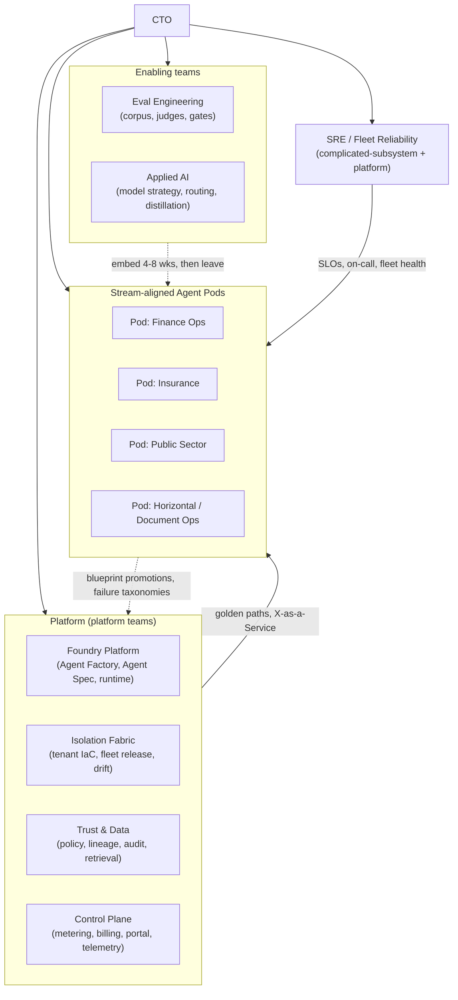

# Habagat — Engineering Organization & Operating Model

> Owner: CTO · Status: Board draft v1.0 · Scope: 8 → 30 → 80 engineers
> Headcount, ratios and ARR figures are **illustrative assumptions**; the ratios are the load-bearing part, not the absolute numbers.

## Executive take

- **The organizing principle is "pods deliver, platform multiplies."** Stream-aligned **Agent Pods** own customer outcomes end to end; a Platform group owns the Isolation Fabric, Agent Factory and Trust Layer; small Enabling teams (Eval, Applied AI) raise the ceiling for everyone. This is Team Topologies applied literally, because the failure mode we most fear — headcount growing linearly with customers — is a topology failure.
- **The economic target is sublinear headcount.** Year 1: ~1 pod per 3 customers. Year 3: ~1 pod per 10 customers. That factor-of-three improvement is delivered by the Agent Factory and by dogfooding agents internally — it is an engineering deliverable with a number attached, not a hope.
- **Eval Engineering is a named function from hire #6.** It is the moat (doc 01 §2.2) and the release gate (bet B5). If it reports into delivery, it will be negotiated away under deadline pressure; it reports to the CTO through the Platform org.
- **The Domain SME is a *first-class engineering-adjacent role*, not a consultant.** The person who knows why a three-way match fails is the person who writes the eval cases. We hire them, embed them in pods, and give them tools — not a Slack channel.
- **On-call is fleet-shaped.** A tenant-affecting incident is bounded to one customer by design; a *platform* incident is fleet-wide. We therefore run two rotations with different severities, SLAs and escalation paths from the moment we exceed 5 tenants.

---

## 1. Operating principles

1. **The pod owns the outcome, not the ticket.** Accuracy, latency, cost per run, and customer escalations are the pod's numbers.
2. **Everything a customer sees is generated from a versioned artifact.** No hand-edits in a tenant, ever (the zero-snowflake rule).
3. **Variation is a parameter, not a fork.** If a customer needs different behavior, it becomes a blueprint parameter or a promoted variant.
4. **Evals gate releases.** CTO-only waivers, time-boxed, reported quarterly.
5. **Cost per successful run is a first-class SLO**, owned by the same people who own accuracy.
6. **Automate the second time, not the third.** We are a fleet business; manual runbooks are a liability that scales with N.
7. **Write it down.** Agent Specs, decision records (ADRs), incident reviews, and eval rubrics are the company's memory. Attrition should cost us people, not knowledge.

---

## 2. Team topology

**Interaction modes (explicit, because ambiguity here is how platform teams become ticket queues):**

| From → To | Mode | Meaning |
|---|---|---|
| Platform → Pods | **X-as-a-Service** | Self-serve golden paths. A pod must be able to stand up a new agent without a Platform ticket. If they can't, that's a Platform defect. |
| Enabling → Pods | **Facilitating** | Eval/Applied AI embed for 4–8 weeks to raise capability, then leave. They do not become permanent pod members. |
| Pods → Platform | **Collaboration (time-boxed)** | Joint work to promote a pod-built pattern into a blueprint. Max 6 weeks, then it is Platform-owned or abandoned. |
| SRE → All | **Platform + collaboration on incidents** | SRE owns fleet SLOs and the paging path; pods own their agent's SLOs. |

---

## 3. The Agent Pod — the delivery unit

### 3.1 Composition

| Role | FTE per pod | Core accountability |
|---|---|---|
| **Agent Engineer** (lead + 1–2) | 2–3 | Agent Spec, tools, prompts, retrieval config, tool contracts, integration code. Owns accuracy and cost-per-run. |
| **Domain SME** | 0.5–1 | The failure taxonomy. Writes and reviews eval cases, defines exception classes, adjudicates ambiguous outputs, trains the human reviewers. |
| **Eval Engineer** | 0.5 (shared, embedded from Enabling early on; dedicated at scale) | Eval suite, judge calibration, regression baselines, gate thresholds, shadow-eval monitoring. |
| **Solutions Architect** | 0.5–1 | Customer-side: data access, identity, network, integration design, security review, go-live plan. Customer-facing technical owner. |
| **SRE** | 0.25–0.5 (shared across pods) | Tenant SLOs, on-call, runbooks, capacity/quota, incident response. |
| **Pod lead** | (one of the above wears it) | Prioritization, customer commitments, the pod's numbers. |

**Total: 4–6 FTE per pod.**

### 3.2 Customers per pod, over time

| Stage | Customers/pod | What makes the ratio move | Enabling investment required |
|---|---|---|---|
| FY26 H1 (design partners) | **2–3** | Everything is bespoke; the blueprint is being discovered | Agent Factory v1, tenant module v1 |
| FY26 H2 | **3–4** | First blueprints reused; eval harness exists | Ring-based rollout, drift detection |
| FY27 | **5–7** | Blueprint parameterization covers ~80% of customer variation; self-serve golden paths | Cost engine, Trust Layer GA, internal agents |
| FY28 | **8–10** | Onboarding is largely templated; internal agents handle triage, eval-case drafting, drift remediation, first-line support | Blueprint variant marketplace, partner-delivered agents |

**Sanity arithmetic (illustrative):** at 100 tenants and 10 tenants/pod → 10 pods × ~5 FTE = 50 delivery engineers; plus ~25 platform/enabling/SRE and ~5 leadership → ~80 engineers. That is the FY28 number and it is only reachable if the ratio actually improves. **The ratio is the CTO's single most important operating metric.**

### 3.3 What a pod does NOT do
- Does not touch a tenant by hand (Fabric only).
- Does not fork a blueprint without a promotion path.
- Does not own its own CI, IaC, or observability stack — Platform provides them.
- Does not set its own eval gate thresholds unilaterally (proposed by pod, ratified by Eval Engineering).

---

## 4. Org at three sizes

### 4.1 At 8 engineers (FY26 H1, ~$0–1M ARR, 1–3 design partners)

One team. No formal platform group; the *platform is what we extract from the first two customers*.

| Function | FTE |
|---|---|
| Agent engineering (incl. CTO hands-on) | 3.5 |
| Platform/infra (tenant IaC, CI/CD, control plane seed) | 2 |
| Eval engineering | 1 |
| Solutions architecture (customer-facing) | 1 |
| Domain SME (contract/fractional in the first vertical) | 0.5 |

Rules at this size: everyone is on call; the CTO writes code; no specialization beyond the above; every customer commitment goes through the CTO because scope discipline *is* the strategy at this stage.

### 4.2 At 30 engineers (FY27, ~$6–12M ARR, ~20–30 tenants)

| Group | Teams | FTE | Charter |
|---|---|---|---|
| **Platform** | Foundry Platform | 5 | Agent Spec + compiler, Agent Factory, blueprint catalog, scaffolding CLI, runtime abstraction, second compiler target kept warm |
| | Isolation Fabric | 4 | Tenant Terraform modules, subscription vending, fleet inventory, ring rollout, drift detection & remediation, quota management |
| | Control Plane | 3 | Metering, cost attribution, billing integration, customer portal, fleet telemetry aggregation, config management |
| **Enabling** | Eval Engineering | 3 | Corpus, judge calibration, gate policy, shadow eval, regression infrastructure, labeling operations |
| | Applied AI | 2 | Model portfolio, routing/cascade policy, prompt/context engineering standards, distillation and fine-tune decisions |
| **Reliability** | SRE / Fleet | 3 | SLOs, on-call, incident command, capacity & regional planning, DR/BCP exercises |
| **Trust** | Trust & Security | 2 | Policy engine, guardrails config, lineage/audit, compliance evidence automation, security reviews |
| **Stream-aligned** | 4 Agent Pods | 16–20 (overlaps SA/SME counted here) | Customer outcomes per vertical |
| **Leadership** | CTO, 2 EMs, 1 staff eng | 4 | |

At this size we introduce: two on-call rotations (platform + tenant), an architecture review forum, ADRs as a hard requirement, and a formal blueprint promotion process.

### 4.3 At 80 engineers (FY28, ~$25–45M ARR, ~100 tenants)

| Group | FTE | Notes |
|---|---|---|
| Agent Pods (10 pods, 5 verticals) | 50 | Each pod 8–10 tenants |
| Foundry Platform | 8 | Adds blueprint variant tooling, agent simulation environment |
| Isolation Fabric | 7 | Adds multi-region fleet, sovereign-cloud support, automated remediation |
| Control Plane | 6 | Adds self-serve customer portal, margin analytics, forecasting |
| Eval Engineering | 7 | Adds labeling ops management, corpus productization, per-vertical eval leads |
| Applied AI | 4 | Adds distillation pipeline, small-model fine-tuning on fleet traces |
| SRE / Fleet Reliability | 6 | 24×5 follow-the-sun (2 regions), fleet health engineering |
| Trust, Security & Compliance Eng | 5 | Continuous-control monitoring, EU AI Act conformity tooling |
| Internal Tools / Dogfooding | 3 | Habagat's own agents (see §8) |
| Leadership (CTO, 3 directors, 5 EMs, 4 staff/principal) | 13 | |

Key structural change at 80: **verticals get directors**, Platform gets a director, and the CTO's job shifts to model strategy, architecture bets, technical diligence, and the pods-per-customer ratio.

---

## 5. Hiring plan

### 5.1 First 10 hires, in order

| # | Role | When | Why this one now |
|---|---|---|---|
| 1 | **Founding Agent Engineer (staff-level, full-stack + LLM systems)** | Month 0 | The first blueprint has to exist before anything else. Must be someone who ships end to end and is comfortable with ambiguity. |
| 2 | **Platform/Infra Engineer (Azure + Terraform depth)** | Month 0–1 | The tenant module is the second-most-load-bearing artifact. Getting subscription vending, identity, networking and CMK right early saves a year of retrofitting compliance. |
| 3 | **Eval Engineer** | Month 2 | Before customer #2. If we ship two customers without a corpus we will never retrofit one. This hire is the moat's first brick. |
| 4 | **Solutions Architect (customer-facing, enterprise security fluent)** | Month 3 | Design-partner onboarding is bottlenecked on customer-side identity/data/network work, not on our code. Also our first real security-review muscle. |
| 5 | **Agent Engineer #2** | Month 4 | Second archetype in parallel; also breaks the bus-factor on #1. |
| 6 | **Domain SME, vertical #1 (e.g. finance ops / AP)** | Month 5 | Converts customer knowledge into eval cases. Hire from the industry, not from tech. Often the highest-ROI non-engineer on the team. |
| 7 | **SRE / Production Engineer** | Month 6 | At ~5 tenants, informal on-call breaks. Also owns the first real SLOs and the incident process. |
| 8 | **Agent Engineer #3** | Month 7 | Third pod-seed; enables the second vertical. |
| 9 | **Security/Compliance Engineer** | Month 8 | SOC 2 Type I evidence must be automated, not assembled. Doing this at hire 25 costs 3× and delays enterprise deals. |
| 10 | **Engineering Manager / first people leader** | Month 9–10 | At ~12–14 people the CTO can no longer be the only manager and still do architecture. Hire before the pain, not after. |

**Deliberately not in the first 10:** a data scientist / researcher (Applied AI can wait until model routing has real volume to optimize), a front-end specialist (the Review Console can be built by a full-stack Agent Engineer until ~10 tenants), and a dedicated QA function (evals *are* QA).

### 5.2 Sequencing tied to ARR

| ARR milestone | Tenants | Cumulative engineers | Hiring focus | Gate before hiring further |
|---|---|---|---|---|
| $0–1M | 1–3 | 8 | The 10 above (partial) | 2 design partners live with eval gates passing |
| $1–3M | 4–8 | 14 | Second pod seed, Eval #2, Fabric #2 | Pods-per-customer ≥3; platform patch to full fleet ≤14 days |
| $3–6M | 8–15 | 20 | Trust & Security team, Control Plane metering | Gross margin ≥55%; drift detection live |
| $6–12M | 20–30 | 30 | Vertical pods 3–4, Applied AI, SRE #2–3 | Pods-per-customer ≥5; SOC 2 Type II |
| $12–25M | 40–65 | 50 | Directors, per-vertical eval leads, dogfooding team | Pods-per-customer ≥7; cost/run down ≥35% from FY26 baseline |
| $25–45M | 80–100 | 80 | Fill to plan; partner enablement engineering | Pods-per-customer ≥8; gross margin ≥70% |

**Hiring rule:** we do not hire an engineer for a customer we have not signed, and we do not sign a customer whose archetype has no blueprint or a funded plan to create one within the quarter.

---

## 6. Rituals, on-call and ownership

### 6.1 Rituals

| Ritual | Cadence | Attendees | Output |
|---|---|---|---|
| **Fleet health review** | Weekly, 45 min | SRE, pod leads, CTO | Tenants off-ring, drift count, open P1/P2, quota headroom |
| **Eval review** | Weekly, 45 min | Eval Eng + pod leads | Score trendlines per agent, new failure classes, gate threshold changes, waiver register |
| **Cost & margin review** | Bi-weekly | Applied AI, Control Plane, CTO, Finance | Cost per successful run by agent/tenant, top regressions, active COGS levers |
| **Architecture forum (ADRs)** | Bi-weekly | Staff+ engineers, CTO | Accepted/rejected ADRs; radar ring movements |
| **Blueprint promotion board** | Bi-weekly | Platform + pod leads | What graduates from pod code into the Factory |
| **Incident review (blameless)** | Within 5 business days of any P1 | Responders + owning pod | Written review, action items with owners and dates |
| **Model watch** | Monthly | Applied AI + CTO | Deprecations, new models, routing changes, re-eval plan |
| **Security & compliance standup** | Monthly | Trust & Security, CTO | Control drift, evidence gaps, pen-test/vuln status |

### 6.2 On-call and severity

Two rotations from >5 tenants:

| Rotation | Scope | Paging hours | Target size |
|---|---|---|---|
| **Platform on-call** | Control plane, Fabric, fleet-wide releases, cross-tenant issues | 24×7 | ≥6 people before 24×7 (never fewer — burnout is a churn risk) |
| **Tenant on-call** | Per-tenant agent failures, integration breaks, quality incidents | Business hours of the tenant's region + escalation | Pod-rostered, backed by SRE |

| Severity | Definition | Response | Comms |
|---|---|---|---|
| **P1** | Fleet-wide outage, data exposure risk, or an agent taking incorrect irreversible actions | 15 min ack, 24×7 | Customer comms within 1 hour; incident commander named |
| **P2** | Single tenant down, or accuracy regression beyond gate threshold in production | 1 hour ack, business hours + on-call | Customer notified same day |
| **P3** | Degraded quality/latency/cost within tolerance; single-agent bug with workaround | Next business day | Weekly report |
| **P4** | Cosmetic, backlog | Sprint queue | — |

**Agent-specific incident class we define explicitly: "Erroneous Action" (P1).** An agent performed an R2/R3 action incorrectly (posted a wrong journal entry, sent an incorrect customer communication). Runbook: freeze the agent, enumerate affected runs from the lineage store, notify the customer within 1 hour, produce a reconciliation list, and only then debug. This runbook exists before the first R3-capable agent goes live.

### 6.3 SLO ownership

| SLO | Owner | Illustrative target |
|---|---|---|
| Agent task success rate (per agent) | Pod | ≥ agent-specific gate (typically 92–98%) |
| Agent p95 end-to-end latency | Pod | Archetype-specific (see doc 04) |
| Cost per successful run | Pod (with Applied AI) | Within ±15% of budget |
| Escalation/human-override rate | Pod + Domain SME | Declining quarter over quarter |
| Control-plane availability | Control Plane team | 99.9% |
| Tenant agent-service availability | SRE + Fabric | 99.5% (business hours 99.9%) |
| Time to deploy security patch to 100% of fleet | Isolation Fabric | ≤7 days |
| Provisioning time for a new tenant | Isolation Fabric | ≤4 hours automated |
| % of fleet on current minor version | Isolation Fabric | ≥90% |

### 6.4 Internal developer platform expectations

The Platform group is measured by whether a pod engineer can, **without filing a ticket**:

1. Scaffold a new agent from a blueprint (`habagat agent new`) in <10 minutes.
2. Run the full eval suite locally against a synthetic fixture set in <15 minutes.
3. Open a PR that automatically runs eval-as-a-gate and posts a scorecard.
4. Provision an ephemeral dev tenant in <30 minutes and destroy it automatically after 72 hours.
5. Promote a version through rings R0→R3 from a single pipeline with approvals.
6. See cost, latency, quality and escalation dashboards for their agent with zero setup.
7. Roll back an agent version in a single tenant in <10 minutes.

Anything on that list requiring a Platform human is tracked as a **golden-path defect** with a named owner.

### 6.5 Metrics

**DORA (per team, monthly)**

| Metric | FY26 target | FY28 target |
|---|---|---|
| Deployment frequency (platform) | Weekly | Daily |
| Lead time for change | <5 days | <1 day |
| Change failure rate | <20% | <10% |
| MTTR (P1/P2) | <8 hours | <2 hours |

**Agent-specific metrics (the ones that actually matter here)**

| Metric | Definition | Why |
|---|---|---|
| **Task success rate** | Runs completing the business outcome without human correction | The product claim |
| **Autonomy rate** | % of runs completed with no human touch | Drives customer ROI and our margin |
| **Escalation precision** | Of escalated runs, % that genuinely needed a human | Measures whether the agent knows what it doesn't know |
| **Groundedness** | % of factual claims supported by retrieved evidence | Hallucination proxy |
| **Cost per successful run** | Fully-loaded COGS ÷ successful runs | The margin engine |
| **Eval-gate pass rate on first attempt** | Releases passing the gate without rework | Engineering quality |
| **Time-to-first-value** | Contract signature → first production run | Sales-to-delivery health |
| **Blueprint reuse ratio** | % of a new agent derived from an existing blueprint | Directly predicts pods-per-customer |
| **Fleet currency** | % of tenants on current minor version | Entropy control (risk R2) |
| **Corpus growth** | New labeled eval cases per month per vertical | Moat accumulation |

---

## 7. Career ladder and knowledge

- Two tracks (IC to Principal, Manager to Director) with parity at Staff/EM. Deliberate, because our senior talent is scarce and we cannot force architects into management.
- **Every P1 produces a written blameless review; every architecture bet produces an ADR; every agent produces a spec.** These three artifact classes are the company's institutional memory and are the mitigation for key-person risk (doc 05 Q22).
- Domain SMEs get a real ladder (Associate → Senior → Principal Domain SME) — otherwise we cannot retain them against industry salaries.

---

## 8. Dogfooding: how Habagat uses its own agents

The entire sublinear-headcount thesis depends on this. We build internal agents on the same platform, with the same eval gates, and treat our own control plane as tenant #0 (ring R0).

| Internal agent | Replaces / augments | Target impact by FY28 |
|---|---|---|
| **Tier-1 Support Triage Agent** | First-line triage of tenant alerts and customer tickets: classify, correlate with fleet telemetry, attach runbook, page only when needed | −40% pages reaching a human; −50% ticket handling time |
| **Eval Case Drafter** | Turns production escalations and human corrections into candidate eval cases with proposed expected outputs, for SME approval | 3× corpus growth rate at constant SME headcount |
| **Drift Remediation Agent** | Reads fleet drift reports, generates the Terraform PR to reconcile, runs plan, opens PR for human approval | −60% Fabric toil |
| **Onboarding Architect Assistant** | Drafts the tenant design (network, identity, data access, integration plan) from a customer intake questionnaire and the blueprint catalog | −30% time-to-first-value |
| **Security Questionnaire Agent** | Answers RFP/security questionnaires from our evidence corpus with citations, flags anything unanswerable | −70% SA time on questionnaires |
| **Release Notes & Change Comms Agent** | Per-tenant change summaries from the diff of Agent Specs and blueprint versions | Removes a recurring manual step per release per tenant |
| **Incident Timeline Agent** | Assembles the incident timeline from traces, deploys, and chat for the blameless review | −50% review prep time |
| **Cost Anomaly Agent** | Watches cost-per-successful-run, attributes regressions to prompt/model/tool changes, opens a defect | Catches COGS drift in days, not at month-end |

**The rule that makes this honest:** internal agents ship through the same SDLC and eval gates as customer agents. If we would not sell it, we do not run it. This also means our own usage is a continuous integration test of the platform — the fastest feedback loop we have.

**Ratio target:** internal agents should carry ≥25% of the operational toil that would otherwise be headcount by FY28. That is roughly 15–20 avoided hires at the 100-tenant scale — the difference between an 80-person and a 100-person engineering org at the same revenue.

---

## Decisions required from the founder/board

1. **Ratify the pods-per-customer ratio (3 → 5 → 8–10) as a board-reported operating metric**, and accept that missing it means slowing sales, not adding headcount.
2. **Approve Eval Engineering as a standing, CTO-reporting function from hire #6**, with a dedicated labeling/SME budget line (illustratively $150–400k/yr by FY27).
3. **Approve hiring Domain SMEs as employees with their own career ladder**, rather than using fractional consultants — and the compensation implications versus industry salaries.
4. **Approve the first-10-hire sequence**, in particular hiring Security/Compliance Engineering at hire #9 rather than deferring to post-Series A.
5. **Choose the FY26 vertical order** (which two verticals get pods first) — this determines SME hiring and corpus depth for two years.
6. **Approve 24×7 platform on-call staffing floor of 6 engineers before we commit 24×7 SLAs to customers**; sales should not sell 24×7 ahead of that.
7. **Fund the internal dogfooding team (3 FTE by FY28)** as a cost-avoidance investment, and hold it to the ≥25% toil-reduction target.
