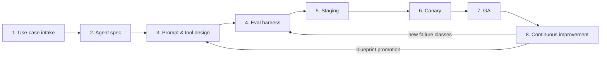
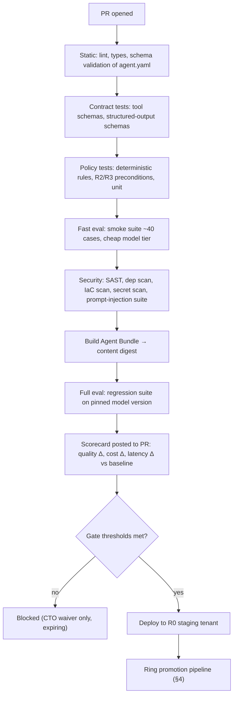

# Habagat — Platform Engineering & the Agent SDLC

> Owner: CTO · Status: Engineering standard v1.0 · Audience: engineering, plus technically literate investors/CISOs
> Thresholds and timings are **illustrative assumptions** to be tuned against real fleet data; the gate *structure* is normative.

## Executive take

- **One monorepo for the platform and blueprints; one repo per customer tenant for configuration.** The platform must move as a unit (spec, compiler, evals, IaC modules travel together); tenant state must be auditable and separable per customer. This hybrid is deliberate and is the single most consequential repo decision we make.
- **The agent is a compiled artifact, not a conversation.** An `agent.yaml` **Agent Spec** plus prompts, tool contracts, retrieval config, policy bundle and eval suite compile to a deployable, content-addressed **Agent Bundle** with an immutable digest. Everything downstream (promotion, rollback, audit) keys off that digest.
- **Evaluation is the release gate.** No promotion past staging without a passing eval run on a pinned regression suite, at a per-agent threshold, on the exact model version being deployed. CTO-only, expiring waivers.
- **Fleet releases use rings (R0 internal → R1 design partners → R2 early → R3 general)** with soak times and automated halt criteria. A security patch must reach 100% of the fleet in ≤7 days.
- **Drift is a defect.** Nightly reconciliation against every tenant; any unmanaged delta opens a P2 and, where safe, an auto-generated remediation PR.

---

## 1. Repository topology

### 1.1 The decision

| Option | Pros | Cons | Verdict |
|---|---|---|---|
| Full monorepo (platform + all tenant state) | One atomic change; simplest refactoring | Customer config commingled; per-customer access control impossible at file granularity; audit export messy; blast radius of a bad merge is the fleet | ✗ |
| Full polyrepo (repo per blueprint, per module, per tenant) | Maximum isolation | Version-skew hell across spec/compiler/eval/IaC; a platform change becomes an 11-PR ceremony; kills velocity at 8 engineers | ✗ |
| **Hybrid: platform monorepo + tenant config repos** | Platform moves atomically; tenant state is per-customer, access-controlled, auditable, exportable at exit | Two release trains to reason about | ✅ **Chosen** |

### 1.2 Layout

```
habagat-platform/                     # single monorepo, one release train
├── spec/                             # Agent Spec schema (JSON Schema + Pydantic), versioned
├── compiler/                         # Agent Spec -> runtime target
│   ├── targets/foundry/              # PRIMARY: Azure AI Foundry Agent Service
│   └── targets/portable/             # WARM SPARE: self-hosted loop on Container Apps (bet B1)
├── blueprints/                       # the Agent Factory
│   ├── doc-extraction/               # spec, prompts, tools, eval skeleton, IaC params, docs
│   ├── invoice-ap/
│   ├── claims-triage/
│   ├── rfp-response/
│   └── ...
├── tools/                            # reusable tool implementations + MCP servers
├── policy/                           # deterministic policy engine + rule bundles
├── eval/                             # harness, judges, rubrics, calibration, CI reporters
├── corpus/                           # eval datasets: synthetic + de-identified; per-vertical
├── infra/                            # Terraform modules: tenant, landing zone, control plane
├── controlplane/                     # metering, billing, fleet inventory, portal, telemetry
├── console/                          # Review Console (HITL UI)
├── cli/                              # `habagat` developer CLI
└── docs/                             # ADRs, runbooks, golden paths
```

```
habagat-tenant-<customer>/            # one per customer; restricted access
├── tenant.yaml                       # region, tier, ring, compliance profile, CMK, quotas
├── agents/<agent>/                   # blueprint ref + version + parameter overrides ONLY
├── connections/                      # data sources, integration endpoints (no secrets)
├── policy-overrides/                 # customer-specific deterministic rules (reviewed)
├── eval-overrides/                   # customer-specific eval cases (their exception classes)
└── .habagat-lock                     # pinned: blueprint versions, model versions, module versions
```

**Rules.**
- A tenant repo contains **no prompts and no code** — only blueprint references and parameters. A prompt in a tenant repo is a snowflake and fails CI.
- `.habagat-lock` is the fleet's source of truth for what is deployed where; the fleet inventory in the control plane is reconciled against it.
- Secrets live only in the tenant's Key Vault; repos hold references, never values.
- Customer exit = handing over their tenant repo, their Azure resources, and a signed export of their Agent Bundles (doc 05 Q25).

### 1.3 Golden paths

| Golden path | Command | Time budget | Owner |
|---|---|---|---|
| New agent from blueprint | `habagat agent new --blueprint invoice-ap --tenant acme` | <10 min | Foundry Platform |
| Local eval run | `habagat eval run --suite regression --fixtures synthetic` | <15 min | Eval Engineering |
| Ephemeral dev tenant | `habagat tenant ephemeral --ttl 72h` | <30 min | Isolation Fabric |
| Promote a version | `habagat release promote --agent ap-agent --to R2` | pipeline | Isolation Fabric |
| Rollback in one tenant | `habagat release rollback --tenant acme --agent ap-agent` | <10 min | SRE |
| New blueprint scaffold | `habagat blueprint new` | <30 min | Foundry Platform |
| New connector/tool | `habagat tool new --mcp` | <1 hr | Foundry Platform |
| New tenant provisioning | `habagat tenant provision --config tenant.yaml` | <4 hr automated | Isolation Fabric |

### 1.4 The Agent Spec (the load-bearing artifact)

```yaml
apiVersion: habagat.dev/v1
kind: Agent
metadata:
  name: ap-invoice-agent
  blueprint: invoice-ap@3.2.1
  owner: pod-finance-ops
spec:
  objective: >
    Extract, validate and post supplier invoices against purchase orders,
    escalating exceptions to a human reviewer with a reason code.
  models:
    primary:  { deployment: gpt-frontier, version: "2026-05-01", maxTokens: 4096 }
    fallback: { deployment: gpt-mid,      version: "2026-04-10" }   # certified: eval >= 97% of primary
    routing:  cascade-v2                                            # see doc 04 §2
  memory:
    shortTerm: thread
    longTerm:  { store: cosmos, scope: vendor, ttlDays: 400, redact: [pii.email, pii.phone] }
  tools:
    - ref: doc-intelligence.extract     risk: R0
    - ref: erp.lookup-po                risk: R0
    - ref: erp.post-invoice             risk: R3   # irreversible: requires policy + approval
  retrieval:
    index: acme-vendor-terms
    strategy: hybrid+semantic-rank
    topK: 8
    groundednessMin: 0.85
  policy:
    bundle: finance/ap-v4
    preconditions:
      - three-way-match.passed
      - amount <= tenant.limits.autoPostCeiling
      - duplicate-check.clear
    humanApprovalRequired: [ "amount > 25000", "vendor.new == true", "confidence < 0.90" ]
  eval:
    suites: [ regression-ap-core, tenant-acme-exceptions ]
    gates: { taskSuccess: 0.96, groundedness: 0.90, falsePost: 0.000, p95LatencyMs: 20000 }
  budgets:
    costPerSuccessfulRunUsd: 0.42
    alertAtPct: 115
```

Everything else in the SDLC is a function of this file. It is reviewable by a Domain SME, diffable by Git, and enforceable by CI.

---

## 2. The agent SDLC



### Stage-by-stage: gates and required artifacts

| # | Stage | Entry gate | Required artifacts | Exit gate | Typical duration |
|---|---|---|---|---|---|
| 1 | **Use-case intake** | Qualified opportunity with a named business owner | Intake canvas: current process, volume/month, unit cost of the human baseline, error tolerance, systems of record, data sensitivity, definition of "done" for one run | **Feasibility verdict** (Go / Reshape / No). Must state: expected autonomy rate, the escalation path, and the archetype (doc 04 §3). Explicit "No" is allowed and encouraged. | 1–2 weeks |
| 2 | **Agent spec** | Feasibility Go | `agent.yaml`, tool contracts (typed), risk classification per tool (R0–R3), data-flow diagram, retention & residency decisions, HITL design | **Spec review** signed by pod lead, Domain SME, Solutions Architect, and Trust & Security (if any R2/R3 tool or regulated data) | 1 week |
| 3 | **Prompt & tool design** | Signed spec | Prompts (versioned, in blueprint), tool implementations or MCP server refs, retrieval config + indexing pipeline, policy bundle, structured-output schemas | **Design review**: every model output boundary is schema-validated; every R2/R3 action has a deterministic precondition; least-privilege identity per tool documented | 1–3 weeks |
| 4 | **Eval harness** | Design review passed | ≥150 labeled cases for a new archetype (or blueprint suite + ≥50 tenant-specific cases for a reuse); failure taxonomy with ≥8 named classes; judge rubrics with human-agreement measurement; adversarial/red-team set; latency & cost fixtures | **Eval readiness**: judge–human agreement κ ≥ 0.75; suite runs green on a known-good and red on a seeded-bad build (the harness must be able to fail) | 1–3 weeks (parallel with 3) |
| 5 | **Staging** | Eval readiness | Deployed to a non-prod tenant with production-shaped (de-identified or customer-provided) data; shadow-run results vs. human baseline | **Staging gate**: full eval suite ≥ thresholds; ≥200 shadow runs; cost/run within 130% of budget; p95 latency within SLO; zero R3 policy bypasses | 2–4 weeks |
| 6 | **Canary** | Staging gate + customer sign-off | Production tenant, restricted scope (e.g. one business unit, one vendor class, or 10% of volume), **100% human review**, live dashboards, rollback plan | **Canary gate**: ≥500 production runs; task success ≥ gate; human-override rate < defined ceiling; zero P1; escalation precision acceptable; SME sign-off on a sampled audit of 50 runs | 2–4 weeks |
| 7 | **GA** | Canary gate + customer business-owner sign-off | Runbook, SLOs registered, on-call rostered, customer training done, review-queue staffing agreed, eval baseline pinned as the regression floor | **GA declared**: agent enters fleet inventory, ring assignment, budget alerting live, autonomy ramp schedule agreed (e.g. 100% review → 30% → 10% sampled) | — |
| 8 | **Continuous improvement** | Running in production | Weekly eval trendline, shadow-eval samples, new eval cases from escalations, quarterly re-baseline, model-refresh plan | Continuous; **quarterly recertification** required to remain at current autonomy level | Ongoing |

**Artifacts that must exist for every GA agent (the audit pack):** signed Agent Spec, eval report with the exact model versions, policy bundle diff, data-flow diagram, DPIA input (if applicable), runbook, rollback procedure, SLO registration, and the human-review design. This pack is what we hand a CISO or auditor.

---

## 3. CI/CD for agents

### 3.1 The pipeline



### 3.2 What gets tested

| Layer | Test type | Deterministic? | Runs on |
|---|---|---|---|
| Spec | JSON-Schema validation, referential integrity (tools/models/policies exist) | Yes | Every PR |
| Tools | Contract tests against recorded/mocked system responses; auth scope assertions | Yes | Every PR |
| Policy | Unit tests per rule; property tests on preconditions; "no R3 without approval" invariant | Yes | Every PR |
| Structured output | Schema conformance on a fixture corpus | Yes | Every PR |
| Retrieval | Recall@k, MRR against a labeled retrieval set; index-config diff detection | Yes | On retrieval changes + nightly |
| Prompt injection / jailbreak | Adversarial suite (data-borne injection in documents, tool-output poisoning, exfiltration attempts) | Yes (pass/fail) | Every PR + nightly |
| End-to-end quality | Full regression suite scored by rubric + calibrated LLM judges + exact-match where possible | Statistically | Pre-merge + nightly + pre-promotion |
| Cost & latency | Token/tool/latency budget assertions per run | Yes | Full eval runs |
| IaC | `terraform plan` diff review, policy-as-code (deny public endpoints, require CMK where profile demands) | Yes | Every infra PR |
| Fleet | Drift reconciliation across tenants | Yes | Nightly |

### 3.3 Eval-as-a-gate: the rules

1. **Every promotion runs the eval suite against the exact model deployment and version being deployed.** Model version is part of the gate key; a model change re-runs the gate.
2. **Non-determinism is handled statistically, not ignored.** Suites run with `n=3` samples per case at production temperature; the gate uses the mean with a required lower confidence bound. Flaky cases (variance above threshold) are quarantined and reported, not silently retried.
3. **Two gate classes:** *absolute* thresholds (e.g. task success ≥0.96, false-post rate = 0) and *relative* thresholds (no regression >1.0pp vs the pinned baseline on any suite; no cost/run increase >10% without an approved budget change).
4. **Zero-tolerance metrics exist and are named per agent** (e.g. "posts an invoice that fails three-way match" = 0 permitted occurrences). One occurrence blocks the release regardless of aggregate score.
5. **Judges are calibrated and versioned.** A judge model or rubric change is itself a change requiring re-baselining; judge-human agreement is re-measured quarterly.
6. **Waivers** are CTO-only, must name the risk, the compensating control (usually forced 100% human review), and an expiry date ≤30 days. The waiver register is reported to the board quarterly.

### 3.4 Versioning and pinning

| Thing | Versioning | Pinned where |
|---|---|---|
| Agent Bundle | Content digest + semver | `.habagat-lock` per tenant |
| Blueprint | Semver (`invoice-ap@3.2.1`) | Agent Spec |
| Prompt | Part of the bundle digest; never edited in place | Bundle |
| Model deployment | Explicit deployment name + provider version string; **auto-upgrade disabled** | Agent Spec + tenant lock |
| Tool / MCP server | Semver + schema hash | Agent Spec |
| Eval suite | Semver; baselines pinned per agent version | Eval registry |
| Terraform module | Semver | `tenant.yaml` |
| Judge model & rubric | Versioned together | Eval registry |

**Auto-upgrade of model versions is disabled fleet-wide.** Provider version rollovers are handled as a planned change: Applied AI re-evaluates, the gate runs, and the fleet moves by ring.

### 3.5 Deployment strategies for agents

| Strategy | When used | Mechanics | Rollback |
|---|---|---|---|
| **Blue-green (agent version)** | Default for prompt/spec/model changes in a tenant | New agent version deployed alongside; traffic pointer flipped at the orchestrator; old version retained for 14 days | Flip pointer back (<10 min) |
| **Canary (traffic split)** | Volume ≥1,000 runs/month | 5% → 25% → 50% → 100%, each step with a soak and automated halt criteria (quality, cost, escalation rate) | Halt + flip to previous version |
| **Shadow** | High-risk archetypes (R3 actions), model swaps | New version runs on live inputs, results scored but **not acted on**; compared to the live version | No production impact; discard |
| **Autonomy ramp** | All new GA agents | Independent of code version: 100% human review → 30% sampled → 10% sampled, each step gated on measured accuracy | Raise review percentage instantly (a config flip, no deploy) |
| **Ring rollout (fleet)** | Any platform or blueprint change touching multiple tenants | §4 | Per-ring halt |

**Rollback semantics — the part that is agent-specific.** Rolling back code is easy; rolling back *effects* is not. Therefore:
- Every run writes a lineage record (inputs hash, retrieved doc IDs, prompt digest, model version, tool calls, outputs, decision path, cost) to the tenant's lineage store, retained per contract.
- Any R3 (irreversible) tool call must implement a **compensating action** or be gated behind human approval. No exceptions — this is enforced by the policy engine at compile time: a spec with an R3 tool and neither a compensator nor `humanApprovalRequired` fails CI.
- Rollback of an agent version automatically produces an **affected-run manifest** (runs executed under the withdrawn version since the last known-good), which the pod triages for remediation.
- Memory written by a withdrawn version is tagged with the bundle digest so it can be quarantined.

---

## 4. Release engineering across N isolated tenants

### 4.1 Rings

| Ring | Population | Contents | Soak | Advance criteria |
|---|---|---|---|---|
| **R0 — Internal** | Habagat's own tenant + ephemeral test tenants | Every change | 24–48 h | Full eval green; zero P1/P2; cost within budget |
| **R1 — Design partners** | 2–4 tenants who opted in for early access (contractually) | Platform + blueprint changes | 3–5 days | No quality regression >0.5pp; no new escalation classes; partner sign-off |
| **R2 — Early** | ~20% of fleet, selected for archetype diversity and lower risk tier | Changes that cleared R1 | 5–7 days | Fleet-wide dashboards green; error budget intact |
| **R3 — General** | Remaining ~80% | Changes that cleared R2 | — | Auto-advance unless halted |

**Timing SLOs.** Security patch (CVE, provider advisory, guardrail fix): **R0→R3 in ≤7 days**, with authority to skip R1/R2 soak on CTO approval. Feature release: **≤30 days to 90% of fleet**. Fleet currency (≥90% on current minor) reported monthly to the board.

**Automated halt criteria** (any ring): task success drop >1.0pp vs baseline; cost/successful-run up >15%; escalation rate up >25% relative; any zero-tolerance event; p95 latency SLO breach for >30 min; any P1.

**Per-tenant exemptions.** Some tenants contractually require change windows or pre-approval (common in regulated verticals). These are declared in `tenant.yaml` as `changePolicy: {window, approvalRequired}` and the Fabric respects them — but an exempt tenant still gets security patches within the 7-day SLO, contractually reserved as an emergency-change right.

### 4.2 Fleet versioning

Each tenant has a **fleet coordinate**: `{platformVersion, blueprintVersions[], modelVersions[], moduleVersion, ring}`. The control-plane fleet inventory is the aggregate view; it is reconciled nightly against the actual Azure resource state and the tenant repos' `.habagat-lock`.

Supported skew policy (illustrative): **N and N−1 minor versions only.** A tenant more than one minor behind is a P2 for the Fabric team. Blueprint major-version upgrades are customer-visible changes requiring a re-eval and, for regulated tenants, re-certification.

### 4.3 Drift detection and remediation

| Drift class | Detection | Response |
|---|---|---|
| **Infrastructure drift** (manual Azure change, policy deviation) | Nightly `terraform plan` in read-only mode across all tenants + Azure Policy compliance state | Auto-generated remediation PR; P2 if security-relevant; P1 if it weakens isolation (public endpoint, disabled private link, key rotation failure) |
| **Config drift** (agent parameters diverging from blueprint contract) | Compare deployed bundle digests vs `.habagat-lock` vs blueprint schema | Block further promotions to that tenant; reconcile or promote the variant into the blueprint |
| **Version drift** (tenant behind rings) | Fleet inventory report | Scheduled catch-up release; escalates to P2 beyond N−1 |
| **Quality drift** (accuracy decaying in production) | Weekly regression run per tenant + shadow-eval sampling of live runs | Pod investigates; new eval cases added; possible model/prompt change |
| **Cost drift** (cost/successful-run rising) | Daily metering aggregation + anomaly detection | Cost Anomaly Agent attributes to a change and opens a defect |
| **Data drift** (input distribution shift — new document types, new vendors) | Input-feature monitoring, novelty detection on embeddings, rising escalation rate | SME reviews; corpus extended; potential re-tune of retrieval or prompts |
| **Snowflake drift** (untemplated resource or prompt in a tenant) | Repo CI (prompts/code forbidden in tenant repos) + resource-tag audit | Hard fail; must be templated or explicitly registered as a priced bespoke variant |

### 4.4 Environments

| Environment | Where | Data | Purpose |
|---|---|---|---|
| **Local** | Developer machine | Synthetic fixtures only | Fast iteration, smoke evals |
| **Ephemeral dev tenant** | Habagat subscription, TTL 72 h | Synthetic / de-identified | Integration, IaC changes |
| **R0 staging** | Habagat subscription | Production-shaped synthetic + our own real operational data | Full eval, pre-ring validation |
| **Customer staging** | Customer's subscription, separate resource group | Customer-provided de-identified or masked data | Customer-specific validation, UAT |
| **Customer production** | Customer's subscription | Live | GA |

No Habagat engineer has standing access to customer production data. Access is **just-in-time, approved, time-boxed and logged** (Entra PIM), and for the highest tier customers requires customer approval per session. This is a control we will be asked to evidence in every enterprise deal (doc 05 Q6).

---

## 5. Quality bar summary

| Rule | Enforcement |
|---|---|
| No prompt or code in a tenant repo | CI hard fail |
| No manual changes in a customer Azure subscription | Drift detection → P2; repeat offenses are a management issue |
| No R3 tool without compensator or human approval | Compiler rejects the spec |
| No model version auto-upgrade | Platform policy; deployments pinned |
| No promotion without a passing eval on the deployed model version | Pipeline gate |
| No GA without a runbook, SLOs, and an audit pack | Release checklist |
| No new agent archetype without ≥150 labeled eval cases | Eval readiness gate |
| Every P1 gets a written blameless review in 5 business days | Ritual + tracked |

---

## Decisions required from the founder/board

1. **Approve the hybrid repo model** (platform monorepo + per-tenant config repos) and the access-control/audit implications, including that customer exit hands over the tenant repo.
2. **Approve the ring-release SLOs as contractual commitments**: security patch to 100% of fleet ≤7 days, feature release to 90% ≤30 days — and the emergency-change right we must negotiate into every MSA to honor them.
3. **Ratify eval-as-a-gate with CTO-only expiring waivers**, and accept that a failing gate delays a customer go-live even when revenue is at stake.
4. **Approve the "no standing production access" control with JIT/PIM access**, including the operational friction it creates for support, and fund the tooling to make JIT fast.
5. **Approve the design-partner ring (R1) as a contractual construct** — 2–4 customers who accept early releases in exchange for pricing/roadmap influence. Sales and legal need standard terms for this.
6. **Decide the autonomy-ramp default** (100% review → 30% → 10%): whether this is a Habagat standard we hold firm on, or negotiable per deal. My recommendation: standard, non-negotiable downward, since it is the primary control against agent-caused-damage liability (doc 05 Q13).
