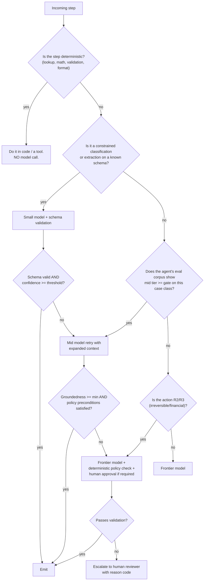

# Habagat — Model Strategy & Agent Unit Economics

> Owner: CTO · Status: Board draft v1.0
> **All prices, token counts and rates below are illustrative assumptions** chosen to be plausible and internally consistent. Every calculation shows its arithmetic so you can substitute current Azure AI Foundry list prices and our measured telemetry. The *structure* of the model is the deliverable; the numbers are a starting point.

## Executive take

- **We do not have a favorite model; we have a routing policy.** Every agent declares a primary and a certified fallback, and most production traffic is served by a mid-tier model with frontier escalation only where the eval corpus proves it is needed. This is worth 40–60% of LLM COGS.
- **Tokens are usually not the dominant cost — human review is.** In the worked invoice example, LLM inference is ~18% of fully-loaded COGS while human review is ~50%. **Autonomy rate, not token price, is the primary margin lever.** Every point of autonomy is worth more than any prompt optimization.
- **Default is: prompt + tools + retrieval. Fine-tuning is a last resort**, justified only by a specific, measured failure the eval corpus attributes to a capability gap that context engineering cannot close. Distillation of our own fleet traces into small models is the exception worth pursuing (FY27+), because we own the training signal.
- **Gross margin path: ~55% (FY26) → ~65% (FY27) → ~72% (FY28)**, driven in order by autonomy rate, small-model routing, prompt caching, and context engineering — not by negotiating token prices.
- **PTU is for the few, not the fleet.** At illustrative pricing, provisioned throughput only beats pay-as-you-go above roughly 300k runs/month for a single tenant. Below that, PTU is bought for *latency determinism*, and it is billed to the customer as a premium SKU.

---

## 1. Model portfolio on Azure AI Foundry

We maintain a small, deliberately constrained portfolio. Every tier has a defined job and an eval-backed entry criterion. More models is not more capability — it is more re-evaluation work per model refresh (fleet entropy, doc 01 risk R2).

| Tier | Role | Illustrative price (per 1M tokens, in/out) | Typical use | Eval requirement to use |
|---|---|---|---|---|
| **Frontier** | Hard reasoning, ambiguous exceptions, multi-hop planning, novel document types | $3.00 / $15.00 | Escalation tier; agent planning loop for complex archetypes | Must beat the mid tier by ≥3pp on the agent's suite to justify use |
| **Mid** | The workhorse: extraction with validation, structured decisioning, tool orchestration on known patterns | $0.80 / $4.00 | 60–80% of production traffic | Must pass the agent's gate thresholds |
| **Small** | Classification, routing, field extraction from clean text, redaction, summarization of retrieved chunks, guard checks | $0.15 / $0.60 | Pre/post-processing steps, cascade first pass | Must pass the *step's* gate (not the agent's) |
| **Embedding** | Retrieval | ~$0.02 per 1M tokens | All RAG | Recall@8 target per index |
| **Open-weight on managed compute** | Cost floor for very high volume, or data-locality/sovereignty edge cases | Compute-billed (e.g. ~$1.20–$4.00 per GPU-hour depending on SKU) | Assess ring; FY27 candidate for one high-volume archetype | Must beat mid tier on cost/successful run *including* idle compute |

**Portfolio rules.**
1. **Maximum two model families in production per agent** (primary + certified fallback). Bet B4 (doc 01).
2. **A new model enters the portfolio only via Applied AI**, with a written eval comparison across all active archetypes and a cost/latency delta. No pod adopts a model unilaterally.
3. **Model versions are pinned; auto-upgrade is disabled fleet-wide.** Provider version rollovers are planned changes moving by ring.
4. **Open-weight is evaluated on cost per successful run, not per token.** A model at one-tenth the token price that needs 2.5× the runs and a dedicated GPU deployment is more expensive, and this is the common outcome at our volumes.

---

## 2. Routing and cascade policy

### 2.1 The decision tree



### 2.2 Routing rules we hold firm on

| Rule | Rationale |
|---|---|
| **The cheapest correct answer wins; correctness is defined by the eval suite, not by intuition.** | Prevents both over-spending on frontier and under-serving quality to chase margin. |
| **Never route by cost alone for R3 actions.** Irreversible steps always use the certified tier for that agent. | A $0.04 saving is not worth a wrongly posted payment. |
| **Cascade only where the cheap tier's failure is *detectable*** (schema invalid, low groundedness, policy precondition unmet, low self-consistency). | An undetectable cheap-tier failure is worse than not cascading — you pay less and ship errors. |
| **Escalation rate is monitored as an SLO.** If mid→frontier escalation exceeds the modeled rate by >20%, the routing policy is re-tuned or the primary tier is changed. | Cascades silently degrade into "always frontier plus a wasted call." |
| **Route at the step, not the agent.** A single agent run may use small, mid and frontier tiers for different steps. | Maximizes the share of tokens served cheaply. |

---

## 3. When to prompt vs. tool vs. fine-tune vs. distill

Applied in this order. Move down only when the level above is measurably exhausted against the eval corpus.

| Approach | Use when | Cost to build | Ongoing cost | Reversibility | Our default |
|---|---|---|---|---|---|
| **Better prompt / context engineering** | Failures are instruction-following, format, or missing context | Days | None | Instant | **First, always** |
| **Give it a tool** | Failures are factual, computational, or require a system of record (the model is being asked to *know* something it should *look up*) | Days–2 weeks | Tool maintenance | Easy | **Second — and this closes most remaining gaps** |
| **Improve retrieval** | Failures are grounding failures: the right evidence was not in context | 1–3 weeks | Index cost | Easy | **Third** |
| **Decompose the agent** | Failures come from one step's errors compounding across a long chain | 2–4 weeks | Slightly more orchestration overhead | Moderate | **Fourth** |
| **Few-shot from the corpus (dynamic exemplars)** | Failures are on stylistic/judgment consistency where examples exist | 1–2 weeks | Extra input tokens | Easy | **Fifth** |
| **Fine-tune** | A *specific, measured* capability gap persists on a stable task with ≥3,000 high-quality labeled examples, and the workload is high-volume enough to amortize | 4–8 weeks + labeling | Hosting/deployment + re-tune on every base-model refresh | **Hard — creates a maintenance obligation per model generation** | **Rare. Requires CTO approval with an eval-backed case.** |
| **Distill our fleet traces into a small model** | A high-volume, narrow step (e.g. document classification) where we already have hundreds of thousands of labeled frontier-model traces | 6–10 weeks | Managed compute | Moderate | **FY27 lever — this is where our data advantage becomes cost advantage** |

**Why we are anti-fine-tune by default.** A fine-tune is a fork of the substrate. Every base-model deprecation forces a re-tune, a re-eval, and a re-certification across every tenant using it — precisely the fleet-entropy failure mode (risk R2). It also makes the "swap the model in a quarter" hedge (bet B1/B4) expensive. We will fine-tune, but the bar is a written case showing that prompting/tools/retrieval/decomposition were tried and measured, and that the annualized saving exceeds 3× the maintenance cost.

**Why distillation is different and attractive.** In distillation *we* generate the training data from our own production traces, for a narrow step, and the student model's job is bounded and eval-gated. Retraining is cheap because the teacher is whatever the current frontier model is. This is the one place our corpus converts directly into COGS advantage.

---

## 4. Unit economics of an agent

### 4.1 Cost decomposition — the general model

Fully-loaded cost per agent run:

```
COST_run =  C_model        (input tokens + output tokens, blended across the cascade)
          + C_retrieval    (embedding + search service, amortized)
          + C_docai        (Document Intelligence / OCR, per page)
          + C_tools        (Functions/Logic Apps invocations, connector API costs)
          + C_orchestration(Agent Service run, Container Apps, Cosmos, Log Analytics ingest, amortized)
          + C_human        (escalation_rate × handling_time × loaded_reviewer_rate)
          + C_fleetops     (SRE/support/eval allocation per tenant, amortized)
```

Two commercial variants:
- **Customer-reviewed:** the customer's staff work the review queue. `C_human = 0` in our COGS. Lower price, lower margin per run in absolute dollars but higher %.
- **Habagat-managed review:** we staff the queue. `C_human` is in our COGS, price is materially higher, and **our incentive to raise autonomy is direct**. This is the SKU we prefer, because it aligns us with the outcome and it feeds the Evaluation Corpus.

### 4.2 Worked example: AP invoice-processing agent, 50,000 runs/month

**Illustrative assumptions**

| Assumption | Value |
|---|---|
| Volume | 50,000 invoices/month |
| Average invoice | 2 pages |
| Cascade | 70% resolved by mid tier; 30% escalate to frontier (mid call still paid) |
| Mid-tier tokens per run | 12,000 in / 1,200 out |
| Frontier tokens per escalated run | 20,000 in / 2,000 out |
| Model prices | mid $0.80/$4.00 per 1M; frontier $3.00/$15.00 per 1M |
| Document Intelligence | $0.010 per page |
| Azure AI Search (per tenant) | $250/month |
| Orchestration + storage + logging (per tenant) | $900/month |
| Tool calls | 3 per run @ $0.0005 |
| Human escalation rate (post-ramp) | 8% of runs |
| Human handling time | 4 minutes |
| Loaded reviewer rate | $22/hour → $1.467 per review |
| Fleet ops allocation (SRE, support, eval maintenance) | $1,500/month per tenant |

**Model cost arithmetic**

```
Mid call:       12,000/1e6 × $0.80 = $0.00960 in
                 1,200/1e6 × $4.00 = $0.00480 out
                                     ---------
                                     $0.01440 per mid call (paid on 100% of runs)

Frontier call:  20,000/1e6 × $3.00 = $0.06000 in
                 2,000/1e6 × $15.00 = $0.03000 out
                                     ---------
                                     $0.09000 per frontier call (paid on 30% of runs)

C_model = $0.01440 + (0.30 × $0.09000)
        = $0.01440 + $0.02700
        = $0.04140 per run
```

**Everything else**

```
C_docai         = 2 pages × $0.010                 = $0.02000
C_retrieval     = $250 / 50,000                    = $0.00500
C_tools         = 3 × $0.0005                      = $0.00150
C_orchestration = $900 / 50,000                    = $0.01800
C_human         = 0.08 × $1.467                    = $0.11736
C_fleetops      = $1,500 / 50,000                  = $0.03000
```

**Total**

| Component | $/run | % of COGS |
|---|---:|---:|
| Model inference | 0.04140 | 17.7% |
| Document Intelligence | 0.02000 | 8.5% |
| Retrieval | 0.00500 | 2.1% |
| Tool calls | 0.00150 | 0.6% |
| Orchestration & telemetry | 0.01800 | 7.7% |
| **Human review** | **0.11736** | **50.2%** |
| Fleet ops allocation | 0.03000 | 12.8% |
| **Total COGS / run** | **0.23326** | 100% |

**Gross margin**

```
Price per run (Habagat-managed review SKU)  = $0.55
COGS per run                                = $0.2333
Gross profit per run                        = $0.3167
Gross margin                                = 0.3167 / 0.55 = 57.6%

Monthly (50,000 runs):
  Revenue      = 50,000 × $0.55    = $27,500
  COGS         = 50,000 × $0.2333  = $11,663
  Gross profit                     = $15,837   (57.6%)
Annualized ACV for this one agent  = $330,000
```

**Customer value check (why $0.55 is defensible).** Illustrative fully-loaded manual AP processing cost is $2.50–$6.00 per invoice; take $4.20. At $0.55 the customer saves ~$3.65/invoice = **$182,500/year** at this volume, an ~87% unit-cost reduction, before considering cycle-time and early-payment-discount capture. We are not price-anchored to token cost; we are price-anchored to the human baseline, and we deliberately leave the majority of the value with the customer.

**Same agent, customer-reviewed SKU:**
```
COGS = 0.23326 − 0.11736 = $0.11590
Price = $0.32
Gross margin = (0.32 − 0.1159)/0.32 = 63.8%
```
Higher margin %, lower revenue per run ($16,000/mo vs $27,500/mo), and — importantly — **we lose sight of the correction signal**, which slows corpus growth. We price the managed SKU attractively for this reason.

### 4.3 Three agent archetypes

**Illustrative**, at steady state after the autonomy ramp, with fleet-ops allocation included.

| | **A. High-volume / low-complexity** | **B. Mid** | **C. Low-volume / high-complexity** |
|---|---|---|---|
| Example | Document classification & routing; PO matching; email triage | AP invoice agent; claims first-pass triage; supplier onboarding checks | RFP/tender response drafting; complex claim adjudication; regulatory filing prep |
| Runs/month per tenant | 200,000 | 50,000 | 800 |
| Primary tier | Small (frontier escalation 5%) | Mid (frontier escalation 30%) | Frontier throughout, multi-agent |
| Tokens per run (in/out, blended) | 3,000 / 300 | 13,700 / 1,340 | 180,000 / 12,000 |
| Model cost/run | $0.0028 | $0.0414 | $1.72 |
| Retrieval + docAI + tools | $0.0035 | $0.0265 | $0.34 |
| Orchestration + fleet ops | $0.0090 | $0.0480 | $2.10 |
| Human review | 2% × $0.73 (2 min) = $0.0147 | 8% × $1.467 = $0.1174 | 60% × 60 min SME @ $75/hr ($75.00) = $45.00 |
| **COGS/run** | **$0.0300** | **$0.2333** | **$49.16** |
| **Price/run** | **$0.075** | **$0.55** | **$135.00** |
| **Gross margin** | **60.0%** | **57.6%** | **63.6%** |
| Monthly revenue | $15,000 | $27,500 | $108,000 |
| Human baseline being displaced | $0.60/item (clerk, 1.5 min) | $4.20/invoice | $650/document (2 specialist days at loaded rate) |
| Customer saving | 87% | 87% | 79% |
| Margin sensitivity | Token price and orchestration floor | Autonomy rate | Expert-review time |
| Where the lever is | Distillation, caching, batching | **Autonomy rate**, small-model routing | Decomposition + tool use to cut expert minutes |

Notes on archetype C: the fixed per-tenant floor ($900 + $1,500 = $2,400/mo over 800 runs = $3.00/run) is material, and the SME review at $75/hour dominates. **For high-complexity agents our engineering effort should target minutes-of-expert-time-per-run, not tokens.** Cutting review from 60 to 35 minutes moves COGS from $49.16 to $30.41 and margin from 63.6% to 77.5% — vastly more than any token optimization could deliver.

### 4.4 Blended portfolio view (illustrative, FY27)

| | Count | Avg monthly revenue each | Revenue | Avg GM | Gross profit |
|---|---:|---:|---:|---:|---:|
| Archetype A agents | 12 | $15,000 | $180,000 | 60% | $108,000 |
| Archetype B agents | 30 | $27,500 | $825,000 | 58% | $478,500 |
| Archetype C agents | 8 | $108,000 | $864,000 | 64% | $552,960 |
| Platform/isolation fee (per tenant, 30 tenants) | 30 | $3,500 | $105,000 | 85% | $89,250 |
| **Total** | | | **$1,974,000/mo** | **62.1%** | **$1,228,710/mo** |

Annualized: ~$23.7M revenue at ~62% gross margin. The **platform/isolation fee is important**: it recovers the per-tenant fixed floor independent of volume and protects us against low-usage tenants dragging margin negative.

---

## 5. COGS reduction levers

Ordered by expected impact. Percentages are **illustrative expected reductions on the affected cost component**, based on the structure of the cost model above; each must be validated with measured A/B data before we bank it.

| # | Lever | Mechanism | Affects | Expected impact | Effort | When |
|---|---|---|---|---|---|---|
| 1 | **Raise autonomy rate** | Better evals → targeted fixes on the top failure classes → fewer escalations. Escalation 8% → 4% on archetype B. | `C_human` | **−45 to −50% of human cost**, i.e. COGS $0.233 → $0.175 (−25% total), GM 57.6% → **68.2%** | High, continuous | Always. This is the #1 lever. |
| 2 | **Small-model routing / cascade tuning** | Move steps down a tier where the eval corpus proves parity; increase mid-tier resolution 70% → 85% | `C_model` | **−30 to −45% of model cost** (e.g. $0.0414 → $0.0252) | Medium | FY26 H2 |
| 3 | **Prompt caching of static prefixes** | System prompt, tool schemas, policy text, few-shot exemplars are identical across runs; cached input billed at ~10% | `C_model` input | **−20 to −35% of model cost** where prefix is ≥40% of input | Low | FY26 H2 — cheapest win available |
| 4 | **Context engineering** | Stop stuffing. Retrieve 8 ranked chunks instead of 30; summarize thread history; strip boilerplate from documents; trim tool schemas to what the step needs | `C_model` input, and often improves accuracy | **−25 to −40% of input tokens** | Medium | Continuous |
| 5 | **Cut expert minutes on archetype C** | Pre-fill the review UI with evidence, citations, and a diffable draft so the SME edits rather than authors | `C_human` (expert) | **−30 to −45% of review time** on high-complexity agents | Medium–High | FY27 |
| 6 | **Tool-result and retrieval reuse** | Cache PO lookups, vendor master records, policy documents within and across runs with correct TTL/invalidations | `C_tools`, `C_model` input | **−10 to −20%** of combined tools+retrieval, more on repetitive workloads | Medium | FY27 |
| 7 | **Batch processing** | Non-interactive workloads (nightly document classification) run on batch endpoints at reduced rates | `C_model` | **−40 to −50% of model cost on eligible traffic**; typically 20–40% of archetype A volume is eligible | Low | FY26 H2 |
| 8 | **Distillation to a small/open-weight model** | Train a student on our own frontier traces for one narrow high-volume step | `C_model` | **−60 to −80% of that step's model cost**, if throughput amortizes the deployment | High | FY27–28 |
| 9 | **Orchestration right-sizing & `nano` tenant tier** | Serverless-first, consumption plans, log sampling and tiering (hot 30 days → archive), shared-nothing but smaller footprint | `C_orchestration` | **−35 to −50% of the per-tenant fixed floor** ($900 → ~$500) | Medium | FY26 H2 |
| 10 | **Fleet ops automation (internal agents)** | Doc 02 §8: triage, drift remediation, eval drafting | `C_fleetops` | **−30 to −40%** as tenants-per-pod rises | High, continuous | FY27–28 |
| 11 | **PTU where volume justifies it** | See §6 | `C_model` | **−15 to −30%** vs PAYG, only above the break-even | Medium | Case-by-case |

**Cumulative illustrative path for archetype B:**

```
FY26 baseline:   COGS $0.2333, price $0.55  → GM 57.6%
+ lever 1 (autonomy 8%→5%):        C_human  $0.1174 → $0.0734   COGS $0.1893 → GM 65.6%
+ levers 2,3,4 (model −55%):       C_model  $0.0414 → $0.0186   COGS $0.1665 → GM 69.7%
+ lever 9 (floor −40%):            C_orch   $0.0180 → $0.0108   COGS $0.1593 → GM 71.0%
+ lever 10 (fleet ops −35%):       C_fleet  $0.0300 → $0.0195   COGS $0.1488 → GM 72.9%
FY28 target:     COGS ~$0.149, price $0.55  → GM ~73%
```

Note that **we hold price constant** in this path. That is a choice: the alternative is to pass some reduction to the customer to defend against competitive pressure (doc 01 risk R1). Recommended posture: hold price for existing contracts, use the improved COGS to win new deals at $0.45–0.50 and to fund the managed-review SKU.

---

## 6. Capacity strategy

### 6.1 PTU vs pay-as-you-go

**Illustrative PTU assumptions:** frontier-class deployment, 50 PTU minimum, reserved monthly rate ~$260 per PTU per month → **$13,000/month**.

```
Break-even volume for archetype B (blended model cost $0.0414/run):
   $13,000 / $0.0414 = 314,010 runs/month
```

**Conclusion:** for a single tenant, PTU is not economic below roughly **300,000 runs/month** of archetype-B-shaped traffic (or ~4.5M runs/month of archetype A). Practically, in FY26–27 almost no single tenant will justify PTU on cost alone.

Therefore PTU is bought for **latency determinism and throughput guarantees**, not savings:

| Situation | Decision |
|---|---|
| Tenant volume above break-even | Buy PTU, keep PAYG spillover for burst. Margin improves. |
| Tenant requires guaranteed p95 latency under load (e.g. interactive agent in a contact center) | Buy PTU and **price it as a premium SKU** — the customer pays the delta plus margin. Never absorb it. |
| Bursty batch workloads | PAYG + batch endpoints; never PTU (utilization would be terrible) |
| Everything else (the default) | PAYG with quota headroom monitoring |

**We cannot pool PTU across tenants** — that is the cost of single-tenancy and we accept it explicitly. It is one of the few places where the isolation promise genuinely costs margin, and it should be stated plainly to investors rather than hidden.

### 6.2 Quota management across N subscriptions

Each customer subscription has its own model deployment quota. At 100 tenants this is 100 quota surfaces, and quota exhaustion presents as a customer-visible outage.

| Practice | Detail |
|---|---|
| **Quota as inventory** | The control plane maintains a fleet quota ledger: per subscription, per region, per model, allocated vs. deployed vs. peak-used. Reviewed weekly. |
| **Headroom SLO** | Every tenant maintains ≥40% headroom above trailing 7-day peak TPM. Below 25% headroom opens a P2. |
| **Quota requests are a lead-time item** | Increases can take days. Provisioning a new tenant includes a quota request as a critical-path task, filed at contract signature — not at go-live. |
| **Graceful degradation** | On 429s: exponential backoff with jitter → route to the certified fallback model (bet B4) → queue non-interactive work → shed to batch. Only then do we surface an error. This chain is a platform primitive, not per-agent code. |
| **Regional spread** | For multi-region-tolerant tenants, deployments in two regions with health-based routing. For residency-locked tenants, quota headroom is raised to 60% to compensate for the lack of a spillover option. |
| **Reservation of capacity via the Microsoft relationship** | Part of the partnership posture (doc 01): committed spend in exchange for capacity assurances in our priority regions. |

### 6.3 Regional capacity planning and the "model not available in region" problem

This will happen, repeatedly, and it is a deal-blocker if unrehearsed. Decision order:

| # | Option | When it applies | Trade-off |
|---|---|---|---|
| 1 | **Use a certified fallback model that *is* available in-region** | Every agent has one by policy (bet B4), pre-evaluated at ≥97% of primary | Small quality delta; document it in the eval report shown to the customer |
| 2 | **Re-architect the step to a smaller model + tools** | The step is decomposable | Engineering time; often improves cost too |
| 3 | **Data-residency-preserving cross-region inference** | Customer's legal position allows processing (not storage) outside the region, or a compliant regional boundary exists (e.g. EU-wide) | Requires explicit contractual and DPIA treatment; must be customer-approved in writing |
| 4 | **Open-weight model on managed compute in-region** | Region has GPU capacity but not the managed model | Higher cost, more ops, needs its own eval pass |
| 5 | **Deploy in the nearest compliant region with a documented latency and residency assessment** | Residency is a preference, not a legal requirement | Latency cost; must be transparent |
| 6 | **Decline the deal or scope the agent down** | Hard legal residency + no viable model | Honest, and better than promising a capability we cannot certify |

**Standing requirement:** the model catalog × region availability matrix is maintained by Applied AI and is checked **at the intake stage (SDLC stage 1)**, not at deployment. A feasibility "Go" for a region-locked customer must name the model that will actually serve them.

---

## Decisions required from the founder/board

1. **Approve outcome-anchored pricing** (price against the human baseline, targeting ~80–90% customer unit-cost savings) rather than cost-plus-on-tokens, and the discipline of a per-tenant platform/isolation fee to cover the fixed floor.
2. **Choose the default SKU: Habagat-managed human review vs. customer-reviewed.** My recommendation is managed-review as the default, because it aligns incentives, raises revenue per run, and — decisively — keeps the correction signal that feeds the Evaluation Corpus.
3. **Ratify the gross-margin path (58% → 65% → 72%)** and accept that FY26 margin is structurally below SaaS norms while autonomy rates ramp. Investors must be briefed on this trajectory up front.
4. **Approve the anti-fine-tuning default** with CTO approval required, and fund the FY27 distillation program instead.
5. **Approve PTU only as a customer-funded premium SKU** or above measured break-even — never as a fleet-wide default.
6. **Approve the Microsoft committed-spend arrangement** in exchange for capacity assurance, and the concentration risk that carries.
7. **Decide the price posture as COGS falls**: hold price and bank margin (my recommendation for existing contracts) vs. pass through to defend against competitive compression on new deals.
