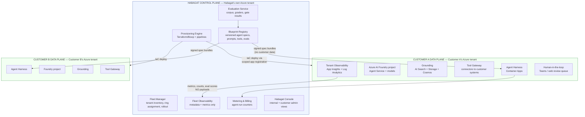
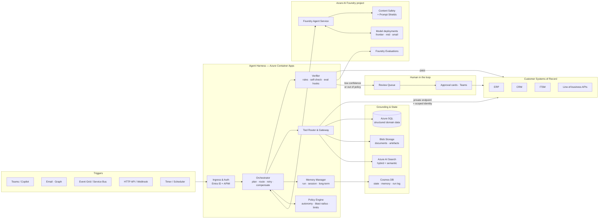
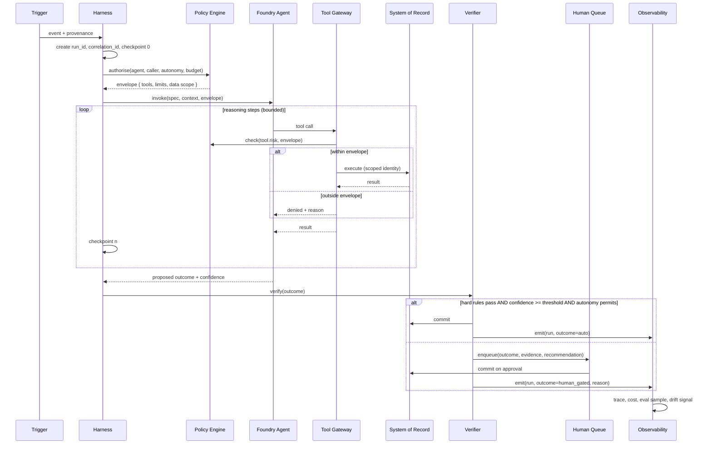

# Document 30 — Habagat Reference Architecture

> The system design for building, deploying and operating agents as a service on Microsoft Azure AI Foundry, with **one isolated Azure tenant/subscription per customer organisation**.
> Companion documents: [31 Orchestrator & Harness](31-orchestrator-harness.md) · [32 Per-Tenant Landing Zone](32-azure-landing-zone.md) · [33 Governance](33-governance-and-management.md) · [34 Security](34-security-and-compliance.md) · [35 Azure Services](35-azure-services-catalogue.md)

---

## Executive take

- Habagat runs a **two-plane architecture**: a single Habagat-owned **control plane** that provisions, versions, observes and bills; and **N fully isolated customer data planes**, one per customer, in the customer's own Azure tenant. Customer content never enters the control plane. Ever.
- This is a deliberate rejection of the multi-tenant SaaS default. It costs more per customer and it is slower to operate — **and it is the reason Habagat can sell to a bank, a hospital and a government in the same quarter.** Isolation is the product, not the overhead.
- The unit of engineering is the **Agent Blueprint**: a versioned, declarative agent specification that compiles to a deployable Foundry agent. Blueprints are built once in the control plane and instantiated many times into data planes. This is the entire margin story.
- The four architectural layers that matter are **Isolation, Orchestration, Grounding and Trust**. Everything else is plumbing. Competitors will match the plumbing; the Trust layer is where the durable advantage lives.
- The single largest technical risk is **fleet entropy** — N tenants drifting into N snowflakes. The architecture is designed around preventing that: declarative specs, no per-tenant code, drift detection, and ring-based fleet rollout.

---

## 1. Architectural principles

These are load-bearing. Every design decision downstream refers back to them.

| # | Principle | Consequence | What it forbids |
|---|---|---|---|
| **P1** | **Isolation is physical, not logical** | Each customer gets a dedicated Azure tenant or subscription, dedicated Foundry project, dedicated storage, dedicated search, dedicated keys | No shared database with a `tenant_id` column. No shared vector index. No shared model deployment holding customer context. |
| **P2** | **The control plane never holds customer content** | Control plane stores configuration, metadata, telemetry aggregates and billing counters only | No customer documents, no prompt payloads, no tool results, no PII crossing the boundary |
| **P3** | **Agents are declared, not coded** | An agent is a versioned YAML/JSON spec compiled to a runtime deployment | No per-customer forks of agent source. No snowflake prompts living in a tenant. |
| **P4** | **Every action is attributable** | Every tool call, model call and write is logged with agent version, spec version, model version, prompt hash, invoking identity and correlation ID | No unlogged action. No "the model just did that." |
| **P5** | **Nothing ships without an eval** | Promotion between rings and between autonomy levels is gated on a versioned evaluation corpus | No manual "looks good to me" promotion. No autonomy increase without evidence. |
| **P6** | **Least privilege by construction** | Agents authenticate as workload identities with narrowly scoped, time-bound permissions; the agent's identity is separate from the user's | No shared service account. No agent with standing admin rights. No agent that can modify its own permissions. |
| **P7** | **Reversibility by default** | Prefer reversible actions; irreversible ones require a human gate or a compensating action | No irreversible tool call at L3 without an approval or a documented compensation |
| **P8** | **The customer can leave** | Data, configuration and agent specs are exportable; the tenant is theirs | No proprietary data format that traps the customer. Exit rights are contractual and technically real. |

---

## 2. The two-plane model



### 2.1 What crosses the boundary — the exhaustive list

Anything not on this list does not cross. This table is a security control and should be tested, not merely documented.

| Direction | Payload | Contains customer data? | Mechanism |
|---|---|---|---|
| Control → Data | Signed agent spec bundle (prompts, tool definitions, policy, model config) | No | Blob pull over private endpoint; signature verified before load |
| Control → Data | Infrastructure change (Terraform plan/apply) | No | Deployment pipeline using a scoped, customer-approved service principal |
| Control → Data | Eval corpus (synthetic or customer-approved, tenant-scoped) | Only if the customer has explicitly approved that corpus | Explicit per-tenant opt-in; stored in the tenant, not the control plane |
| Data → Control | Run metrics: counts, durations, token totals, cost, success/failure, eval scores, autonomy level | No | Aggregated push; schema-validated allowlist of fields |
| Data → Control | Health and drift signals: config hash, spec version, resource state | No | Same channel |
| Data → Control | Billing counters: agent-runs by agent and period | No | Same channel |

> **The canary control.** A scheduled job plants uniquely-identifiable synthetic strings into each tenant's data and searches the entire control plane for them. Any hit is a P1 incident. This turns "we don't move customer data" from a claim into a continuously tested assertion — and it is the single most persuasive artefact in an enterprise security review.

---

## 3. Data plane reference architecture (per customer)



### 3.1 Layer responsibilities

| Layer | Responsibility | Azure services |
|---|---|---|
| **Trigger** | Convert an event into a well-formed agent-run request with provenance | Event Grid, Service Bus, Logic Apps, Graph subscriptions, API Management, Functions (timer) |
| **Ingress & identity** | Authenticate the caller, establish the acting identity, enforce quota | API Management, Entra ID, Managed Identity |
| **Orchestration** | Plan, decompose, call tools, handle failure, compensate, checkpoint | Container Apps (harness), Durable Functions for long-running sagas |
| **Policy** | Enforce autonomy level, blast-radius rules, spend limits, tool allowlists, data-scope rules | In-harness policy engine, backed by tenant config |
| **Reasoning** | Model inference, agent loop, tool calling | Azure AI Foundry Agent Service, model deployments |
| **Grounding** | Retrieve the right context, entitlement-filtered | AI Search, Blob, Cosmos, Fabric/SQL, Graph |
| **Tooling** | Execute actions against customer systems, safely and reversibly | Tool Gateway (in-harness), APIM, Logic Apps connectors, private endpoints |
| **Verification** | Check output against rules, schema, self-consistency and eval criteria before it escapes | In-harness verifier + Foundry Evaluations |
| **Human gate** | Route to a person with full context when policy or confidence requires | Teams adaptive cards, review queue web app |
| **Observability** | Trace every run end to end; retain per the customer's policy | Application Insights, Log Analytics, OpenTelemetry |

---

## 4. The Agent Blueprint

The blueprint is Habagat's core intellectual property and the mechanism by which delivery cost stays sublinear to customer count.

### 4.1 What a blueprint contains

```yaml
# blueprint: invoice-processing v4.2.0  (illustrative shape)
apiVersion: habagat.dev/v1
kind: AgentBlueprint
metadata:
  name: invoice-processing
  version: 4.2.0
  archetype: A2                 # Document Intelligence (see Doc 00)
  useCase: X02

contract:
  trigger:
    types: [email.received, blob.created, api.invoke]
    schema: ./schemas/invoice-trigger.json
  outcome:
    schema: ./schemas/invoice-outcome.json

autonomy:
  default: L2                   # every blueprint ships at L1/L2
  maxPermitted: L3              # ceiling; raising it requires a governance decision
  blastRadius: B3
  promotionGate: eval>=0.95 && shadowDays>=14 && falseActionRate<0.002

reasoning:
  modelPolicy: ./policies/model-routing.yaml   # cascade: small → mid → frontier
  systemPrompt: ./prompts/system.md
  maxSteps: 24
  maxCostPerRunUsd: 0.85

tools:
  - id: extract_invoice_fields
    risk: R0                    # read-only
  - id: lookup_vendor_master
    risk: R0
  - id: three_way_match
    risk: R0
  - id: post_invoice_to_erp
    risk: R2                    # reversible write — requires policy envelope
    compensatingAction: reverse_invoice_posting
  - id: release_payment
    risk: R3                    # IRREVERSIBLE — human approval mandatory, always
    requiresHumanApproval: true

grounding:
  indexes: [vendor_master, gl_coding_history, ap_policy]
  entitlementFilter: caller_identity          # ACL-trimmed retrieval, always
  citationRequired: true

verification:
  hardRules:                    # deterministic; the model cannot override these
    - arithmetic_foots
    - tax_rate_valid_for_jurisdiction
    - no_duplicate_invoice
    - bank_details_unchanged      # a change is a hard stop, not a low score
  selfCheck: true
  confidenceThreshold: 0.92

evaluation:
  corpus: ./evals/invoice-v4/
  graders: [field_accuracy, coding_accuracy, exception_precision, hard_rule_adherence]
  gate: { field_accuracy: 0.97, hard_rule_adherence: 1.00 }

observability:
  traceLevel: full
  retentionDays: tenant_policy
```

### 4.2 Blueprint → Instance

| Stage | Artefact | Where it lives | Who owns it |
|---|---|---|---|
| **Blueprint** | Versioned spec + prompts + tools + eval corpus | Control plane registry | Habagat platform team |
| **Tenant binding** | Connection config, entitlement mapping, policy overrides, autonomy level | Customer tenant (Key Vault + App Config) | Habagat delivery + customer |
| **Grounding** | The customer's own documents, policy and history | Customer tenant only | Customer |
| **Instance** | The running deployment | Customer tenant | Habagat operates; customer owns |

**The zero-snowflake rule.** A tenant binding may contain configuration, credentials, entitlement mappings and policy values. It may **never** contain prompts, code or tool definitions. CI enforces this: a tenant repository containing a `.md` prompt or an executable fails the build. Without this rule, Habagat becomes a consultancy with 100 bespoke codebases and the margin structure collapses. It is the most important single rule in the architecture.

---

## 5. The agent run lifecycle



### 5.1 Failure semantics — the part most agent platforms get wrong

| Failure | Handling |
|---|---|
| Model call fails / times out | Retry with backoff; on repeat, fall back to the next model in the cascade; then fail the run cleanly |
| Tool call fails transiently | Retry with idempotency key |
| Tool call fails permanently | Do not "reason around" it. Fail the step, record why, route to human |
| Partial write completed, later step fails | Execute the registered **compensating action** for each completed R2 write, in reverse order. Every R2 tool must declare one — CI rejects those that don't |
| Loop / no progress | Step budget and cost budget both hard-stop the run |
| Model produces unparseable output | One reformat attempt, then fail to human. Never guess the schema |
| Low confidence | Route to human with the reasoning; this is a success, not a failure |
| Policy denial | Terminate cleanly; record the denial; surface to the customer's governance dashboard |

> **The design stance:** an agent that stops and asks is behaving correctly. The metrics must reward correct escalation, not raw automation rate — otherwise the system optimises toward confident wrongness, which is the failure mode that ends deployments.

---

## 6. Grounding architecture

Retrieval quality determines agent quality far more than model choice does. Three rules govern it.

**Rule 1 — Entitlement-trimmed retrieval, always.** Retrieval is filtered by the invoking user's actual permissions *at query time*, using security trimming in Azure AI Search with Entra ID group membership. Filtering after retrieval leaks; filtering by index partition doesn't scale; only query-time trimming is correct.

**Rule 2 — Citation or silence.** Any factual claim in an agent output must be attributable to a retrieved passage or a tool result. Unattributable claims are stripped by the verifier and the gap is stated explicitly.

**Rule 3 — Freshness is a first-class property.** Every indexed item carries an effective date and a supersession link. A retrieved 2021 policy superseded in 2024 must lose to the 2024 version deterministically, not probabilistically.

| Grounding source | Pattern | Notes |
|---|---|---|
| Documents (SharePoint, file shares) | Ingest → chunk → embed → AI Search with ACL trimming | Incremental indexing; deletion propagation matters and is usually missed |
| Structured business data | Direct query via tool, not embedding | Never embed a transactions table. Query it. |
| Systems of record | Live API call at run time | Freshness beats caching for anything transactional |
| Domain knowledge | Curated, versioned knowledge packs per blueprint | Habagat IP; shipped with the blueprint |
| Long-term memory | Cosmos DB with explicit, inspectable, deletable records | Memory the customer cannot inspect is a liability |

---

## 7. Multi-agent composition

Most use cases in Documents 01–21 are single agents. Some are genuinely multi-agent. The distinction matters commercially, because multi-agent systems cost more to build, evaluate and debug.

| Pattern | When to use | Example from the catalogue | Caution |
|---|---|---|---|
| **Single agent, many tools** | Default. Use unless proven insufficient | X02 Invoice processing | Preferred — simplest to evaluate and debug |
| **Supervisor + specialists** | Genuinely distinct skill domains with a clear routing decision | X05 Support triage routing to billing / technical / retention specialists | The supervisor becomes the bottleneck and the failure point |
| **Sequential pipeline** | Stages with clear handoffs and independent quality gates | BFS-03 KYC: extract → screen → risk-rate → assemble | Each stage needs its own eval, or errors compound invisibly |
| **Parallel fan-out + reduce** | Independent subtasks over a set | X07 RFP: answer 180 questions independently, then a consistency pass | The reduce step is where quality is won |
| **Debate / critic** | High-stakes reasoning where a second perspective genuinely improves accuracy | BFS-06 Credit memo risk analysis | Expensive; justify it with eval evidence, not intuition |

> **Rule:** a multi-agent design must be justified by an evaluation showing it beats the single-agent baseline. "It felt more sophisticated" is not a justification. Most multi-agent systems in production are single agents with extra latency.

---

## 8. Why single-tenant, stated plainly

Habagat will be asked this in every investor meeting and every architecture review. The answer:

| Dimension | Multi-tenant SaaS | Habagat single-tenant |
|---|---|---|
| Blast radius of a breach | All customers | One customer |
| Regulated-industry sales cycle | Long; often blocked at security review | Materially shorter; isolation answers the hardest question up front |
| Data residency and sovereignty | Hard; often impossible for government | Native — the tenant is in the customer's chosen region |
| Customer-specific compliance (HIPAA, GxP validation, FedRAMP-style) | Contaminates all tenants | Contained to the tenant that needs it |
| Noisy neighbour / capacity contention | Real | None |
| Exit and portability | Contractual promise | Technically real — it's their tenant |
| **Cost per customer** | **Low** | **Higher — a fixed floor per tenant** |
| **Operational complexity** | **Low** | **High — this is the real cost, and it is where Habagat must be excellent** |

**The honest trade-off:** single-tenant costs more and is harder to operate. Habagat's bet is that the **Fleet Manager and the zero-snowflake rule** reduce that operational cost to something close to multi-tenant, while retaining the commercial advantage of isolation. If that bet fails, the business does not work — which is why fleet operations (Document 33) gets disproportionate engineering investment from day one, and why per-tenant platform pricing must cover the fixed floor.

---

## 9. Architecture decision record (summary)

| ID | Decision | Alternatives rejected | Reversibility |
|---|---|---|---|
| ADR-01 | One Azure tenant/subscription per customer | Multi-tenant with logical isolation; namespace-per-customer in one subscription | **One-way** — the commercial promise depends on it |
| ADR-02 | Azure AI Foundry Agent Service as the primary runtime | Self-hosted orchestration (LangGraph/Semantic Kernel only); other clouds | Two-way — mitigated by the provider-neutral spec (ADR-03) |
| ADR-03 | Provider-neutral Agent Spec compiled to a runtime target | Foundry-native definitions authored directly | Two-way, deliberately — this is the lock-in hedge |
| ADR-04 | Habagat harness owns policy, verification and compensation | Rely on the platform's built-in agent loop alone | Two-way, but the harness is the differentiator; don't give it up |
| ADR-05 | Control plane holds zero customer content | Centralised observability with payload capture | **One-way** — it is the security claim |
| ADR-06 | Eval-gated promotion with no manual override below CTO | Ship-and-monitor | Two-way in theory, one-way in practice: once waived, the discipline is gone |
| ADR-07 | Every R2 tool declares a compensating action; R3 requires human approval | Trust the model to avoid bad writes | **One-way** — liability containment |
| ADR-08 | Blueprints versioned centrally; tenants hold config only | Per-tenant customisation in code | **One-way** — margin depends on it |
