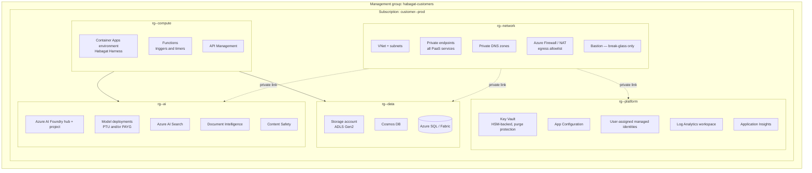
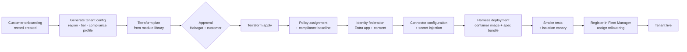

# Document 32 — Per-Tenant Azure Landing Zone & Infrastructure Build

> How Habagat provisions, configures and operates one isolated Azure environment per customer organisation — repeatably, in hours rather than weeks.

---

## Executive take

- The landing zone is **fully declarative and fully automated**. A new customer environment is a pipeline run, not a project. If provisioning a tenant requires a human to click anything in the portal, the business model does not scale.
- Habagat supports **three deployment models** depending on who owns the Azure commercial relationship. All three produce the same logical architecture; they differ in billing, identity and who holds the subscription.
- Target: **customer environment provisioned in under 4 hours, first agent live in under 10 working days.** Every hour above that is margin lost and credibility lost.
- The hardest problems are not the resources — they are **identity federation, private networking to customer systems, and quota**. Budget accordingly: those three consume most of the onboarding elapsed time in practice.

---

## 1. Deployment models

| | **Model A — Habagat-managed subscription** | **Model B — Customer subscription, Habagat-operated** | **Model C — Customer tenant, customer-operated** |
|---|---|---|---|
| Azure tenant | Habagat's tenant, dedicated subscription per customer | Customer's tenant, dedicated subscription | Customer's tenant |
| Azure billing | Habagat (resold in the subscription fee) | Customer pays Microsoft directly | Customer |
| Habagat access | Owner within that subscription | **Azure Lighthouse** delegated access, scoped and time-bound | Deployment-time only; no standing access |
| Customer data location | Habagat subscription, customer-chosen region | Customer's own subscription | Customer's own |
| Best for | Mid-market; customers without Azure maturity; fastest onboarding | **The default for regulated enterprise** | Government, defence, and customers with sovereign requirements |
| Habagat operational burden | Highest | Medium | Lowest — but support is harder |
| Onboarding time | ~4 hours | ~2–5 days (customer approvals dominate) | 2–4 weeks |

**Recommendation.** Lead with **Model B**. It gives the customer the audit and control position they need, keeps Habagat operationally effective through Lighthouse, and removes the cloud spend from Habagat's COGS. Offer Model A to accelerate mid-market. Offer Model C only where required — and price it higher, because support without standing access is genuinely more expensive.

### 1.1 Azure Lighthouse in Model B

Lighthouse is what makes Model B operable at fleet scale: Habagat engineers authenticate with their own Habagat identities and receive scoped, auditable, revocable access into the customer's subscription without a guest account.

- Delegation is scoped to the resource groups Habagat operates, never the whole subscription.
- Roles are least-privilege and **eligible rather than active** — activated through PIM with justification and a time limit.
- All Habagat actions appear in the **customer's** activity log, which is the point: the customer audits their operator.
- The customer can revoke delegation unilaterally at any time. This is stated in the contract and it is technically true, which is what makes it persuasive.

---

## 2. Landing zone topology



### 2.1 Resource inventory per tenant

| Resource | Purpose | Isolation note |
|---|---|---|
| **Azure AI Foundry hub + project** | Agent Service, model deployments, evaluations, tracing | One project per tenant; never shared |
| **Model deployments** | Frontier, mid and small tiers per the routing policy | Per-tenant deployment; no shared endpoint carrying customer context |
| **Azure AI Search** | Grounding index with ACL security trimming | Per-tenant service; per-use-case indexes |
| **Azure AI Document Intelligence** | Structured extraction from documents | Per-tenant |
| **Azure AI Content Safety** | Input/output filtering, Prompt Shields | Per-tenant configuration |
| **Container Apps environment** | Habagat Harness runtime | Per-tenant; VNet-integrated |
| **Azure Functions** | Trigger adapters, scheduled runs | Per-tenant |
| **API Management** | Ingress, authentication, rate limiting, tool egress control | Per-tenant (Developer/Standard v2 for smaller tenants) |
| **Cosmos DB** | Run state, checkpoints, memory | Per-tenant account |
| **Storage (ADLS Gen2)** | Documents, artefacts, traces | Per-tenant, CMK-encrypted |
| **Key Vault (Premium/HSM)** | Connector secrets, CMK keys | Per-tenant; purge protection on |
| **Log Analytics + App Insights** | Observability, retained per customer policy | Per-tenant workspace |
| **VNet, private endpoints, private DNS** | No public data-plane exposure | Per-tenant |
| **Azure Firewall or NAT + egress policy** | Outbound allowlist | Per-tenant |
| **Managed identities** | Workload identity for every component | Per-component, least privilege |

**Design rule: no public endpoints on any data-plane service.** Foundry, Search, Storage, Cosmos and Key Vault are all private-endpoint only, with public network access disabled. This is checked by Azure Policy with a deny effect, so a misconfiguration cannot be deployed rather than being detected afterwards.

---

## 3. Provisioning pipeline



### 3.1 Infrastructure as code

- **Terraform** for the tenant landing zone (multi-cloud optionality, superior state management, mature module ecosystem).
- **Bicep** where a resource's Azure-native features lead Terraform's provider — accepted as a pragmatic hybrid rather than a purity contest.
- **Module library** with one module per architectural concern, versioned semantically. A tenant is a composition of pinned module versions plus a small config file — typically under 100 lines.
- **State** in a Habagat-controlled backend with per-tenant isolation and locking.
- **No portal changes, ever.** Drift detection runs continuously; manual changes are reverted, not adopted. A tenant that has been hand-edited is no longer a tenant Habagat can operate at fleet cost.

### 3.2 Tenant configuration file (illustrative)

```yaml
tenant:
  id: contoso-prod
  displayName: Contoso Manufacturing
  deploymentModel: B                 # customer subscription, Lighthouse-operated
  subscriptionId: <guid>
  primaryRegion: swedencentral
  drRegion: westeurope
  dataResidency: eu-only             # enforced by policy, not convention

compliance:
  profile: iso27001-gdpr             # baseline policy set
  additional: [nis2]
  retentionDays: { traces: 400, memory: 1095, documents: tenant_managed }
  cmk: true                          # customer-managed keys required

capacity:
  tier: standard                     # drives SKUs and quota requests
  models:
    frontier: { deployment: ptu, units: 2 }
    mid:      { deployment: payg }
    small:    { deployment: payg }

agents:
  - blueprint: enterprise-knowledge@2.1.0
    autonomy: L2
  - blueprint: invoice-processing@4.2.0
    autonomy: L2                     # promotes to L3 after the eval gate
  - blueprint: support-triage@3.0.1
    autonomy: L2

connectors:
  - type: microsoft-graph
    scopes: [Files.Read.All, Mail.Read, Chat.ReadWrite]
    authMode: delegated
  - type: sap-s4
    endpoint: private
    authMode: service-principal
    network: { privateEndpoint: true, subnet: snet-integration }

network:
  customerConnectivity: expressroute  # or site-to-site VPN, or public API + IP allowlist
  egressAllowlist: [login.microsoftonline.com, <customer API hosts>]

rolloutRing: R2
```

---

## 4. Connectivity to customer systems

This is consistently the longest pole in onboarding. Habagat should present the options up front with their real timelines, because a customer that discovers the network requirement in week three loses confidence.

| Pattern | When | Latency to establish | Notes |
|---|---|---|---|
| **Public API + Entra auth + IP allowlist** | Modern SaaS (Salesforce, ServiceNow, Workday) | Hours | Simplest; egress from a fixed NAT IP the customer allowlists |
| **Private Endpoint / Private Link** | Customer services already published on Azure Private Link | Hours–days | Cleanest for Azure-native estates |
| **VNet peering** | Customer systems already in Azure | Days | Requires address-space coordination |
| **Site-to-site VPN** | On-premises systems, moderate volume | Days–weeks | Customer network team dependency |
| **ExpressRoute** | On-premises, high volume, latency-sensitive | Weeks–months | Usually already exists in large enterprises — ask early |
| **Azure Arc + on-prem agent** | Data cannot leave the premises (OT, sovereign, air-gapped-adjacent) | Weeks | Local execution with control-plane management; essential for manufacturing, mining and utilities |
| **File/queue drop** | Legacy systems with no API | Days | Ugly, effective, and more common than anyone admits |

**Practical guidance for delivery.** In the first technical call, ask three questions: (1) Do you have ExpressRoute? (2) Which of the target systems are SaaS versus on-premises? (3) Who approves a firewall rule and how long does that take? The answers predict the onboarding timeline more accurately than anything else.

---

## 5. Capacity, quota and region strategy

| Concern | Approach |
|---|---|
| **Model quota** | Quota is per-subscription and per-region. With one subscription per customer, each new tenant needs quota requested. **Automate the request in the provisioning pipeline and track it as a first-class onboarding task** — a tenant blocked on quota is a stalled deal |
| **PTU vs pay-as-you-go** | PAYG by default. Move a tenant to Provisioned Throughput when sustained utilisation makes it cheaper and when latency predictability matters (see CTO Doc 04 for the break-even arithmetic) |
| **Model availability by region** | Not every model is in every region. Where the customer's data-residency region lacks a required model, the options are: use the next-best available model with a documented eval delta; use a different region within the residency boundary; or decline the use case. **Never silently route outside the residency boundary** |
| **DR** | Warm standby in the paired region: infrastructure defined but not running, state replicated. RTO 4h / RPO 15min for standard tier |
| **Scale limits** | Track per-subscription resource limits during design; they bind sooner than expected on Search and Cosmos |

---

## 6. Environments per tenant

| Environment | Purpose | Data | Cost posture |
|---|---|---|---|
| **Production** | Live agents | Real customer data | Full |
| **Staging** | Pre-production validation, customer UAT | Anonymised or synthetic; real data only with explicit approval | Reduced SKUs, scale-to-zero |
| **Sandbox** *(optional)* | Customer experimentation | Synthetic | Minimal, time-boxed |

Habagat additionally runs **internal environments** in its own tenant — development, integration and the R0 dogfooding tenant where every blueprint runs against Habagat's own operations before any customer sees it. Shipping to yourself first is both a quality control and the most credible sales artefact available.

---

## 7. Cost model per tenant (illustrative)

> Illustrative figures for a **standard-tier tenant** — one region, three agents, roughly 50,000 agent-runs per month. Substitute your own rates; the arithmetic is what matters.

| Component | Monthly (USD) | Notes |
|---|---|---|
| Container Apps (harness) | 350 | 2 replicas baseline, scaling on queue depth |
| Azure AI Search (Standard S1) | 250 | Per-tenant index |
| Cosmos DB (serverless → provisioned) | 200 | Run state and memory |
| Storage (ADLS Gen2) | 80 | Documents and traces |
| Key Vault Premium | 30 | HSM-backed keys |
| Log Analytics + App Insights | 300 | Dominated by trace volume; tune sampling |
| API Management (Standard v2) | 350 | Ingress and tool egress control |
| Networking (private endpoints, NAT/firewall) | 400 | Firewall is the swing item; NAT-only is far cheaper |
| Document Intelligence | 150 | Volume-dependent |
| Content Safety | 50 | |
| **Fixed platform subtotal** | **~2,160** | **This is the single-tenant floor — it exists whether the tenant runs 5,000 or 500,000 runs** |
| Model inference (variable) | 1,800 | 50k runs, cascade routing, ~$0.036/run blended |
| **Total** | **~3,960** | |

**The commercial consequence.** A tenant with a fixed floor of roughly $2,200/month cannot be sold a $1,500/month contract without being gross-margin negative before a single token is spent. Therefore Habagat's pricing **must** include a per-tenant platform fee that covers the floor, with agent-run pricing on top. This is the direct, unavoidable consequence of choosing single-tenant, and it should be stated openly to investors rather than discovered by them.

Levers on the floor: NAT gateway instead of Azure Firewall for smaller tenants (−$300), aggressive trace sampling (−$150), consumption-tier APIM for low-volume tenants (−$250), and Container Apps scale-to-zero for interactive-only workloads. A lean small-tenant profile lands nearer **$1,100–1,300/month**.

---

## 8. Onboarding runbook

| Day | Activity | Owner | Exit criterion |
|---|---|---|---|
| 0 | Commercial close; deployment model chosen | Sales + customer | Signed order; model A/B/C decided |
| 1 | Technical discovery: subscription, region, residency, connectivity, target systems | Solutions Architect | Tenant config file drafted |
| 1–2 | Azure prerequisites: subscription, Lighthouse delegation, quota requests raised | Habagat + customer cloud team | Delegation active; quota requested |
| 2 | Landing zone provisioned | Pipeline | Terraform apply green; policy compliant; isolation canary passes |
| 2–5 | Identity federation and connector configuration | Habagat + customer IT | Agent can authenticate and read from target systems |
| 3–7 | Grounding: content ingestion, index build, ACL verification | Habagat delivery | Retrieval returns correct, entitlement-filtered results |
| 5–8 | Blueprint instantiation and tenant-specific evaluation | Agent Pod | Eval gate passed on the customer's own data |
| 8–10 | Shadow mode: agent runs alongside the human process, outputs compared | Agent Pod + customer team | Agreement rate meets the agreed threshold |
| 10 | Go live at L1/L2 | Both | First production run; review queue staffed |
| 10–40 | Monitored operation; weekly review; promotion decision | Both | Autonomy promotion gate met or not, with evidence |

**The commitment to make in the sales process:** first agent in production within 10 working days of Azure access. It is achievable with this architecture, and it is a differentiator against every consultancy-led alternative.
