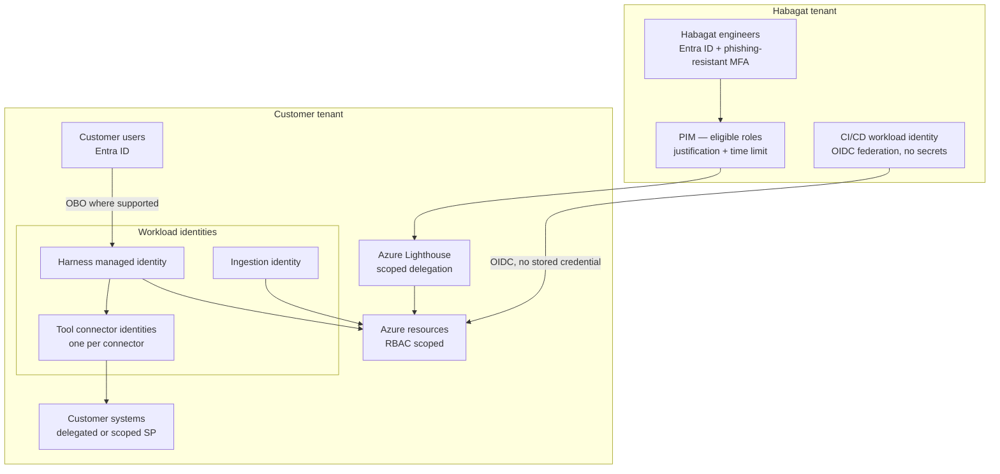

# Document 34 — Security Architecture & Compliance

> The security design for a platform that holds an enterprise's most sensitive data, acts on its systems, and must prove both to a regulator.

---

## Executive take

- Habagat's security posture has to clear a bar most SaaS never faces: agents **read privileged data and take actions**. A compromised agent is not a data breach, it is an insider with API access. The architecture is designed around that fact.
- The four pillars: **tenant isolation** (Document 30), **identity and least privilege**, **agent-specific threat controls** (prompt injection, excessive agency, tool misuse), and **provable auditability**.
- Habagat's isolation claim is not asserted, it is **continuously tested** by the canary control. That single mechanism does more in an enterprise security review than any certificate.
- Certification roadmap: **SOC 2 Type II + ISO 27001 in year one**, ISO 42001 and sector attestations (HIPAA BAA, GxP validation packs) in year two. These gate market access, so they are a product decision, not a compliance chore.

---

## 1. Threat model

| Threat actor | Objective | Primary controls |
|---|---|---|
| **External attacker** | Access customer data via the platform | Private-endpoint-only data plane, no public ingress to data services, Entra-only auth, WAF at APIM, no shared infrastructure across customers |
| **Malicious insider (Habagat)** | Access or exfiltrate customer data | Zero standing access; PIM with justification and time limits; all access in the customer's own audit log; control plane structurally cannot hold payloads; separation of duties |
| **Compromised Habagat supply chain** | Ship a malicious blueprint or container | Signed artefacts, verified at load; SBOM; reproducible builds; ring rollout limits blast radius; two-person review on all blueprint changes |
| **Malicious customer user** | Use an agent to exceed their own permissions | Agent acts with the caller's entitlements; ACL-trimmed retrieval at query time; policy envelope computed from the caller's identity |
| **Prompt injection via content** | Redirect the agent to exfiltrate or act maliciously | Envelope computed **before** untrusted content is read; tool results are non-authoritative data; egress allowlist; Prompt Shields; no arbitrary-HTTP tool |
| **Compromised customer system** | Poison the agent's grounding or tools | Ingestion source-authority validation; anomaly detection on retrieval; circuit breakers |
| **Model provider risk** | Data used for training; availability loss; terms change | Azure OpenAI contractual position (no training on customer data); multi-model portability via the provider-neutral spec |
| **Nation-state / regulatory compulsion** | Access to customer data | Data resides in the customer's own tenant and region; Habagat frequently cannot produce it, which is a genuine and material protection |

---

## 2. Identity architecture

### 2.1 Identity principles

| # | Principle | Implementation |
|---|---|---|
| 1 | **No standing access for humans** | All Habagat access is PIM-eligible, activated with justification, time-limited, approved, and logged in the customer's tenant |
| 2 | **No secrets in CI/CD** | OIDC workload identity federation from the pipeline to Azure. No stored service-principal secrets anywhere |
| 3 | **One identity per workload** | Each harness component and each connector has its own managed identity with a distinct permission set. No shared service account |
| 4 | **Act on behalf of the user where possible** | On-behalf-of flow so the agent inherits the caller's entitlements. Where a system cannot support it, the service identity is minimally scoped and its use is logged with the originating user |
| 5 | **The agent cannot escalate itself** | The harness identity has no permission over identity, policy or RBAC — enforced by RBAC, not by prompt |
| 6 | **Break-glass is real and monitored** | A documented emergency access path with immediate alerting, mandatory review, and quarterly testing |

### 2.2 Secrets and keys

- All secrets in **Key Vault Premium (HSM-backed)** with purge protection and soft delete.
- **Customer-managed keys (CMK)** for storage, Cosmos and Search where the customer requires it — which in regulated sectors is always. CMK gives the customer a genuine, unilateral revocation capability, and that capability is itself the reassurance.
- Automated rotation; secrets never appear in prompts, model context, logs, traces or environment variables.
- The model never sees a credential. Tool authentication happens in the Tool Gateway, after the model has decided to call the tool.

---

## 3. Data protection

| Control | Implementation |
|---|---|
| **Encryption at rest** | Platform encryption by default; CMK where required; double encryption for the highest tier |
| **Encryption in transit** | TLS 1.2 minimum (1.3 preferred); private endpoints so traffic does not traverse the public internet |
| **Data residency** | All resources deployed in the customer's chosen region(s); enforced by Azure Policy with a deny effect on non-compliant locations |
| **Data classification** | Sensitivity labels propagated from Microsoft Purview; agents respect labels in retrieval and in output handling |
| **Minimisation** | Agents retrieve only what the task requires; retrieval is scoped by policy, not by convenience |
| **Retention** | Per-tenant, per-data-class policies, automatically enforced. Traces default to 400 days; memory and documents follow the customer's policy |
| **Deletion** | Customer-initiated deletion propagates to indexes, memory, traces and backups within the contractual SLA, with evidence of completion |
| **No training on customer data** | Contractually guaranteed through Azure OpenAI terms and Habagat's own commitments. Fine-tuning on customer data occurs only with explicit written consent and stays entirely within the tenant |
| **Cross-border** | No customer data leaves the residency boundary. Where a model is unavailable in-region, the choice is a different model or no agent — never a silent cross-border call |

---

## 4. Agent-specific security controls

Standard application security is necessary but insufficient. These are the controls that address what is genuinely new.

### 4.1 Prompt injection defence in depth

| Layer | Control | Why it matters |
|---|---|---|
| 1 | **Envelope precedes content** | The policy envelope is computed from the trigger, the caller's identity and the blueprint — before any untrusted content enters context. Injected instructions therefore cannot expand permissions. This is the structural defence, and the only one that holds |
| 2 | **Content typing** | Tool results and retrieved documents are delimited and typed as data. The system prompt states explicitly that content never carries instruction authority |
| 3 | **Prompt Shields** | Azure AI Content Safety detection on inputs, as a detective layer |
| 4 | **Tool allowlist** | Deny by default. An injection cannot invoke a tool the envelope does not permit |
| 5 | **Egress allowlist** | Outbound destinations are allowlisted per tenant. There is no arbitrary-HTTP tool, so there is no generic exfiltration channel |
| 6 | **Output scanning** | Outputs are checked for exfiltration patterns (encoded data, unexpected URLs, credential shapes) before they leave |
| 7 | **Human gate on high-risk actions** | R3 actions require approval regardless of how confident the model is |
| 8 | **Detection and response** | Anomalous tool-call patterns alert; a successful injection is a SEV-1 regardless of whether harm resulted |

### 4.2 Excessive agency controls

| Risk | Control |
|---|---|
| Agent does more than intended | Step and cost budgets; tool allowlist; blast-radius policy |
| Agent acts on stale or wrong context | Freshness checks; supersession handling; grounding verification |
| Agent acts outside business context | Time-of-day and operating-window policy; value limits; volume limits per period |
| Agent chains actions to an unintended outcome | Saga model with checkpoints; compensating actions; verification before commit |
| Agent affects another agent | Agents do not call each other directly; composition is explicit in the blueprint and mediated by the harness |

### 4.3 Supply chain security

- All container images built from pinned, scanned base images; signed; SBOM generated and retained.
- Blueprint bundles are cryptographically signed in the control plane and verified by the harness before load. **An unsigned or modified spec fails to load** — this is the zero-snowflake rule as a security control.
- Dependency scanning with a defined remediation SLA by severity.
- Two-person review on every blueprint and platform change; no single engineer can ship to the fleet.
- Model versions pinned explicitly; provider model changes are evaluated before adoption.

---

## 5. Compliance roadmap

| Certification / attestation | Timing | Why | Effort |
|---|---|---|---|
| **SOC 2 Type II** | Year 1, H2 | The default enterprise requirement in North America; gates most deals | High initially; then continuous |
| **ISO 27001** | Year 1, H2 | The default in Europe and Asia; often contractually required | High initially; shares evidence with SOC 2 |
| **GDPR readiness** (DPA, records, DPIA support, sub-processor transparency) | Year 1, H1 | Prerequisite for any EU customer | Medium |
| **ISO/IEC 42001 (AI management)** | Year 2 | Differentiator now, expectation soon; validates the governance model in Document 33 | Medium — the governance work is already done |
| **HIPAA BAA** | Year 1, on first healthcare customer | Prerequisite for the healthcare vertical | Low incremental over SOC 2 |
| **GxP validation pack** | Year 2, on first pharma customer | Prerequisite for life sciences; a genuine moat once built | High — but it is a per-blueprint asset that compounds |
| **EU AI Act conformity** (high-risk blueprints) | Ahead of applicable deadlines | Legal requirement; supports customers' own obligations | Medium — governance foundation exists |
| **DORA readiness** (as an ICT third party) | Year 2 | Required by EU financial customers: exit plans, resilience testing, register entries | Medium |
| **FedRAMP / national schemes** | Year 3+, only if the public-sector pipeline justifies it | Very expensive; pursue only against committed revenue | Very high |

**Sequencing principle:** certifications are pursued **against pipeline**, not aspirationally. Each one is a product decision with a revenue justification, and each should be requested by a named prospect before it starts.

---

## 6. The isolation evidence pack

What Habagat hands a prospective customer's security team. Having this ready before the first enterprise deal is worth more than any amount of sales effort.

| Artefact | Content |
|---|---|
| **Architecture attestation** | The two-plane model, what crosses the boundary, and why the control plane cannot hold customer content |
| **Canary test results** | Continuous evidence that no synthetic customer marker has ever reached the control plane, with the test methodology |
| **Access report** | Every Habagat access to the customer's tenant in the period, with identity, justification, duration and actions — drawn from the customer's own logs |
| **Penetration test summary** | Annual third-party test including agent-specific tests: prompt injection, tool misuse, privilege escalation, cross-tenant attempts |
| **Policy compliance state** | Live Azure Policy compliance for the customer's tenant |
| **Sub-processor list** | Complete, with the data each receives and the legal basis |
| **Model card set** | One per deployed agent: capability, limitations, evaluation results, known failure modes, human oversight design |
| **Exit plan** | How the customer terminates, what they receive, in what format, in what timeframe — tested, not asserted |
| **Incident history** | Transparent record of incidents affecting the customer, and fleet-wide incidents of the class |

---

## 7. Business continuity

| Scenario | Response | Target |
|---|---|---|
| Azure region failure | Failover to the paired region; infrastructure pre-defined, state replicated | RTO 4h / RPO 15min (standard tier) |
| Model endpoint unavailable | Cascade to the next model tier; degrade to L1 (human-in-loop) rather than fail | Automatic, seconds |
| Customer system unavailable | Circuit breaker; queue work; resume on recovery; notify | Automatic |
| Habagat control plane unavailable | **Tenants continue running.** The control plane is required for deployment and fleet management, not for execution | Zero customer impact on agent execution |
| Habagat ceases trading | Source escrow for blueprints and harness; customer retains their tenant, data and configuration; documented transition plan | Contractual |
| Model provider terms change | Provider-neutral spec allows recompilation to an alternative target; quarterly portability test keeps this real | Weeks, not months |

> **The control-plane independence property is a significant and under-appreciated selling point.** Because agents execute entirely within the customer's tenant, a Habagat outage — or a Habagat failure as a company — does not stop the customer's agents from running. Very few AI vendors can say that, and it neutralises the most common objection to buying from a startup.
