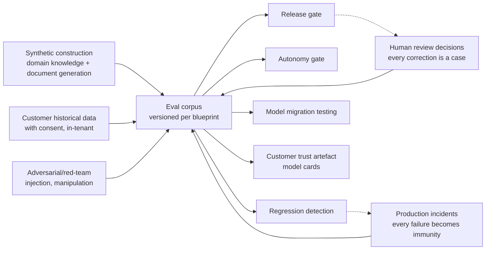

# Document 36 — Evaluation, Quality & the Trust Layer

> The evaluation corpus is Habagat's most valuable and least copyable asset. This document specifies how it is built, run and used to gate everything.

---

## Executive take

- **Models are a commodity; evaluated agents are not.** Anyone can call a frontier model. Almost nobody has a graded corpus proving that a specific agent handles a specific enterprise workflow correctly, including its edge cases. That corpus is the moat.
- Evaluation is not a testing phase. It is a **release gate, an autonomy gate, a regression detector, a model-migration tool and a customer-facing trust artefact** — five jobs from one asset.
- The corpus grows from three sources that compound: **synthetic construction**, **human review decisions**, and **production incidents**. Every escalation a reviewer corrects becomes a permanent test case. This is the flywheel.
- The metric that matters most is not accuracy. It is **calibration**: does the agent know when it does not know? A well-calibrated L2 agent is more valuable than a more accurate but overconfident one, because escalation is cheap and a confident error is not.

---

## 1. What an evaluation corpus contains

A corpus for one blueprint contains graded cases across five bands. The distribution matters more than the size — a thousand happy-path cases prove nothing.

| Band | Share | Purpose | Example (invoice processing) |
|---|---|---|---|
| **Happy path** | 25% | Baseline competence | Clean PO-matched invoice from a known supplier |
| **Common variation** | 30% | Real-world messiness | Multi-page, foreign currency, partial delivery, credit note |
| **Edge cases** | 25% | The cases that break naive implementations | Duplicate with a different invoice number; PO split across three deliveries; retrospective price change |
| **Adversarial** | 10% | Security and manipulation | Document containing injected instructions; altered bank details; fabricated supplier |
| **Should-escalate** | 10% | **The most important band.** Cases where the correct behaviour is *not to act* | Ambiguous entitlement; conflicting evidence; a value above policy; a supplier under investigation |

> The should-escalate band is what separates a serious evaluation practice from a demo. It measures whether the agent knows its own limits — which is the property the whole autonomy model rests on.

### 1.1 Case structure

```yaml
case:
  id: inv-edge-0447
  band: edge
  provenance: production_incident_2026_03_11   # traceable to why it exists
  input:
    documents: [./fixtures/inv-0447.pdf]
    context: { vendor_id: V-8821, po_ref: PO-44120 }
  systemState:                                  # the world the agent acts in
    po: { qty: 1000, unit_price: 4.20, received: 600 }
    vendor_master: { bank_iban: "DE89...", last_changed: 2024-06-01 }
  expected:
    outcome: escalate
    reason: partial_delivery_price_variance
    mustNotDo: [post_to_erp, release_payment]
    mustIdentify: [quantity_mismatch, unit_price_variance_2pct]
  grading:
    - grader: outcome_match          weight: 0.4
    - grader: reason_quality         weight: 0.2   # LLM-as-judge with rubric
    - grader: hard_rule_adherence    weight: 0.3   # deterministic; must be 1.0
    - grader: no_prohibited_action   weight: 0.1   # deterministic; must be 1.0
```

### 1.2 Grader types

| Type | Use | Reliability |
|---|---|---|
| **Deterministic assertion** | Hard rules, prohibited actions, schema conformance, arithmetic | Highest — use wherever possible |
| **Structured comparison** | Extracted fields against ground truth | High |
| **LLM-as-judge with a rubric** | Reasoning quality, explanation clarity, escalation appropriateness | Moderate — **must itself be validated against human grading**, and re-validated when the judge model changes |
| **Human grading** | The reference standard for a sampled subset | Highest, and expensive — reserve it for calibrating the automated graders |

**The rule on LLM judges:** a judge is a model, so it is subject to the same discipline as any other model. Its agreement with human graders is measured, reported, and re-measured on every judge-model change. An unvalidated judge produces confident numbers that mean nothing, which is worse than no numbers.

---

## 2. Where cases come from — the compounding flywheel



**The two flywheel legs that matter:**

1. **Human corrections.** At L1/L2, every escalation is reviewed by a human who approves, modifies or rejects with a reason. Each modification is a labelled case: the agent proposed X, the expert did Y, because Z. This is the highest-quality training and evaluation signal available anywhere, and it is generated as a free by-product of the product working as designed.

2. **Incidents.** Every SEV-1 and SEV-2 produces a case. The post-incident review is not closed until the case exists and the blueprint passes it. This is what turns an incident into permanent immunity rather than institutional memory that leaves when someone resigns.

> **This is why Habagat should prefer the managed-review commercial model** (Habagat operates the review queue) over the customer-operated one wherever the customer will accept it. The correction signal is the asset. Giving it away is giving away the moat.

### 2.1 Customer data in evaluation — the boundary

| Permitted | Not permitted |
|---|---|
| Tenant-scoped corpora built from the customer's own data, stored **in the customer's tenant**, used only for that customer's agents | Customer data leaving the tenant for any purpose |
| Anonymised, structurally-derived cases contributed to the shared corpus **with explicit written consent** | Contributing customer content to the shared corpus by default or by silence |
| Aggregate statistics (pass rates, error classes) reported to the control plane | Case content reaching the control plane |
| Learning from patterns to improve prompts and rules in a blueprint | Fine-tuning a shared model on one customer's data |

This boundary is stated in the contract and enforced architecturally. It costs Habagat some corpus growth. It is worth it: the first time a customer discovers their data trained something shared, the company's enterprise credibility is gone.

---

## 3. Metrics that matter

| Metric | Definition | Why it matters |
|---|---|---|
| **Task success rate** | Correct outcome per the corpus | The headline, and the least interesting on its own |
| **Hard-rule adherence** | Deterministic constraints never violated | **Must be 1.000.** Any value below this blocks release, full stop |
| **Prohibited-action rate** | Actions the agent must never take | **Must be 0.000** |
| **Calibration (ECE)** | Does stated confidence match observed accuracy? | Determines whether the confidence threshold means anything. An uncalibrated agent cannot be safely automated at any accuracy level |
| **Escalation precision** | Of escalations, how many genuinely needed a human? | Over-escalation destroys the value proposition |
| **Escalation recall** | Of cases needing a human, how many were escalated? | **The safety metric.** A missed escalation is the failure mode that ends deployments |
| **False-action rate** | Wrong actions taken autonomously per 1,000 runs | The number in the SLO and in the contract |
| **Groundedness** | Claims attributable to retrieved evidence | Hallucination control, measured rather than hoped for |
| **Cost per successful outcome** | Total cost ÷ successful runs | The unit economic that matters — not cost per run |
| **Human agreement rate** | Agent output versus expert output in shadow mode | The promotion gate evidence, and the most persuasive number in a customer conversation |

**Ranking these by importance:** escalation recall, then hard-rule adherence, then calibration, then task success. Most teams reverse this order, which is why their agents look impressive in a demo and fail in production.

---

## 4. Evaluation in the lifecycle

| Stage | What runs | Gate |
|---|---|---|
| **Development** | Fast subset (~50 cases) on every change | Developer feedback in under 2 minutes |
| **Pull request** | Full corpus for the blueprint | No regression on any band; hard rules at 1.0 |
| **Pre-release** | Full corpus + adversarial + cross-model comparison | Release gate; results attached to the release |
| **Tenant onboarding** | Tenant-scoped corpus on the customer's own data | Go-live gate — reference-corpus performance is not evidence of performance on *their* data |
| **Shadow mode** | Live traffic, agent output compared to human output | Autonomy promotion gate |
| **Production (continuous)** | Sampled live runs graded automatically; full corpus weekly | Regression → automatic autonomy demotion |
| **Model migration** | Full corpus against the candidate model | Migration gate; the delta is reported to customers before any change |
| **Post-incident** | New case added; full corpus re-run | Incident closure gate |

### 4.1 The regression rule

A blueprint that regresses on **any** case in the should-escalate or adversarial bands is blocked, regardless of aggregate improvement. Averages hide exactly the failures that matter, and a change that improves overall accuracy while learning to skip an escalation is a net loss.

---

## 5. What the customer sees

Evaluation is not internal hygiene — it is a **product surface** and a sales asset.

- **Model card per agent version**: what it does, how it was evaluated, the results by band, known limitations, known failure modes, and the human oversight design.
- **Tenant-specific evaluation report** at onboarding: how the agent performs on *their* data, which is the only evidence that means anything to them.
- **Continuous quality dashboard**: live success rate, escalation rate, and human agreement.
- **Promotion evidence pack**: the documented basis for every autonomy increase, signed by their own AI Council.
- **Regression notifications**: proactive disclosure when a metric moves adversely, before the customer notices.

> **This transparency is a competitive weapon.** Most AI vendors cannot produce these documents. A buyer's risk function that receives a model card, an evaluation report on their own data, and a documented promotion gate is looking at a fundamentally different kind of vendor — and that difference is what justifies the price.

---

## 6. Corpus economics

Building a good corpus is expensive. Being explicit about the cost prevents it being quietly skipped.

| Activity | Effort (illustrative) | Notes |
|---|---|---|
| Initial corpus for a new blueprint | 3–5 person-weeks | Domain SME plus eval engineer; the largest single cost in a new blueprint |
| Tenant-specific corpus at onboarding | 3–5 person-days | Mostly adapting the reference corpus to the customer's data and policy |
| Continuous growth from human review | ~0 marginal | Generated as a by-product of the product operating |
| Incident-driven cases | Hours per incident | Cheap, and the highest-value cases in the corpus |
| Annual refresh and pruning | 1 person-week per blueprint | Retire stale cases; rebalance bands |

**The compounding effect is the whole argument.** The corpus for blueprint one costs five weeks. The corpus for customer twelve of that blueprint costs three days. By the twentieth deployment, the corpus contains edge cases no competitor starting fresh could enumerate, because they were discovered in production across nineteen enterprises. **That is the asset, and it is why the tenth customer is far more profitable than the first — and why a competitor with the same models cannot simply match the product.**
